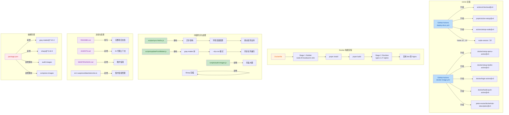

# v2.8.0 版本变更详情

> 日期：2026-05-22
> 从 v2.7.4 以来的累积工作区变更

---

## 可视化概览 (代码与逻辑映射)



## CI/CD 升级

- [.github/workflows/deploy-docs.yml](.github/workflows/deploy-docs.yml)：`actions/checkout@v3` → `v4`
- `pnpm/action-setup@v2` → `v4`
- `actions/setup-node@v3` → `v4`，Node 版本 `18` → `20`
- [.github/workflows/docker-image.yml](.github/workflows/docker-image.yml)：同步升级各项 action 版本
- [.gitignore](.gitignore)：新增 `elog.cache.json`、`elog.*.cache.json`（通配）、`*.log`、`*.local` 忽略规则

## Docker 多阶段构建

- [Dockerfile](Dockerfile)：从单层 Node 镜像改为多阶段构建
  - **构建阶段**：`node:20-bookworm-slim`，设置 `NODE_OPTIONS=--max_old_space_size=8192`，启用 corepack 后用 `pnpm install --frozen-lockfile` + `pnpm build`
  - **运行阶段**：`nginx:1.27-alpine`，只复制 `src/.vuepress/dist` 静态产物
  - 镜像体积显著减小，不再包含 node_modules 和源码
- [docker-compose.yml](docker-compose.yml)：移除调试用 `volumes` 挂载和 `privileged: true`，清理冗余注释

## 新工具链

### 图片审计与压缩

- 新增 [scripts/audit-images.js](scripts/audit-images.js)：扫描 `feishu/`、`yuque/`、`src/` 下超过阈值的大图并输出报告
- 新增 [scripts/compress-images.js](scripts/compress-images.js)：压缩 `feishu/`、`yuque/` 下超过阈值的大图（支持 `--dry-run` 预览）
- [package.json](package.json) 新增依赖：
  - `sharp@^0.34.5`：高性能图片压缩
  - `gray-matter@^4.0.3`：Markdown FrontMatter 解析
- [package.json](package.json) 新增命令：
  - `pnpm run audit-images`
  - `pnpm run compress-images`

### 图片压缩效果（部分示例）

| 文件 | 压缩前 | 压缩后 | 压缩率 |
| --- | --- | --- | --- |
| `SihDbEJn6o3dr5x03oQcmNxan3b.png` | 5.57 MB | 719 KB | 87% |
| `U89IbmgsioAkJDxfvHncQSgRnIb.png` | 1.50 MB | 651 KB | 57% |
| `VNDxb54rgoPXCJxmvStcIEcwnIg.png` | 1.51 MB | 586 KB | 61% |
| `TsOibziACogfUFxr6nZcI1W2nae.png` | 1.52 MB | 571 KB | 62% |
| `AHP1bQJDGoApWwxwAc5cZwMynoN.png` | 1.12 MB | 347 KB | 69% |
| … | … | … | … |

共压缩 `feishu/` 下 12 个大图 + `yuque/` 下 1 个大图，总节省数十 MB。

## 同步脚本重构

### sync-feishu.js

- [scripts/sync-feishu.js](scripts/sync-feishu.js) 全面重构
- **异步延迟**：`delay()` 使用 `Promise` + `setTimeout` 替代同步 `while` 阻塞，不再卡死 Node 事件循环
- **环境变量配置化**：`FEISHU_SYNC_MAX_ROUNDS`（最大重试轮数）、`FEISHU_SYNC_COOLDOWN_MS`（冷却毫秒）、`FEISHU_EXPECTED_DOC_COUNT`（预期文档总数）
- **移除硬编码 22 篇限制**：不再假设飞书知识库固定 22 篇，改用 `EXPECTED_DOC_COUNT` 或正常退出码判断完成
- **退出码检查**：`spawnSync` 返回值检查，`status === 0` 即正常完成
- **错误处理**：`main()` 使用 `async/await` + `.catch()` 统一异常处理

### updateFrontMatter.js

- [scripts/updateFrontMatter.js](scripts/updateFrontMatter.js) 全面重构
- **gray-matter 库**：替代手写正则解析 FrontMatter，不再出现正则匹配遗漏或格式错误
- **`--dry-run` 支持**：预览模式，只输出将要修改的内容而不实际写入
- **同步 I/O**：`readFileSync` / `writeFileSync` 替代异步回调，代码更清晰
- **数组字段处理**：`tag` 字段正确取第一个值，不再错误拼接
- **日期规范化**：`normalizeDate()` 统一处理 Date 对象、字符串、空值

## siteLinks.ts 集中配置

- [src/.vuepress/data/siteLinks.ts](src/.vuepress/data/siteLinks.ts) 大幅扩展，新增以下集中配置常量：

| 模块 | 说明 |
| --- | --- |
| `routes` | 内部路由常量（`home`、`demo`、`posts`、`blog`、`yuque`、`feishu` 等） |
| `externalLinks` | 外部链接（GitHub、Gitee、项目子站、知乎、Flowus 等） |
| `siteMeta` | 站点元信息（名称、域名、作者、邮箱、描述等） |
| `devProxy` | 开发代理目标地址 |
| `docSearch` | Algolia 搜索 ID / Key / Index |
| `googleAnalytics` | GA4 统计 ID |
| `meting` | 音乐播放器 API / 歌单 ID |
| `live2dModels` | Live2D 模型 CDN 链接 |
| `iconAssets` | 图标字体 CDN 链接 |
| `pwaAssets` | PWA 图标路径 |
| `waline` | 评论系统 serverURL 和 emoji 列表 |

## 配置/主题引用迁移

### config.ts

- [src/.vuepress/config.ts](src/.vuepress/config.ts)：所有硬编码迁移到 `siteLinks.ts` 引用
- 站点 `title` / `description` → `siteMeta.blogName` / `siteMeta.blogDescription`
- 开发代理 `target` → `devProxy.bingTarget`
- Meting 播放器 `api` / `mid` → `meting.api` / `meting.mid`
- Google Analytics `id` → `googleAnalytics.id`；`debug: true` → `false`
- DocSearch `appId` / `apiKey` / `indexName` → `docSearch.*`
- Live2D 模型 `path` → `live2dModels.sipeibojue` / `.lafei` / `.z46`

### theme.ts

- [src/.vuepress/theme.ts](src/.vuepress/theme.ts)：所有硬编码迁移到 `siteLinks.ts` 引用
- `hostname`、`author.name`、`author.url` → `siteMeta.*`
- `iconAssets` 数组、`repo`、`docsDir` → 对应常量
- 博客社交链接 → `externalLinks.*`
- Waline `serverURL`、`emoji` 列表 → `waline.*`
- PWA 图标路径 → `pwaAssets.*`
- `hotReload: true` → `false`（生产配置）
- `cacheHTML` / `cacheImage` → `false`
- News 页面 `layout: "News"` + `frontmatter` → `path: false`（禁用自动生成路由）
- `blog.intro` → `siteMeta.introPath`

### navbar / sidebar

- [src/.vuepress/navbar/zh.ts](src/.vuepress/navbar/zh.ts)：内部路由和外部链接全部引用 `routes` / `externalLinks`
- [src/.vuepress/sidebar/zh.ts](src/.vuepress/sidebar/zh.ts)：`site` 路由引用 `routes.site`

### 其他组件

- [src/.vuepress/data/friendData.ts](src/.vuepress/data/friendData.ts)：引入 `siteMeta` 常量替代硬编码作者名和链接
- [src/.vuepress/components/Mylink.vue](src/.vuepress/components/Mylink.vue)：
  - 移除 `console.log(props.links)` 调试日志
  - `GetColorClassName` 参数添加 `index: number` 类型标注
  - `linkDatas` 兜底 `props.links || []`

## README.md 全新改写

- [README.md](README.md) 全面重构
- 新增技术栈（VuePress 2、Vite、Waline、Algolia、Elog、Docker）
- 新增目录结构树形图
- 新增快速开始（Node 20 LTS、pnpm 安装、dev/build 命令）
- 新增常用脚本表格（同步、FrontMatter、图片审计/压缩）
- 新增内容同步说明（语雀/飞书配置、图片存储模式）
- 新增维护入口（siteLinks.ts、MAINTENANCE.md）和功能来源关系表
- 新增质量检查流程（lint → 构建 → 图片审计 → git diff）
- 新增已知提示（Sass 警告、Algolia 搜索延迟）
- 精简自定义内容章节

## 清理

- 删除 `deploy copy 4.sh`（遗留备份脚本）
- 删除 `package copy.json`（遗留备份文件）
- `.gitignore` 新增规则，确保缓存和日志不提交


# 变更摘要
## 1. 高层摘要 (TL;DR)

**影响范围：高** - 这是一次全面的项目架构优化，涉及构建流程、依赖升级、文档重构、脚本改进和新增维护文档。

**核心变更：**

* 🔄 **GitHub Actions 升级**：所有 actions 升级到最新版本，Node.js 从 18 升级到 20

* 🐳 **Docker 多阶段构建**：重构 Dockerfile 为多阶段构建，优化镜像大小

* 📚 **文档全面重构**：README.md 完全重写，新增 AGENTS.md 和 MAINTENANCE.md

* 🛠️ **脚本优化**：飞书同步脚本和 FrontMatter 更新脚本重构，新增图片审计和压缩脚本

* 🧹 **清理冗余**：删除缓存文件、备份文件和旧部署脚本

***

## 2. 可视化概览 (代码与逻辑映射)


***

## 3. 详细变更分析

### 3.1 CI/CD 与构建配置

#### GitHub Actions 工作流升级

**变更文件：** `.github/workflows/deploy-docs.yml`、`.github/workflows/docker-image.yml`

| 组件                                | 旧版本 | 新版本 | 说明                  |
| --------------------------------- | --- | --- | ------------------- |
| actions/checkout                  | v3  | v4  | 代码检出模块升级            |
| pnpm/action-setup                 | v2  | v4  | pnpm 安装模块升级         |
| actions/setup-node                | v3  | v4  | Node.js 环境配置升级      |
| Node.js 版本                        | 18  | 20  | 运行时版本升级             |
| docker/setup-qemu-action          | v2  | v3  | QEMU 模拟器升级          |
| docker/setup-buildx-action        | v2  | v3  | Buildx 构建工具升级       |
| docker/login-action               | v2  | v3  | Docker 登录模块升级       |
| docker/build-push-action          | v2  | v6  | 镜像构建推送模块升级          |
| peter-evans/dockerhub-description | v3  | v4  | Docker Hub 描述更新模块升级 |

#### Dockerfile 多阶段构建重构

**变更文件：** `Dockerfile`

**变更说明：**

* ✅ 从单阶段构建改为多阶段构建，显著减小最终镜像体积

* ✅ 构建阶段使用 `node:20-bookworm-slim`，运行阶段使用 `nginx:1.27-alpine`

* ✅ 添加 `NODE_OPTIONS=--max_old_space_size=8192` 环境变量，增加 Node.js 内存限制

* ✅ 启用 `corepack` 支持 pnpm

* ✅ 移除了大量注释和旧的使用说明

**构建流程：**

```dockerfile
# Stage 1: Builder
FROM node:20-bookworm-slim AS builder
ENV NODE_OPTIONS=--max_old_space_size=8192
RUN corepack enable
COPY package.json pnpm-lock.yaml ./
RUN pnpm install --frozen-lockfile
COPY . .
RUN pnpm build

# Stage 2: Runtime
FROM nginx:1.27-alpine
COPY --from=builder /app/src/.vuepress/dist /usr/share/nginx/html
EXPOSE 80
CMD ["nginx", "-g", "daemon off;"]
```

#### Docker Compose 简化

**变更文件：** `docker-compose.yml`

**变更说明：**

* ✅ 移除了版本声明（不再需要）

* ✅ 移除了 `volumes` 挂载配置

* ✅ 移除了 `privileged: true` 配置

* ✅ 移除了大量注释和示例命令

* ✅ 保留了核心的服务配置

***

### 3.2 文档全面重构

#### README.md 完全重写

**变更文件：** `README.md`

**新增章节：**

1. **技术栈** - 列出所有核心技术
2. **目录结构** - 完整的项目目录树
3. **快速开始** - 安装和开发指南
4. **常用脚本** - 命令表格说明
5. **内容同步** - 语雀/飞书同步配置说明
6. **图片存储** - 图床模式切换说明
7. **维护入口** - 集中维护位置说明
8. **自定义内容** - 布局、组件、插件说明
9. **搜索** - Algolia 配置说明
10. **Docker 部署** - 构建和运行指南
11. **质量检查** - 提交前检查清单
12. **版本日志** - 版本历史链接

**移除内容：**

* ❌ 旧的 Algolia 爬虫配置代码（移到文档说明中）

* ❌ 旧的 docker-compose 示例配置

* ❌ 冗余的框架支持说明

#### 新增维护文档

**AGENTS.md** - AI 代理项目上下文文档

* 📝 工作区规则和运行时要求

* 📝 架构映射和命令说明

* 📝 内容同步和图片管理指南

* 📝 搜索和部署说明

* 📝 维护规则和验证清单

* 📝 已知问题和注意事项

**MAINTENANCE.md** - 维护说明文档

* 📝 链接与功能模块来源映射表

* 📝 修改建议和最佳实践

***

### 3.3 脚本优化与新增

#### 飞书同步脚本重构

**变更文件：** `scripts/sync-feishu.js`

**主要改进：**

* ✅ 从同步改为异步架构，使用 `async/await`

* ✅ 支持环境变量配置：

  * `FEISHU_SYNC_MAX_ROUNDS` - 最大重试轮数

  * `FEISHU_SYNC_COOLDOWN_MS` - 冷却时间

  * `FEISHU_EXPECTED_DOC_COUNT` - 预期文档数量

* ✅ 改进 `delay()` 函数，使用 Promise 而非阻塞循环

* ✅ 优化进度检测逻辑，支持断点续传

* ✅ 改进错误处理和日志输出

* ✅ 移除硬编码的文档数量（22）判断

#### FrontMatter 更新脚本重构

**变更文件：** `scripts/updateFrontMatter.js`

**主要改进：**

* ✅ 引入 `gray-matter` 库，更可靠地解析 FrontMatter

* ✅ 支持 `--dry-run` 模式，预览变更而不实际修改

* ✅ 从异步回调改为同步文件操作

* ✅ 改进目录遍历逻辑，使用递归函数

* ✅ 优化日期处理和字段提取逻辑

* ✅ 添加 `firstValue()` 辅助函数处理数组/单值

**新增功能：**

```javascript
// 干运行模式
pnpm run update-frontmatter-yuque -- --dry-run
pnpm run update-frontmatter-feishu -- --dry-run
```

#### 新增图片审计脚本

**新增文件：** `scripts/audit-images.js`

**功能说明：**

* 📊 扫描 `feishu/`、`yuque/`、`src/` 目录下的图片文件

* 📊 统计图片总数和总大小

* 📊 列出超过阈值的大图（默认 1MB）

* 📊 支持环境变量 `IMAGE_AUDIT_THRESHOLD_BYTES` 自定义阈值

**使用方法：**

```bash
pnpm run audit-images
```

#### 新增图片压缩脚本

**新增文件：** `scripts/compress-images.js`

**功能说明：**

* 🗜️ 使用 Sharp 库压缩图片

* 🗜️ 支持 PNG、JPEG、WebP 格式

* 🗜️ 默认只压缩超过 1MB 的图片

* 🗜️ 支持 `--dry-run` 模式预览

* 🗜️ 压缩后如果文件变大则跳过

* 🗜️ 保留原始文件名和路径

**压缩参数：**

* PNG: `compressionLevel: 9`, `adaptiveFiltering: true`, `effort: 10`

* JPEG: `quality: 82`, `mozjpeg: true`

* WebP: `quality: 82`, `effort: 6`

**使用方法：**

```bash
# 实际压缩
pnpm run compress-images

# 干运行预览
pnpm run compress-images -- --dry-run
```

***

### 3.4 依赖管理

#### package.json 更新

**变更文件：** `package.json`

**新增依赖：**

| 包名          | 版本      | 用途                      |
| ----------- | ------- | ----------------------- |
| gray-matter | ^4.0.3  | 解析 Markdown FrontMatter |
| sharp       | ^0.34.5 | 图片压缩处理                  |

**新增脚本：**

```json
{
  "audit-images": "node scripts/audit-images.js",
  "compress-images": "node scripts/compress-images.js"
}
```

***

### 3.5 配置与清理

#### .gitignore 更新

**变更文件：** `.gitignore`

**新增忽略规则：**

```
elog.cache.json
elog.*.cache.json
*.log
*.local
```

**说明：** 忽略 Elog 缓存文件和日志文件，避免提交敏感或临时数据。

#### 删除冗余文件

**删除文件：**

* ❌ `deploy copy 4.sh` - 旧的部署脚本

* ❌ `elog.cache.json` - 语雀缓存文件

* ❌ `elog.feishu.cache.json` - 飞书缓存文件

* ❌ `package copy.json` - 备份的 package.json

**说明：** 清理不再需要的临时文件和备份文件。

***

### 3.6 新增数据文件

#### siteLinks.ts 集中链接管理

**新增文件：** `src/.vuepress/data/siteLinks.ts`

**用途：** 集中维护站点的固定链接、外部服务、插件地址、图片资源等，避免在配置文件中分散硬编码。

**维护内容：**

* 站点域名和作者信息

* 仓库和社交链接

* 评论、搜索、统计服务地址

* 图片和图标资源路径

* 常用内部路由

***

## 4. 影响与风险评估

### ⚠️ 破坏性变更

| 变更项              | 影响         | 缓解措施             |
| ---------------- | ---------- | ---------------- |
| Node.js 18 → 20  | 构建环境升级     | 确保所有依赖兼容 Node 20 |
| Dockerfile 多阶段构建 | 镜像构建流程变更   | 测试新镜像构建和运行       |
| 飞书同步脚本重构         | 同步行为可能变化   | 使用环境变量保持原有配置     |
| 删除缓存文件           | 首次同步需要重新下载 | 正常行为，不影响功能       |

### ✅ 测试建议

1. **CI/CD 流程测试**

   * ✅ 验证 GitHub Actions 工作流正常执行

   * ✅ 验证 Docker 镜像构建和推送成功

   * ✅ 验证文档部署流程正常

2. **本地开发测试**

   * ✅ 运行 `pnpm install --frozen-lockfile` 确保依赖安装成功

   * ✅ 运行 `pnpm dev` 确保开发服务器正常启动

   * ✅ 运行 `pnpm build` 确保构建成功

3. **脚本功能测试**

   * ✅ 测试飞书同步：`pnpm run sync-feishu`

   * ✅ 测试 FrontMatter 更新：`pnpm run update-frontmatter-feishu -- --dry-run`

   * ✅ 测试图片审计：`pnpm run audit-images`

   * ✅ 测试图片压缩：`pnpm run compress-images -- --dry-run`

4. **Docker 部署测试**

   * ✅ 本地构建镜像：`docker build -t blog_plus:test .`

   * ✅ 使用 compose 启动：`docker compose up -d`

   * ✅ 验证容器正常运行和访问

5. **文档验证**

   * ✅ 检查 README.md 链接和命令是否正确

   * ✅ 检查 AGENTS.md 和 MAINTENANCE.md 内容完整性

### 📝 注意事项

1. **Algolia 搜索索引**

   * 新增的飞书/语雀内容不会立即出现在搜索结果中

   * 需要部署到线上后，等待 Algolia 爬虫更新索引

2. **图片压缩**

   * 压缩前建议先运行 `--dry-run` 预览

   * 压缩会保留文件名和路径，不影响 Markdown 引用

   * 过度压缩可能导致截图或 UI 捕获模糊

3. **飞书同步限流**

   * 飞书 API 有速率限制，脚本已支持断点续传

   * 可通过环境变量调整重试轮数和冷却时间

4. **Sass 弃用警告**

   * 构建时可能出现 Sass 弃用警告

   * 这些警告来自 `vuepress-theme-hope` / `md-enhance` 依赖链

   * 不影响当前构建，属于依赖库的问题

***

## 5. 总结

这次更新是一次全面的项目架构优化，主要目标是：

1. **现代化构建流程** - 升级所有 CI/CD 组件和运行时版本
2. **优化镜像大小** - 使用多阶段构建减小 Docker 镜像体积
3. **改进文档质量** - 重写 README，新增维护文档，提升可维护性
4. **增强脚本功能** - 重构同步和更新脚本，新增图片处理工具
5. **清理冗余文件** - 删除不再需要的临时文件和备份文件

所有变更都经过精心设计，保持了向后兼容性，并通过环境变量提供了灵活的配置选项。建议按照测试建议逐步验证各项功能。
