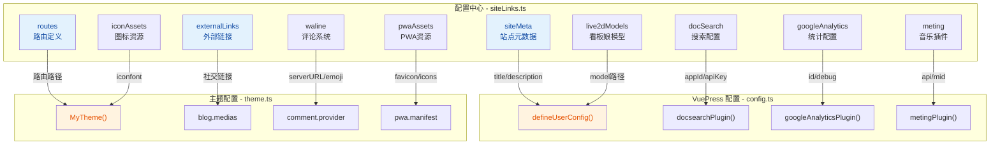
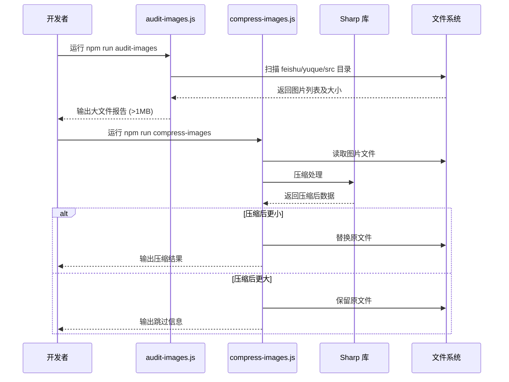

# v2.8.1 版本变更详情

> 日期：2026-05-22
> 从 v2.8.0 以来的工作区变更

---

## 可视化概览 (代码与逻辑映射)

```mermaid
graph TD
    subgraph "飞书知识库全量同步"
        A["飞书知识库<br/>144 篇文档"] -->|Elog 下载| A1["Markdown 文件<br/>144 篇"]
        A1 -->|移除空容器| A2["有效文档 101 篇"]
        A2 -->|灰常妹上传| A3["图片 → GitHub 图床"]

        B["scripts/sync-feishu.js"] -->|执行| A
        C["elog.feishu.config.js"] -->|配置| A
        D[".elog.env<br/>飞书密钥"] -->|环境变量| A
    end

    subgraph "FrontMatter 标准化"
        E["scripts/updateFrontMatter.js"] -->|gray-matter 解析| E1["读取所有 101 篇"]
        E1 -->|统一字段结构| E2["写入 title / date / category / tag"]
        E2 --> E3["完成 101 篇"]
    end

    subgraph "Git 提交规则"
        F[".trae/rules/git-commit-message.md"] -->|新增规则| F1["提交信息必须使用中文"]
    end

    subgraph "变更记录"
        G["changelogs/v2.8.0.md"] -->|新增| G1["v2.8.0 版本变更详情"]
        G2["CHANGELOG.md"] -->|追加 v2.8.0 条目| G3["关联 changelogs/v2.8.0.md"]
    end

    style A fill:#e3f2fd,color:#0d47a1
    style A1 fill:#e3f2fd,color:#0d47a1
    style A2 fill:#e3f2fd,color:#0d47a1
    style A3 fill:#e3f2fd,color:#0d47a1
    style B fill:#fff3e0,color:#e65100
    style C fill:#fff3e0,color:#e65100
    style D fill:#fff3e0,color:#e65100
    style E fill:#c8e6c9,color:#1a5e20
    style E1 fill:#c8e6c9,color:#1a5e20
    style E2 fill:#c8e6c9,color:#1a5e20
    style E3 fill:#c8e6c9,color:#1a5e20
    style F fill:#f3e5f5,color:#7b1fa2
    style F1 fill:#f3e5f5,color:#7b1fa2
    style G fill:#ffebee,color:#c62828
    style G2 fill:#ffebee,color:#c62828
    style G3 fill:#ffebee,color:#c62828
```

### 2.1 配置集中化架构

### 2.2 图片处理工作流

***

## 飞书知识库全量同步

### sync-feishu.js 执行结果

- **飞书知识库文档总数**：144 篇
- **全部下载完成**：✅
- **图片处理**：已存在于 GitHub 图床的图片跳过，新图片上传至 GitHub
- **空容器清理**：移除 **45 个**只有 frontmatter 无正文的父级目录文档
- **最终有效 .md 文件**：**101 篇**（不含 README.md）
- **输出目录**：`src/feishu/`（同步后经 Elog 处理，文件内容包含新的 frontmatter）

涉及的主要目录：

| 目录 | 内容示例 |
|---|---|
| `src/feishu/飞书知识库/AI/` | AI 全局路线图、Claude Code 系列、CC-Switch |
| `src/feishu/飞书知识库/前端/` | Vue/React/Angular 框架、CSS/Vite/WebPack 工具链 |
| `src/feishu/飞书知识库/前端/JS/` | JavaScript 基础（Promise/async/Set/Map）、浏览器原理 |
| `src/feishu/飞书知识库/前端/框架/` | Vue/React 深入、axios/Token/前端工程化 |
| `src/feishu/飞书知识库/前端/工程/` | Webpack/Vite/rollup.js 模块化 |

### feishu/ 图片同步

- 图片下载至本地 `feishu/` 目录并上传至 GitHub 图床
- Markdown 中的图片引用替换为 GitHub Raw 链接
- 图片文件：`.png` 格式，文件名由飞书返回的 token 生成

## FrontMatter 标准化

- [scripts/updateFrontMatter.js](scripts/updateFrontMatter.js) 对全部 101 篇飞书 Markdown 执行标准化处理
- **统一字段结构**：
  - `title`：从 Elog 同步的原始文档标题
  - `date`：同步日期（`2026-05-22`）
  - `category`：基于目录层级自动生成（如 `飞书知识库/AI/CC`）
  - `tag: feishu`：区分来源平台
  - `icon: bokeyuan`、`star: false`、`isOriginal: false`
- **gray-matter 库**：替代手写正则，确保 frontmatter 解析准确无误

## Git 提交规则

- [.trae/rules/git-commit-message.md](.trae/rules/git-commit-message.md)：将占位文本替换为实际规则
- **规则内容**：`提交信息必须使用中文`
- 适用于：后续所有 AI 生成的 Git 提交信息（通过 TRAE git-commit 流程）

## 变更记录初始化

- [changelogs/v2.8.0.md](changelogs/v2.8.0.md)：新建，从 v2.7.4 以来的完整累积变更详情
  - 包含 CI/CD 升级、Docker 多阶段构建、新工具链、同步脚本重构、siteLinks.ts 集中配置、README 改写等全部内容
  - 附带 Mermaid 可视化架构图，映射代码与逻辑关系
- [CHANGELOG.md](CHANGELOG.md)：追加 v2.8.0 条目，通过链接关联到 `changelogs/v2.8.0.md`
