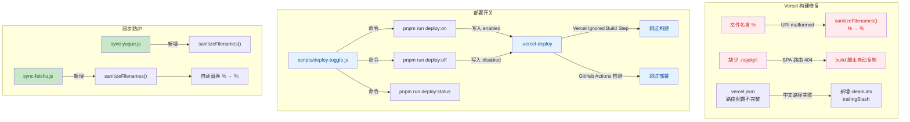

# v2.8.2 版本变更详情

> 日期：2026-06-03
> 从 v2.8.1 以来的工作区变更

---

## 可视化概览 (代码与逻辑映射)



## Vercel 构建修复

### URI malformed 错误修复

- **根因**：文件名 `8个ES2024实用特性,让代码量减少60%.md` 中的半角 `%` 被 Node.js `fileURLToPath()` 中的 `decodeURIComponent()` 解析为不合法的 URL 编码，抛出 `URIError: URI malformed`
- **修复**：重命名文件 `60%` → `六成`
- **长效防护**：[scripts/sync-feishu.js](scripts/sync-feishu.js) 和 [scripts/sync-yuque.js](scripts/sync-yuque.js) 新增 `sanitizeFilenames()` 函数，每次同步后自动将文件名中的 `%` 替换为全角 `％`

### SPA 路由 404 修复

- **根因**：构建产物 `src/.vuepress/dist/` 缺少 `.nojekyll` 文件，Vercel 默认启用 Jekyll 处理静态站点，导致 `/feishu/` 等子路由返回 404
- **修复**：项目根目录新增 [.nojekyll](.nojekyll)，`build` 脚本末尾自动复制到 dist：
  ```
  node -e "require('fs').copyFileSync('.nojekyll','src/.vuepress/dist/.nojekyll')"
  ```

### Vercel 路由配置

- [vercel.json](vercel.json) 新增 `cleanUrls: true` 和 `trailingSlash: false`，确保中文路径和多层级目录能正确路由到对应 `index.html`

## 部署开关功能

实现通过 `.vercel-deploy` 标记文件灵活控制自动部署触发状态。

| 命令 | 作用 |
|---|---|
| `pnpm run deploy:status` | 查看当前部署开关状态 |
| `pnpm run deploy:on` | 开启自动部署（默认） |
| `pnpm run deploy:off` | 关闭自动部署 |

### 工作流程

```
关闭开关 (pnpm run deploy:off)
  → .vercel-deploy 写入 "disabled"
  → Vercel Ignored Build Step 检测到 disabled → exit 0 → 跳过构建
  → GitHub Actions deploy-docs.yml 前置 job 检测到 disabled → 跳过部署
  → GitHub Actions docker-image.yml 前置 job 检测到 disabled → 跳过构建

开启开关 (pnpm run deploy:on)
  → .vercel-deploy 写入 "enabled"
  → 所有远程 pipeline 正常运行
```

### 涉及文件

- [scripts/deploy-toggle.js](scripts/deploy-toggle.js)：开关核心脚本，支持 `status` / `on` / `off` 三个命令
- [.vercel-deploy](.vercel-deploy)：标记文件，内容仅 `enabled` 或 `disabled`
- [.github/workflows/deploy-docs.yml](.github/workflows/deploy-docs.yml)：新增 `check-deploy-toggle` 前置 job，读取 `.vercel-deploy` 判断是否继续
- [.github/workflows/docker-image.yml](.github/workflows/docker-image.yml)：同上

### 配置要求

在 Vercel Dashboard → Project Settings → Git → **Ignored Build Step** 填入：
```
[ "$(cat .vercel-deploy | tr -d '[:space:]')" = "disabled" ]
```
当标记文件为 `disabled` 时，Vercel 跳过构建。

## siteLinks.ts 恢复

- [src/.vuepress/data/siteLinks.ts](src/.vuepress/data/siteLinks.ts) 从 git 历史恢复（131 行），修复构建时报 `Cannot read properties of undefined (reading 'home')` 的问题

## 文档更新

- [AGENTS.md](AGENTS.md)：新增 Deployment 和 Deploy Toggle 章节，记录部署开关的使用方式
