[Claude Code 终极版 FAQ 指南](https://linux.do/t/topic/803265)


[Any牌路由器使用清障！](https://linux.do/t/topic/1779614)
# 安装部分
[https://linux.do/t/topic/803265](https://linux.do/t/topic/803265)


部分软件包存在 个人偏好

如你明白其作用和意义 按需选择

如不明白 请悉数按序执行安装

目的是正确 方便 快乐 的使用

<<< 准备工作 从富强软件中获得其提供的 Proxy 端口 >>>

$$
env:HTTP_PROXY="http://127.0.0.1:Port"; $$
`env:HTTPS_PROXY="``http://127.0.0.1``:Port"`

<<< Powershell 中执行以上命令后被富强软件正确代理 >>>

**以保证 诸多软件包的安装拉取正常进行**
# Windows
### 1. [Windows Terminal](https://apps.microsoft.com/detail/9N0DX20HK701?hl=zh-cn&gl=CN&ocid=pdpshare)
安装好后 设定默认打开 系统内置 Powershell 并且给予默认为管理员权限

后续右键能够直接在所处文件夹内打开对应的终端 Shell


### WinGet
```shell
$progressPreference = 'silentlyContinue'
Install-PackageProvider -Name NuGet -Force | Out-Null
Install-Module -Name Microsoft.WinGet.Client -Force -Repository PSGallery | Out-Null
Write-Host "Using Repair-WinGetPackageManager cmdlet to bootstrap WinGet..."
Repair-WinGetPackageManager -AllUsers
```
### PowerShell 7
```plaintext
winget install Microsoft.PowerShell
```


切换默认为我们刚安装的 Powershell

"image")

同样修改其默认配置为 管理员启动


全部关闭后打开新终端窗口后 继续安装其他内容
### Notepad 4
```plaintext
winget install zufuliu.notepad4
```


使用命令 `Notepad4` 打开
使用系统集成设置 替换系统记事本 和 快捷打开方式
### Git for Windows
```bash
winget install --id Git.Git -e --source winget
```

### fnm
```plaintext
winget install Schniz.fnm
```


安装成功后同样关闭全部窗口 重新打开一个终端 Shell

继续安装 某版本 Node
```bash
fnm install lts/krypton
```
```bash
fnm use lts/krypton
```


需要对 FNM 给予一个环境启动
```bash
notepad $profile
```
没有已有 `PROFILE` 的情况下会提示不存在

需要新建，那么我们新建
```bash
New-Item –Path $Profile –Type File –Force
```
完成后再次使用命令 `notepad $profile` 打开

添加内容后保存
```rust
fnm env --use-on-cd --shell powershell | Out-String | Invoke-Expression
```

# 安装部分
部分软件包存在 个人偏好

如你明白其作用和意义 按需选择

如不明白 请悉数按序执行安装

目的是正确 方便 快乐 的使用

<<< 准备工作 从富强软件中获得其提供的 Proxy 端口 >>>

$$
env:HTTP_PROXY="http://127.0.0.1:Port"; $$
`env:HTTPS_PROXY="http://127.0.0.1:Port"`

<<< Powershell 中执行以上命令后被富强软件正确代理 >>>

**以保证 诸多软件包的安装拉取正常进行**
# Windows
### 1. [Windows Terminal](https://apps.microsoft.com/detail/9N0DX20HK701?hl=zh-cn&gl=CN&ocid=pdpshare)
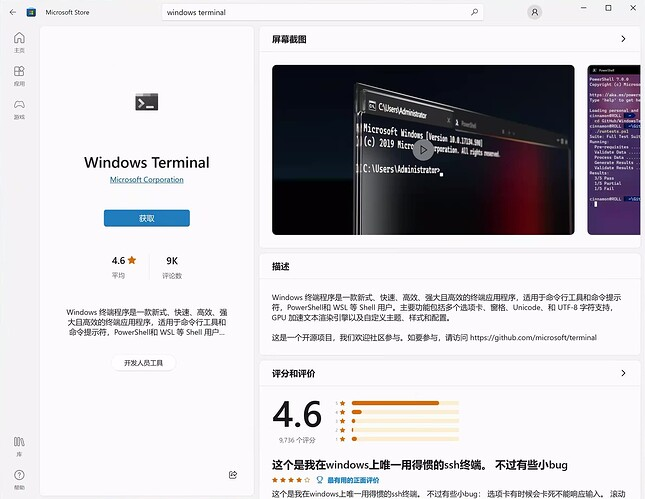
[image-202507201919045991920×1488 144 KB](https://cdn3.ldstatic.com/original/4X/e/0/1/e0147e114cc1b079aa012c1dfc56145876ebda29.jpeg)

安装好后 设定默认打开 系统内置 Powershell 并且给予默认为管理员权限
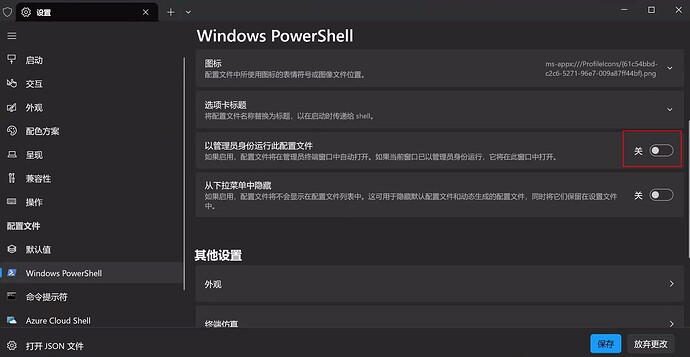
[image-202507201948555801920×994 74.5 KB](https://cdn3.ldstatic.com/original/4X/4/f/e/4fe53bd2bc246bf31c17f28390ff6d10e7387c57.jpeg)

后续右键能够直接在所处文件夹内打开对应的终端 Shell

### WinGet
```shell
$progressPreference = 'silentlyContinue'
Install-PackageProvider -Name NuGet -Force | Out-Null
Install-Module -Name Microsoft.WinGet.Client -Force -Repository PSGallery | Out-Null
Write-Host "Using Repair-WinGetPackageManager cmdlet to bootstrap WinGet..."
Repair-WinGetPackageManager -AllUsers
```
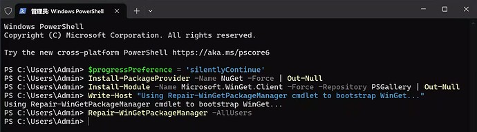
[image1920×534 77.2 KB](https://cdn3.ldstatic.com/original/4X/7/9/a/79a82a7fcdaae078643f3cfbfa444af54b8052b1.jpeg)
### PowerShell 7
```plaintext
winget install Microsoft.PowerShell
```
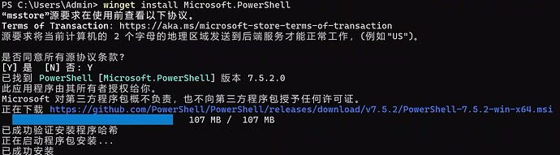
[image1920×533 87.3 KB](https://cdn3.ldstatic.com/original/4X/3/d/f/3df36b91ecc2b1f0013e349d4f37ec65995d220b.jpeg)

切换默认为我们刚安装的 Powershell
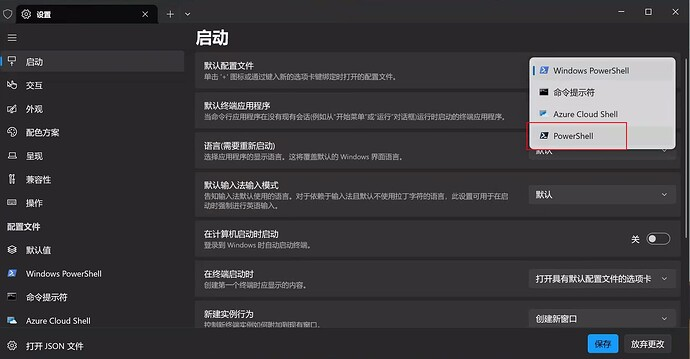
[image1920×1000 89.8 KB](https://cdn3.ldstatic.com/original/4X/f/1/c/f1c23df971278f2aa47d490faac3d33e3cd3b71e.jpeg)

同样修改其默认配置为 管理员启动

[image1676×164 68.1 KB](https://cdn3.ldstatic.com/original/4X/a/8/d/a8de24a87d2734becfdc264195b80965cb29da70.png)

全部关闭后打开新终端窗口后 继续安装其他内容
### Notepad 4
```plaintext
winget install zufuliu.notepad4
```
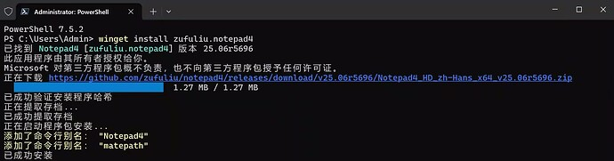
[image1920×504 64.9 KB](https://cdn3.ldstatic.com/original/4X/5/2/2/522e83a19496169f488c760929c638e8f313c2a6.jpeg)

使用命令 `Notepad4` 打开
使用系统集成设置 替换系统记事本 和 快捷打开方式
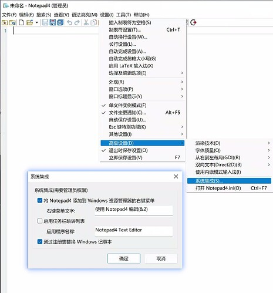
[image1438×1546 128 KB](https://cdn3.ldstatic.com/original/4X/e/a/3/ea36723810e17185180c0a9e6b667aa18a8ccbae.jpeg)
### Git for Windows
```bash
winget install --id Git.Git -e --source winget
```
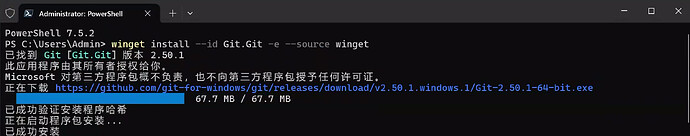
[image2340×464 153 KB](https://cdn3.ldstatic.com/original/4X/2/e/c/2ecb56b2e6fd318a4f8343a08c4bd03cdf148b59.jpeg)
### fnm
```plaintext
winget install Schniz.fnm
```
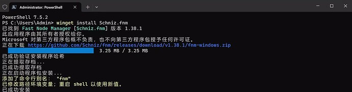
[image1920×503 60.3 KB](https://cdn3.ldstatic.com/original/4X/e/d/6/ed64ce0210e057add7fa36fd009fd6852e4d83fc.jpeg)

安装成功后同样关闭全部窗口 重新打开一个终端 Shell

继续安装 某版本 Node
```bash
fnm install lts/krypton
```
```bash
fnm use lts/krypton
```
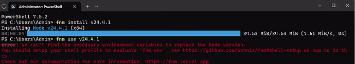
[image2342×426 146 KB](https://cdn3.ldstatic.com/original/4X/b/6/7/b6704d6b63a77af2430623878aabf4a6810b859a.jpeg)

需要对 FNM 给予一个环境启动
```bash
notepad $profile
```
没有已有 `PROFILE` 的情况下会提示不存在
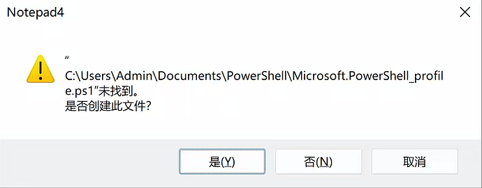
[image964×378 91.6 KB](https://cdn3.ldstatic.com/original/4X/0/7/0/07042af4cf9e3f7a1481767cf661f95f0daaca1a.png)

需要新建，那么我们新建
```bash
New-Item –Path $Profile –Type File –Force
```
完成后再次使用命令 `notepad $profile` 打开
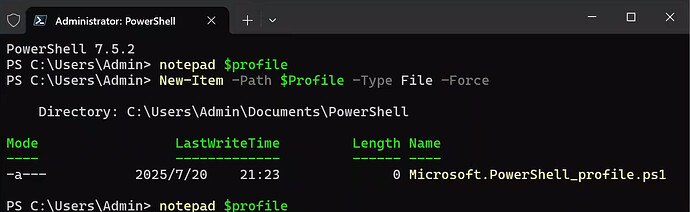
[image1628×502 108 KB](https://cdn3.ldstatic.com/original/4X/7/b/a/7bab9f8c88ce09870dfee7c807ee38c5c7812a94.jpeg)

添加内容后保存
```rust
fnm env --use-on-cd --shell powershell | Out-String | Invoke-Expression
```
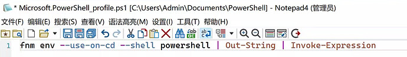
[image1394×200 84.9 KB](https://cdn3.ldstatic.com/original/4X/1/b/f/1bf10b99d0b20e6b2bf67bdc0ba3c3e1fa3c62fd.jpeg)

后同样关闭全部窗口 重新打开一个终端 Shell
- 使用刚才安装的版本

```bash
fnm use lts/krypton
```
成功应用默认 Node 版本
- 设定 npm 镜像源

```bash
npm config set registry https://registry.npmmirror.com
```
- 全局安装 Claude Code

```css
npm install -g @anthropic-ai/claude-code@2.1.112
```
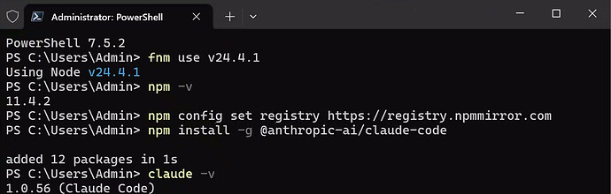
[image1552×496 100 KB](https://cdn3.ldstatic.com/original/4X/f/a/f/fafec11406c7d5331682ad7d82a9749e57daeec0.jpeg)
### （可选设定）美化相关
- 包含中文的等宽字体
[开发了一年多，开源等宽字体 Maple Mono 发布 v7.0 正式版](https://linux.do/t/topic/496409)
[MapleMonoNormal-NF-CN.zip](https://github.com/subframe7536/maple-font/releases/download/v7.9/MapleMonoNormal-NF-CN.zip)
	- 打开 powershell 修改默认字体为 `Maple Mono Normal NF CN`
		- 点击顶部下拉箭头 → 设置
			- 配置文件项中的 Powershell → 其他设置中的外观项 → 字体选择
		
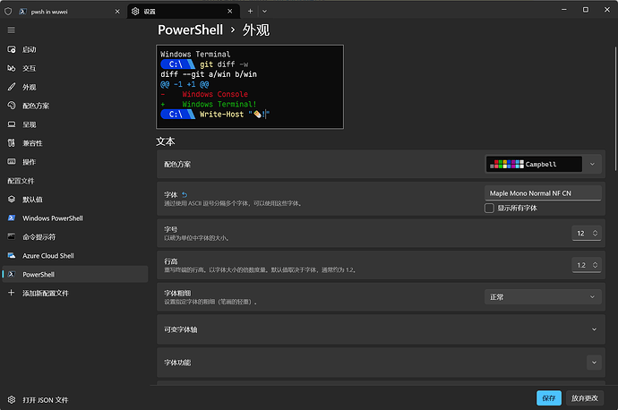
[image1978×1315 129 KB](https://cdn3.ldstatic.com/original/4X/b/1/8/b1809dbdd281037a365d1df19e2b8160e40e6339.png)
- Oh My Posh

```css
winget install JanDeDobbeleer.OhMyPosh --source winget --scope user --force
```
同样打开 `PROFILE` 新增激活 OhMyPosh
```bash
notepad $profile
```
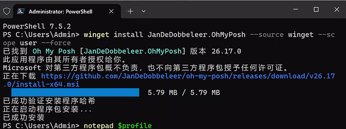
[image1544×576 174 KB](https://cdn3.ldstatic.com/original/4X/7/b/4/7b49b00210802e65b06335923ea61328bcc6f6d5.jpeg)
```perl
oh-my-posh init pwsh --eval | Invoke-Expression
```
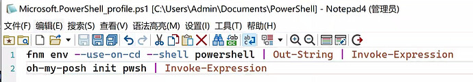
[image1350×236 102 KB](https://cdn3.ldstatic.com/original/4X/7/8/5/785217af8415c021a673727750218b7e1aa6f0ec.jpeg)
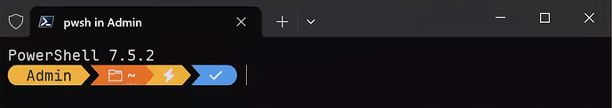
[image1268×226 57.9 KB](https://cdn3.ldstatic.com/original/4X/f/3/8/f3810ff471fff05ac5dd2ebd8fd4e2cfa08cd13f.png)

**主题样式很多 任君挑选** [Themes | Oh My Posh](https://ohmyposh.dev/docs/themes)
- [Claude Code StatusLine | 小工具 大用处！| 超绝更新自定义](https://linux.do/t/topic/859699)

---
# FAQ
#### Q: Windows Plan Mode 切换问题
- A: [Windows 下 claude code 如何切换到 plan 模式？ - #4，来自 Haleclipse](https://linux.do/t/topic/794815/4)


- 仅在 Node v24.2.0 / v22.17.0 以上Shift+Tab正确工作

- 其中 在不支持的 Node 版本上自动回退绑定到 Alt+M

- 2.0.31 使用 bun 构建的 CC 全端统一为 Shift+Tab，因其不存在 node 的这个问题

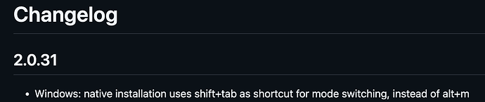
- [image1474×310 12.2 KB](https://cdn3.ldstatic.com/original/4X/3/5/d/35d6d2ffba3f9ec16212e03c45c5521ca6c5ce86.png)

#### Q: Windows 图片粘贴方法
- A: [win 下 claude code 怎么上传图片。 - #28，来自 Haleclipse](https://linux.do/t/topic/796754/28)


- macOS 1.0.61 增加了 ⌘ + V 的图片粘贴支持
原强制为 Ctrl + V 现粘贴体验更加一致

- Windows 1.0.93 增加了 Alt + V 的图片粘贴支持，原只能接收图片文件而不是剪贴板中的图片数据

#### Q: macOS 下 iTerm2 下换行绑定 工作正常，但 VSCode 类内嵌终端 该功能多出一个 `\` ？
- A: 因为历史问题兼容性 目前给到的 `keybindings.json` 绑定内容为 `"\\\r\n"`
初看似乎没有问题，但其会在换行后多输出一个 `\`
我们将其改为 `"\u001B\u000A"` 即可和 ⌥Option+Enter 行为一致

#### Q: Windows 触发错误异常弹出 `Error: cannot open _claude_fs_right:`
- A: 暂时卸载 VSCode 的 VSIX 扩展程序 其在编辑之时会将目标文件路径传递给 VSCode 进行协同，目前路径转换存在问题 待修复「并且关闭 IDE Auto Connect 功能」


- 此问题可能已在历史版本中修正，按照如上的安装方式 在 Powershell 下运行，一并解决了 链接 IDE 的找不到的问题

- 1.0.65 已修正链接 IDE 稳定性问题

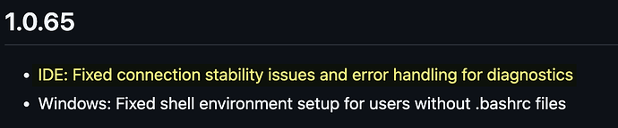
- [image1190×250 20.8 KB](https://cdn3.ldstatic.com/original/4X/b/c/2/bc235ad7aba13e2838824074aaf976fafbe31789.png)

#### Q: Windows 下 MCP Server (Stdio) 全部无法使用？
- A： 改成 `command: "cmd"` 后接 `arg : ["/c","npx"]`


- 原理：[关于 Windows 原生运行 claude code 的问题 - #4，来自 Haleclipse](https://linux.do/t/topic/784087/4)

- 样例：[Claude Code 原生 Windows 的 MCP 错误处理](https://linux.do/t/topic/782073)

- `claude mcp add --transport sse context7 https://mcp.context7.com/sse --header "CONTEXT7_API_KEY: YOUR_API_KEY"`

#### Q: 红色 Offline 字样是做什么用的？遥测相关会不会用于检测封号？
- A: Offline 只是用作真 连接状态检测 详见


- [windows claude code 显示 offline，但是不影响使用。 - #10，来自 Haleclipse](https://linux.do/t/topic/807647/10)

- 遥测信息仅元数据 封号不相关： [windows claude code 显示 offline，但是不影响使用。 - #7，来自 Haleclipse](https://linux.do/t/topic/807647/7)

#### Q: 官网 / 中转站 / CCR 类自定义重定向 API 接入，在设定上有何区别
- A:


---
---
---
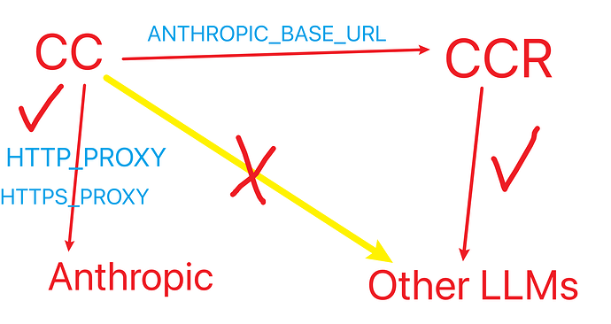
[image1676×890 78.2 KB](https://cdn3.ldstatic.com/original/4X/c/6/8/c68a1babe5e88340d02c1c9a510fc13671c116ef.png)
---
- 
	1. 官网：设定 `HTTP_PROXY` / `HTTPS_PROXY` 环境变量正常登录即可
		- [有使用 Claude code 的大佬吗，一直报 403 - #9，来自 Haleclipse](https://linux.do/t/topic/702742/9)
		- [使用 claude code 提示 offline - #12，来自 Haleclipse](https://linux.do/t/topic/784593/12)
	
- 
	1. 中转站：如无魔改 使用其提供的 api 端点地址和 key 设定即可
		- `ANTHROPIC_BASE_URL` (需是 Anthropic 形式接口)
		- `ANTHROPIC_API_KEY` (只有标准 Anthropic 填写此项)
		- `ANTHROPIC_AUTH_TOKEN` (有极高概率是此项)
		- 二选一而非可以共存
			- 案例：接入月之暗面 K2 (标准 Anthropic 形式接口)
		- `"ANTHROPIC_BASE_URL": "https://api.moonshot.cn/anthropic"`
			- `"ANTHROPIC_API_KEY":"你的Key"`
			- 案例：Aηyrouter (NewAPI 转换得来)
		- `"ANTHROPIC_BASE_URL": "https://aηyrouter.top"`
			- `"ANTHROPIC_AUTH_TOKEN": "sk-xxxxxx"`
		
- 
	1. 自定义 Anthropic 兼容接口接入：
		- 同中转站 但 KEY 处可置空 按照 Proxy 提供者的要求处理
		- 案例：接入 [Qwen Coder](https://linux.do/t/topic/803265/111)
		- CCR 接入 GLM-4.5 支持触发思考应如何配置？
		- [GLM4.5 如何在 claude code 里开启思考？ - #27，来自 Haleclipse](https://linux.do/t/topic/838507/27)
		
- **以上内容均只需在 **`~/.claude/settings.json`** 中的 **`env`** 节点下编辑 全篇无须操作系统的环境变量，以及折腾代理软件的诸如 TUN 系统代理等内容 ，来支持 CC 的使用**

- **并且需要注意 **`ANTHROPIC_API_KEY`** 的优先级要高于官网登录态，只要存在该 **`env`**，CC 将不会使用官网登录态的服务**

- ~~所以最简单的接入点切换方法暂时就是 copy 几份不同的 ~~`~/.claude/settings.json`~~ 文件 然后手动进行替换~~,后续会将这部分功能傻瓜化到 GUI 中 `Claudiatron`，以方便快速切换和设定这些内容

- v1.0.61 已经添加 `--settings` 参数，能够便捷化指定加载不同的 `settings.json` 配置

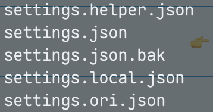
- [image358×188 20.8 KB](https://cdn3.ldstatic.com/original/4X/d/b/1/db166a2bd7b5077e9ebad211393f308a820b2c00.png)

- 目前在设置中开启 `Verbose Output` 恢复原有 详情输出 且添加了 上下文窗口实际值显示

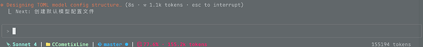
- [image2364×264 32.7 KB](https://cdn3.ldstatic.com/original/4X/b/6/c/b6ca02af18f6a8060aaa51659aebd87831d58372.png)

---
鉴于没有推进 SubAgent 的内容，这里给到一个集合网站给予参考
- [http://subagents.cc](http://subagents.cc/)

