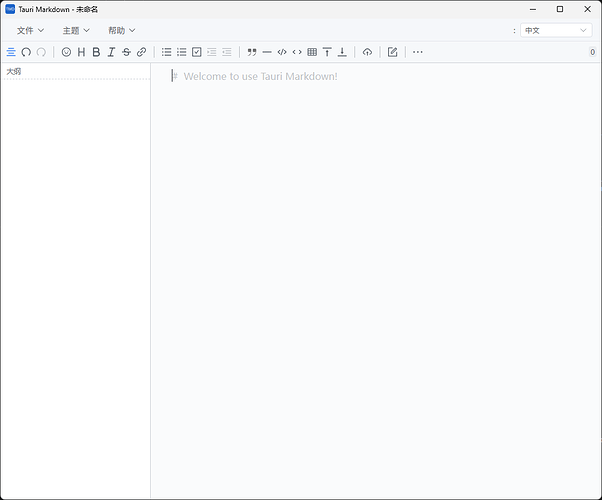
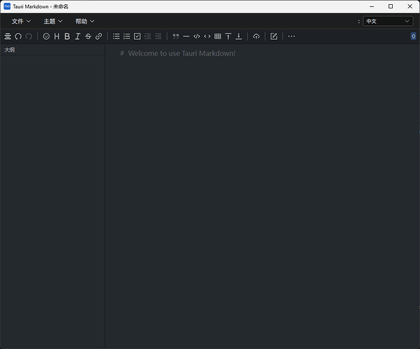

鸽了 4 年的软件 TauriMarkdown 借助 AI 更新了

原本是 tauri v1 的一个学习项目 demo

一个简单的本地 Markdown 工具, 使用 Tauri & Vditor & Vue3

更新后变得更加易用了，同时升级到了 tauri v2

[github.com](https://github.com/jeeinn/tauri-markdown)

### [GitHub - jeeinn/tauri-markdown: A simple local markdown tool, use Tauri & Vditor &...](https://github.com/jeeinn/tauri-markdown)
A simple local markdown tool, use Tauri & Vditor & Vue3
### 新增功能
- **文件导出**: 使用 Ctrl+Shift+S 快捷键导出 Markdown 文件

- **自动打开上次文件**: 启动时自动打开上次编辑的文件

- **动态窗口标题**: 在窗口标题中显示当前文件名和修改状态

- **主题切换**: 支持自动/浅色/深色主题，可检测系统偏好

- **多语言支持**: 完整的国际化支持，包括简体中文、繁体中文、英语、日语和韩语

- **直接保存**: 按 Ctrl+S 直接保存文件，无需对话框

- **新建文件**: 使用 Ctrl+N 创建新的 Markdown 文件

- **增强菜单栏**: 自定义顶部应用菜单，显示键盘快捷键

- **文件上传支持**: 文件上传与图片上传分离处理，支持更多文件类型

- **图片上传支持**: 直接拖拽或粘贴图片到编辑器，自动管理图片资源

- **文件关联支持**: 右击 .md/.markdown 文件可选择在应用中打开

软件截图

[tmdthemelight1002×832 14.8 KB](https://cdn3.ldstatic.com/original/4X/0/6/d/06d29ae6077aeffc1fb1bc4558bdcd7219a28ad2.png)

