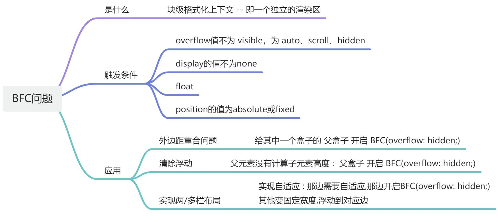
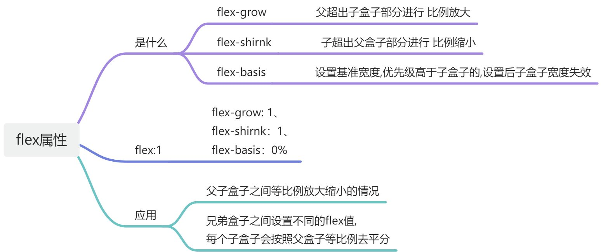
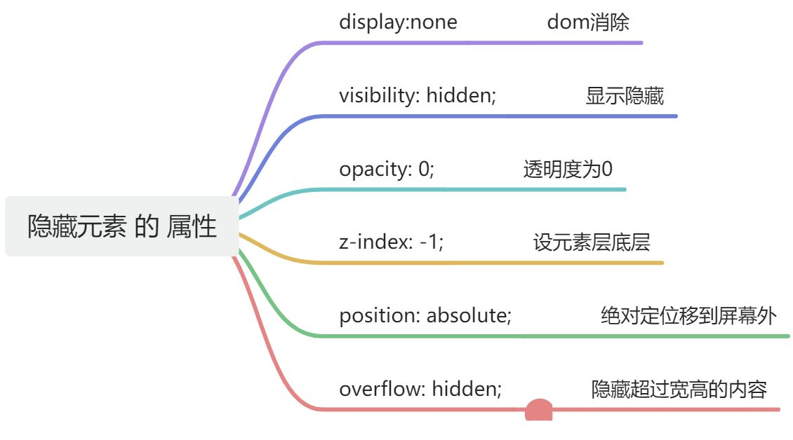

# Html5和CSS3

## 常见的水平垂直居中实现方案

[https://blog.csdn.net/m0_70705683/article/details/135777987](https://blog.csdn.net/m0_70705683/article/details/135777987)

**方案总结**

<details class="lake-collapse"><summary id="u241db6cd"><span class="ne-text">方案总结</span></summary>

#### 利用定位(父相子绝) + 位移

**-- 父相子绝 + 子 **margin**:**auto**;**

**-- 父相子绝 + 子 top,left 位移**50%; **transform**:**translate**(**-50%**,**-50%**);

```javascript
<style>
    .father{
        //width,height,其他省略
  
        position: relative;
    }
    .son{
        position: absolute;
        top:0;
        left:0;
        right:0;
        bottom:0;
        margin:auto;
    }
</style>
<div class="father">
    <div class="son"></div>
</div>
```

#### 利用定位+margin:负值

```javascript
<style>
    .father {
        position: relative;
        width: 200px;
        height: 200px;
        background: skyblue;
    }
    .son {
        position: absolute;
        top: 50%;
        left: 50%;
        margin-left:-50px;
        margin-top:-50px;
        width: 100px;
        height: 100px;
        background: red;
    }
</style>
<div class="father">
    <div class="son"></div>
</div>
```

#### table布局

```javascript
<style>
  .father {
 //width,height,其他省略

  display: table-cell;
  
  text-align: center;//水平居中
  vertical-align: middle;//垂直居中
}
.son {
 //width,height,其他省略

  display: inline-block;
}
</style>
  <div class="father">
  <div class="son"></div>
  </div>
```

#### flex弹性布局

```javascript
<style>
    .father {
        display: flex;
        justify-content: center;//主轴居中,默认水平居中
        align-items: center;//交叉轴居中,默认垂直居中
    }
    .son {
    }
</style>
<div class="father">
    <div class="son"></div>
</div>
```

#### grid网格布局

```javascript
<style>
    .father {
            display: grid;
            justify-content: center;//主轴居中,默认水平居中
            align-items: center;//交叉轴居中,默认垂直居中
        }
        .son {
        }
</style>
<div class="father">
    <div class="son"></div>
</div>
```

#### 拓展

**在CSS中实现元素的水平和垂直居中布局是一个常见需求，不同的元素类型（内联元素和块级元素）和布局方法（如Flexbox、Grid、定位等）提供了多种解决方案。以下是对您提供的文件内容的总结：**

### 内联元素居中布局

 **水平居中** **：**

* **行内元素可以通过设置父元素的 **`<span class="ne-text">text-align: center;</span>` 来实现水平居中。
* **使用Flexbox布局，可以设置父元素为 **`<span class="ne-text">display: flex;</span>` 并使用 `<span class="ne-text">justify-content: center;</span>` 来实现水平居中。

 **垂直居中** **：**

* **对于单行文本，可以通过设置父元素的高度等于行高（**`<span class="ne-text">height === line-height</span>`）来实现垂直居中。
* **对于多行文本，可以使用表格单元格布局，将父元素设置为 **`<span class="ne-text">display: table-cell;</span>` 并使用 `<span class="ne-text">vertical-align: middle;</span>` 来实现垂直居中。

### 块级元素居中布局

 **水平居中** **：**

* **对于已定义宽度的元素，可以通过设置 **`<span class="ne-text">margin: 0 auto;</span>` 来实现水平居中。
* **使用绝对定位，可以将元素的 **`<span class="ne-text">left</span>` 属性设置为 `<span class="ne-text">50%</span>`，然后使用 `<span class="ne-text">margin-left</span>` 设置为元素宽度的一半的负值来实现水平居中。

 **垂直居中** **：**

* **使用绝对定位，可以设置元素的 **`<span class="ne-text">top</span>`、`<span class="ne-text">left</span>`、`<span class="ne-text">margin-top</span>` 和 `<span class="ne-text">margin-left</span>`（如果已定义高度）来实现垂直居中。
* **通过设置父元素为 **`<span class="ne-text">display: table-cell;</span>` 并使用 `<span class="ne-text">vertical-align: middle;</span>` 可以实现垂直居中。
* **使用 **`<span class="ne-text">transform: translate(x, y);</span>` 可以在不知道元素宽高的情况下实现垂直居中。
* **使用Flexbox（**`<span class="ne-text">display: flex;</span>`）和Grid（`<span class="ne-text">display: grid;</span>`）也可以实现垂直居中，但Grid的兼容性相对较差。

</details>

---

## BFC问题

```markdown

```



[https://blog.csdn.net/qq_63299825/article/details/131048599](https://blog.csdn.net/qq_63299825/article/details/131048599)

<details class="lake-collapse"><summary id="u8f2438d8">拓展</summary>

## 一、[BFC](https://so.csdn.net/so/search?q=BFC&spm=1001.2101.3001.7020)的定义 (一个独立的渲染区)

 **BFC** **（Block Formatting Context），即** **块级格式化上下文** **，它是页面中的一块渲染区域，并且有一套属于自己的渲染规则,**

**1.内部的盒子会在垂直方向上一个接一个的放置**

**2.对于同一个BFC的俩个相邻的盒子的margin会发生重叠，与方向无关。**

**3.每个元素的左外边距与包含块的左边界相接触（从左到右），即使浮动元素也是如此**

**4.BFC的区域不会与float的元素区域重叠**

**5.计算BFC的高度时，浮动子元素也参与计算**

**6.BFC就是页面上的一个隔离的独立容器，容器里面的子元素不会影响到外面的元素，反之亦然**

**BFC目的是形成一个相对于外界完全独立的空间，让内部的子元素不会影响到外部的元素**

**在页面布局阶段，往往会因为BFC问题导致 页面布局发生错乱，如外边距合并问题，元素高度丢失，两栏布局没有实现自适应。**

## 二、触发BFC的条件

**1.根元素，即HTML元素**

**2.浮动元素：float值为left、right**

**3.overflow值不为 visible，为 auto、scroll、hidden**

**4.display的值为除了none以外的全部值, inline-block、inltable-cell、table-caption、table、inline-table、flex、inline-flex、grid、inline-grid**

**5.position的值为absolute或fixed**

## 四、BFC的应用场景([https://blog.csdn.net/qq_63299825/article/details/131048599](https://blog.csdn.net/qq_63299825/article/details/131048599))

#### **1.避免外边距重叠**

**当兄弟盒子设置 同时给兄弟元素设置一个下外边距同时设置一个上外边距,发生外边距合并**

```javascript
        <style>
            div:first-child {
                width: 100px;
                height: 100px;
                background: red;
                margin-bottom: 10px;
            }
            div:last-child {
                width: 100px;
                height: 100px;
                background: green;
                margin-top: 20px;
            }
        </style>
  
        <div class="cube"></div>
        <div class="cube"></div>
```


**最佳方法:**当我们 **给第一个盒子一个父盒子** **，并触发父盒子生成一个BFC,那么两个div就不属于同一个BFC,则不会出现外边距重叠问题。**

```javascript
         <style>
            .cube {
                width: 100px;
                height: 100px;
                background-color: red;
                margin-bottom: 10px;
            }
            .cube1:last-child {
                width: 100px;
                height: 100px;
                background-color: red;
                margin-top: 20px;
            }
            .container {
                /* 开启bfc属性  */
                overflow: hidden;
            }
        </style>
 
        <div class="container">
            <div class="cube"></div>
        </div>
        <div class="cube1"></div>
```


#### 2.[清除浮动](https://so.csdn.net/so/search?q=%E6%B8%85%E9%99%A4%E6%B5%AE%E5%8A%A8&spm=1001.2101.3001.7020)

**在父元素parent计算高度时，并没有计算子元素child的高度。**

```javascript
        <style>
            .parent {
                border: 10px solid red;
            }
            .child {
                width: 100px;
                height: 100px;
                background-color: blue;
                /* 浮动效果 */
                float: left;
            }
        </style>
 
        <div class="parent">
            <div class="child"></div>
        </div>
```


**我们给父元素生成BFC后，父元素在计算高度时就会将浮动子元素child的高度也计算到其中**

```javascript
            .parent {
                border: 10px solid red;
                /* 开启bfc overflow hidden auto */
                overflow: hidden;
            }
```


#### 3.实现两栏布局

**左侧设置宽度，右边自适应，右边开启BFC**

```javascript
	<style>
		.left{
			width: 300px;
			background-color: red;
			float: left;
		}
		.right{
			background-color: blue;
			/* 开启bfc */
			overflow: hidden;
		}
	</style>
  
    <div class="left">左侧定宽</div>
	<div class="right">右侧自适应右侧自适应右侧自适应右侧自适应
		右侧自适应右侧自适应右侧自适应右侧自适应右侧自适应右侧自适应
		右侧自适应右侧自适应右侧自适应右侧自适应右侧自适应右侧自适应
		右侧自适应右侧自适应右侧自适应右侧自适应右侧自适应右侧自适应
	</div>
```

**实现了两栏布局且右边是自适应**


#### 4.实现三栏布局

**思路:左右两边固定宽度，给左盒子float:left;给右盒子float:right，给中间盒子开启BFC,实现左右固定宽度，中间自适应的效果**

```javascript
        <style>
            /* 三列布局 左侧右侧定宽 中间自适应 */
            .left,
            .right {
                width: 100px;
                height: 50px;
                background-color: red;
            }
            .left {
                float: left;
            }
            .right {
                float: right;
            }
            .center {
                height: 100px;
                background-color: blue;
                /* 开启bfc */
                overflow: hidden;
            }
        </style>
  
        <div class="left"></div>
        <div class="right"></div>
        <div class="center"></div>
```


## 三、外边距合并问题

**.兄弟级外边距合并**

**        合并出现原因:同时给兄弟元素设置一个下外边距同时设置一个上外边距,发生外边距合并**

**        合并解决方案:**

**            1.只给其中一个兄弟元素设置外边距**

**            2.给下边外边距开启BFC**

**                1.display:inline-blick/flex**

**                2.position:absolute/fixed**

**                3.float:left**

**            3.给上边兄弟元素设置一个父元素 给父元素开启BFC**

**                overflow hidden/auto **

** 2.父子级外边距合并**

**        合并出现原因:同时给父子元素设置同一方向的一个外边距**

**        合并解决方案:**

**            1.给父元素设置padding属性**

**            2.给父元素设置border边框**

</details>

---

## flex:1:是哪些属性的缩写，对应的属性代表什么含义

**flex:1 属性时，**

**代表 flex-grow: 1、flex-shirnk：1、flex-basis：0%**



<details class="lake-collapse"><summary id="uc2dbeb54">拓展</summary>


* **flex:1实际代表的是三个属性的简写**
* **flex-grow**是用来增大盒子的，比如，当父盒子的宽度大于子盒子的宽度，父盒子的剩余空间可以利用flex-grow来设置子盒子增大的占比
* **flex-shrink**用来设置子盒子超过父盒子的宽度后，超出部分进行缩小的取值比例
* **flex-basis**是用来设置盒子的基准宽度，并且basis和width同时存在basis会把width干掉

**所以**flex：1；的逻辑就是用flex-basis把width干掉，然后再用flex-grow和flex-shrink增大的增大缩小的缩小，达成最终的效果**。**

* `<span class="ne-text">flex-basis</span>`：指定元素在主轴的大小，可以等同 `<span class="ne-text">width</span>`或者 `<span class="ne-text">height</span>`，优先级要高于 `<span class="ne-text">width</span>` 和 `<span class="ne-text">height</span>`

[https://www.cnblogs.com/mmzuo-798/p/17246920.html](https://www.cnblogs.com/mmzuo-798/p/17246920.html)

</details>

---

## 隐藏元素 的属性有哪些




<details class="lake-collapse"><summary id="ucf4c21c0">拓展</summary>

**在CSS中，隐藏元素可以通过多种方式实现，每种方式都有其特定的用途和效果。以下是一些常用的方法来隐藏元素：**

1. `<span class="ne-text">display: none;</span>`：

* **完全从文档流中移除元素，不占据任何空间。**
* **元素不会被显示，也不会影响到其他元素的布局。**

2. `<span class="ne-text">visibility: hidden;</span>`：

* **元素在页面上不可见，但它仍占据着原来的空间。**
* **与 **`<span class="ne-text">display: none;</span>` 不同，使用 `<span class="ne-text">visibility: hidden;</span>` 隐藏的元素仍会影响布局，因为它仍占据空间。

3. `<span class="ne-text">opacity: 0;</span>`：

* **将元素的透明度设置为0，使其完全透明，从而看不见。**
* **元素仍然占据空间，并且可以响应交互（如点击）。**

4. `<span class="ne-text">z-index: -1;</span>`：

* **通过将 **`<span class="ne-text">z-index</span>` 属性设置为负值，可以使元素被其他元素覆盖，从而在视觉上“隐藏”。
* **元素仍然可见，如果页面上没有其他元素覆盖它，或者在某些情况下，它可能会重新可见。**

5. `<span class="ne-text">position: absolute;</span>` 与 `<span class="ne-text">left</span>` **/** `<span class="ne-text">top</span>` 属性结合：

* **将元素通过绝对定位移出视口外，例如设置 **`<span class="ne-text">left: -9999px;</span>` 或 `<span class="ne-text">top: -9999px;</span>`。
* **元素不可见，但仍然占据空间。**

6. `<span class="ne-text">clip-path: inset(100%);</span>` 或 `<span class="ne-text">clip: rect(0, 0, 0, 0);</span>`：

* **使用 **`<span class="ne-text">clip-path</span>` 或 `<span class="ne-text">clip</span>` 属性将元素的可视区域设置为0，从而在视觉上隐藏元素。
* **元素不可见，且不占据空间。**

7. `<span class="ne-text">height: 0; width: 0;</span>`：

* **将元素的宽度和高度设置为0，使其不可见。**
* **元素不可见，且不占据空间，除非有边框或内边距。**

8. `<span class="ne-text">overflow: hidden;</span>`：

* **当与 **`<span class="ne-text">height</span>` 或 `<span class="ne-text">width</span>` 属性结合使用时，可以隐藏元素内溢出的内容。
* **元素本身仍然可见，但超出部分的内容不可见。**

9. **使用 **`<span class="ne-text">aria-hidden="true"</span>` ** 属性** **：**

* **这是一个无障碍性（accessibility）相关的属性，用于告知辅助技术（如屏幕阅读器）忽略该元素。**
* **元素在视觉上仍然可见，但不会传达给使用辅助技术的用户。**

10. `<span class="ne-text">pointer-events: none;</span>`：

* **禁止元素响应指针事件，如点击、悬停等。**
* **元素在视觉上仍然可见，但用户无法与之交互。**

**选择哪种方法取决于你的具体需求，比如是否需要元素继续参与文档流的布局，是否需要保持可访问性，或者是否需要元素在某些情况下重新可见。**

</details>

---
