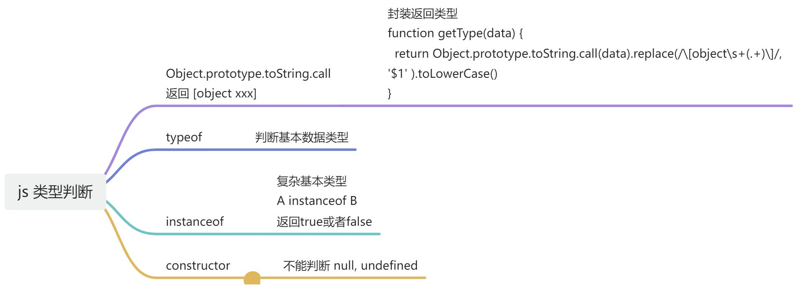
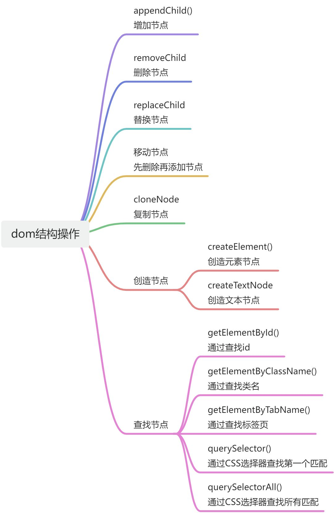
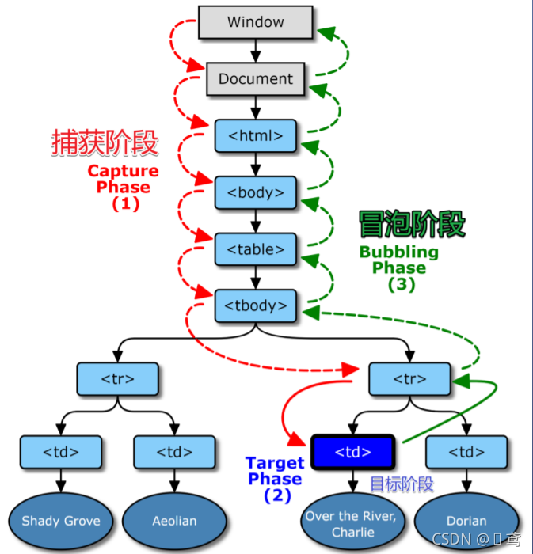

# JavaScript

# Js相关

<details class="lake-collapse"><summary id="u8404aeb8"></summary>

**Js相关**

**Js的基础类型，typeof和instanceof的区别**

**数组的forEach和map方法有哪些区别？常用哪些方法去对数组进行增、删、改**

**闭包和作用域**

**实现一个类以关键字new功能的函数**

**如何实现继承（原型和原型链）**

**箭头函数和普通函数有什么区别**

**迭代器(iterator)接口和生成器(generator)函数的关系**

**浏览器的事件循环机制**

</details>

## js 类型判断[ttps://blog.csdn.net/mywpython/article/details/134671186](https://blog.csdn.net/mywpython/article/details/134671186)



**Object.prototype.toString.call**

**Object.prototype.toString.call方法返回各数据类型的[object xxx]形式：**

**去掉Object.prototype.toString.call方法返回结果中的"[object"，只保留具体类型：**

```javascript

function getType(data) {
  return Object.prototype.toString.call(data).replace(/\[object\s+(.+)\]/, '$1' ).toLowerCase()
}
```

<details class="lake-collapse"><summary id="u1f7880bb"></summary>

**四、Object.prototype.toString.call**

**Object.prototype.toString.call方法返回各数据类型的[object xxx]形式：**

```javascript
 
const str = 'testme'
Object.prototype.toString.call(str) // [object String]
 
const num = 123
Object.prototype.toString.call(num) // [object Number]
 
const bol = true
Object.prototype.toString.call(bol) // [object Boolean]
 
const sy = Symbol('a')
Object.prototype.toString.call(sy) // [object Symbol]
 
const bi = BigInt("12345678910111213")
Object.prototype.toString.call(bi) // [object BigInt]
 
Object.prototype.toString.call(null) // [object Null]
 
Object.prototype.toString.call(undefined) // [object Undefined]
 
const arr = [1,5,7]
Object.prototype.toString.call(arr) // [object Array]
 
const obj = {a:3}
Object.prototype.toString.call(obj) // [object Object]
 
function Man(name,age) {
   this.name = name
   this.age = age
}
 
Object.prototype.toString.call(Man) // [object Function]
 
const man = new Man('Lily', 12)
Object.prototype.toString.call(man) // [object Object]
```

```javascript
1. 使用typeof判断基本类型：
const str = 'testme'
typeof str // string
 
const num = 123
typeof num // number
 
const bol = true
typeof bol // boolean
 
const nu = null
type nu // object
 
typeof undefVar // undefined
 
const sy = Symbol('a')
typeof sy // symbol
 
const bi = BigInt("12345678910111213")
typeof bi // bigint
 
2. 使用typeof判断引用类型：
 
const arr = [1,5,7]
typeof arr // object
 
const obj = {a:3}
typeof obj // object
 
function Man(name,age) {
   this.name = name
   this.age = age
}
typeof Man // function
 
const man = new Man('Lily', 12)
typeof man // object
```

**二、instanceof**

**使用方法:  A instanceof B**

```javascript
 
const arr = [1,5,7]
arr instanceof Array // true
 
const obj = {a:3}
obj instanceof Object // true
 
obj instanceof Array // false
 
function Man(name,age) {
   this.name = name
   this.age = age
}
 
Man instanceof Function // true
 
const man = new Man('Lily', 12)
man instanceof Object // true
```

**三、constructor**

```javascript

 
const str = 'testme'
str.constructor === String // true
 
const num = 123
num.constructor === Number // true
 
const bol = true
bol.constructor === Boolean // true
 
const arr = [1,5,7]
arr.constructor === Array // true
 
const obj = {a:3}
obj.constructor === Object // true
 
function Man(name,age) {
   this.name = name
   this.age = age
}
 
Man.constructor === Function // true
 
const man = new Man('Lily', 12)
man.constructor === Man // true
 
但是像 null、undefined这种就调用不了constructor判断数据类型了
```

---

</details>

## 怎么判断两个对象相等？

[https://juejin.cn/post/7408226845466902568](https://juejin.cn/post/7408226845466902568)

### 总结

**判断两个对象是否相等可以通过以下几种主要方式：**

* **引用比较** **：使用 **`<span class="ne-text">===</span>` 操作符，仅适用于比较对象引用。
* **JSON 字符串化** **：通过 **`<span class="ne-text">JSON.stringify()</span>` 方法比较对象的字符串表示，适用于简单对象。
* **深度比较** **：递归地比较对象的属性，适用于复杂对象。**
* **使用第三方库** **：如 ****Lodash** 或其他深度比较库，处理各种复杂的比较需求。_.isEqual(obj1, obj2)

<details class="lake-collapse"><summary id="u859f2f44"><span class="ne-text">判断两个对象相等</span></summary>

**在JavaScript中，判断两个对象是否相等或者判断一个对象是否为空，涉及到几个不同的概念和方法。**

**JavaScript中的对象是引用类型，这意味着当你比较两个对象时，即使它们包含相同的数据，它们也是不相等的，因为它们在内存中的地址不同。以下是一些判断对象相等的方法：**

1. **严格等于（** `<span class="ne-text">===</span>` **）** **：这会检查两个对象是否是同一个引用，如果不是同一个引用，则返回** `<span class="ne-text">false</span>`。

```javascript
const obj1 = { a: 1 };
const obj2 = { a: 1 };
console.log(obj1 === obj2); // 输出 false
```

2. **JSON.stringify()** **：将对象转换为JSON字符串，然后比较字符串是否相同。这种方法适用于简单对象，但对于包含函数、循环引用或特殊对象（如** `<span class="ne-text">Date</span>`）的对象不适用。

```javascript
const obj1 = { a: 1 };
const obj2 = { a: 1 };
console.log(JSON.stringify(obj1) === JSON.stringify(obj2)); // 输出 true
```

3. **使用库** **：有一些库如lodash提供了深度比较功能，可以比较两个对象的内容是否相等。**

```javascript
import _ from 'lodash';
const obj1 = { a: 1 };
const obj2 = { a: 1 };
console.log(_.isEqual(obj1, obj2)); // 输出 true
```

---

</details>

## 如何判断空对象？

**总结**

**包含可枚举 和 不可枚举 **

 **Reflect.ownKeys() ( 强烈推荐) :** **返回一个数组，包含对象自身的** **所有属性键** **(包含** **symbol** **)，包括不可枚举的属性和符号属性。**

```javascript
Object.keys(obj).length === 0 // 输出 true
```

**Object.getOwnPropertyNames: **方法返回一个数组，包含对象自身的 **所有属性名** **，不管它们是否可枚举。**

```javascript
Object.getOwnPropertyNames(obj).length === 0 // 输出 true
```

**可枚举**

**JSON.stringify(obj) === '{}'**

**Object.keys(obj).length === 0**

**Object.entries(obj).length === 0**

**for...in循环**

### 判断空对象

<details class="lake-collapse"><summary id="u3f72465b"><span class="ne-text">Object.getOwnPropertyNames()或者Reflect.ownKeys()。</span></summary>

`<span class="ne-text">Object.getOwnPropertyNames()</span>` 和 `<span class="ne-text">Reflect.ownKeys()</span>` 是 JavaScript 中用于获取对象自身属性的方法，包括不可枚举的属性和符号属性。这两个方法都可以帮助你判断一个对象是否为空，但它们有一些区别。

### Object.getOwnPropertyNames()

`<span class="ne-text">Object.getOwnPropertyNames()</span>` 方法返回一个数组，包含对象自身的所有属性名，不管它们是否可枚举。

```javascript
const obj = { a: 1 };
Object.defineProperty(obj, 'b', {
  value: 2,
  enumerable: false
});

console.log(Object.getOwnPropertyNames(obj)); // 输出 ["a", "b"]
```

**在这个例子中，**`<span class="ne-text">"b"</span>` 属性是不可枚举的，但 `<span class="ne-text">Object.getOwnPropertyNames()</span>` 仍然能够获取到它。

### Reflect.ownKeys()

`<span class="ne-text">Reflect.ownKeys()</span>` 方法返回一个数组，包含对象自身的所有属性键，包括不可枚举的属性和符号属性。

```javascript
const obj = { a: 1 };
Object.defineProperty(obj, 'b', {
  value: 2,
  enumerable: false
});
const symbol = Symbol('c');
obj[symbol] = 3;

console.log(Reflect.ownKeys(obj)); // 输出 ["a", "b", Symbol(c)]
```

**在这个例子中，**`<span class="ne-text">Reflect.ownKeys()</span>` 不仅获取了不可枚举的属性 `<span class="ne-text">"b"</span>`，还获取了符号属性 `<span class="ne-text">Symbol(c)</span>`。

**要判断一个对象是否为空，你可以使用这两个方法中的任何一个来获取对象的所有自身属性键，然后检查返回的数组是否为空。**

```javascript
const obj = {};

// 使用 Object.getOwnPropertyNames()
console.log(Object.getOwnPropertyNames(obj).length === 0); // 输出 true

// 使用 Reflect.ownKeys()
console.log(Reflect.ownKeys(obj).length === 0); // 输出 true
```

**在这两个例子中，如果对象 **`<span class="ne-text">obj</span>` 没有任何自身的属性，那么这两个方法都会返回一个空数组，数组的长度为0，表示对象为空。

### 总结

* `<span class="ne-text">Object.getOwnPropertyNames()</span>`：返回对象自身的所有属性名，包括不可枚举的属性。
* `<span class="ne-text">Reflect.ownKeys()</span>`：返回对象自身的所有属性键，包括不可枚举的属性和符号属性。

**在大多数情况下，**`<span class="ne-text">Reflect.ownKeys()</span>` 提供了更全面的结果，因为它还包括了符号属性。如果你只需要获取字符串属性名，那么 `<span class="ne-text">Object.getOwnPropertyNames()</span>` 就足够了。在选择使用哪个方法时，需要根据你的具体需求来决定。

</details>

<details class="lake-collapse"><summary id="u757a8b40"><span class="ne-text">判断空对象</span></summary>

**空对象指的是一个对象没有任何可枚举的属性。以下是一些判断对象是否为空的方法：**

1. **for...in循环** **：使用** `<span class="ne-text">for...in</span>`循环遍历对象的属性，如果没有属性执行，那么对象为空。

```javascript
const obj = {};
for (let key in obj) {
  if (obj.hasOwnProperty(key)) {
    console.log('Object is not empty');
    return;
  }
}
console.log('Object is empty');
```

2. **Object.keys()** **：这个方法返回一个包含对象所有自身可枚举属性的数组，如果数组长度为0，则对象为空。**

```javascript
const obj = {};
console.log(Object.keys(obj).length === 0); // 输出 true
```

3. **JSON.stringify()** **：将对象转换为JSON字符串，空对象转换后的结果是一个空的大括号** `<span class="ne-text">{}</span>`。

```javascript
const obj = {};
console.log(JSON.stringify(obj) === '{}'); // 输出 true
```

4. **Object.entries()** **：这个方法返回一个给定对象自身可枚举属性的键值对数组，如果数组长度为0，则对象为空。**

```javascript
const obj = {};
console.log(Object.entries(obj).length === 0); // 输出 true
```

**请注意，这些方法只能检测对象是否有可枚举的属性，它们不会检查对象的原型链上的属性。如果需要检查对象是否完全没有属性（包括不可枚举的属性和原型链上的属性），可以使用** `<span class="ne-text">Object.getOwnPropertyNames()</span>`或者 `<span class="ne-text">Reflect.ownKeys()</span>`。

---

</details>

## 数组的forEach和map方法有哪些区别？常用哪些方法去对数组进行增、删、改

<details class="lake-collapse"><summary id="u676907e8"><span class="ne-text">拓展</span></summary>

`<span class="ne-text">forEach</span>` 和 `<span class="ne-text">map</span>` 是JavaScript中用于数组遍历和元素处理的两个常用方法，它们有一些关键的区别：

### forEach 方法

* `<span class="ne-text">forEach</span>` 方法会对数组的每个元素执行一次提供的函数。
* **它不返回任何值，即返回 **`<span class="ne-text">undefined</span>`。
* **它不能被中断，即使在回调函数中抛出错误，**`<span class="ne-text">forEach</span>` 也会继续执行直到数组的末尾。
* **它常用于执行副作用操作，如数组的遍历、累加求和等。**

```javascript
let numbers = [1, 2, 3];
numbers.forEach(function(number) {
  console.log(number); // 输出每个元素
});
```

### map 方法

* `<span class="ne-text">map</span>` 方法也遍历数组的每个元素，但会返回一个新数组，新数组的元素是原数组元素经过回调函数处理后的结果。
* **它不会更改原数组，而是创建一个新数组。**
* **它可以通过返回值进行链式调用。**
* **它常用于对数组中的每个元素进行转换或计算，并获取一个新的数组。**

```javascript
let numbers = [1, 2, 3];
let squares = numbers.map(function(number) {
  return number * number; // 返回每个元素的平方
});
console.log(squares); // 输出 [1, 4, 9]
```

### 增删改方法

**对于数组的增、删、改操作，JavaScript 提供了多种方法：**

**增加元素：**

* `<span class="ne-text">push(...items)</span>`：在数组末尾添加一个或多个元素，并返回新的长度。
* `<span class="ne-text">unshift(...items)</span>`：在数组开头添加一个或多个元素，并返回新的长度。
* `<span class="ne-text">splice(index, 0, ...items)</span>`：在指定位置添加元素。

**删除元素：**

* `<span class="ne-text">pop()</span>`：删除数组的最后一个元素，并返回被删除的元素。
* `<span class="ne-text">shift()</span>`：删除数组的第一个元素，并返回被删除的元素。
* `<span class="ne-text">splice(index, count)</span>`：删除指定位置的元素。
* `<span class="ne-text">filter(callback)</span>`：创建一个新数组，包含通过测试的所有元素。

**修改元素：**

* `<span class="ne-text">splice(index, count, ...items)</span>`：删除指定位置的元素，并可在该位置添加新元素。
* `<span class="ne-text">slice()</span>` 结合 `<span class="ne-text">concat()</span>` 或 `<span class="ne-text">push()</span>`：创建一个数组的副本，然后添加或修改元素。
* `<span class="ne-text">map(callback)</span>`：创建一个新数组，其元素是原数组元素经过回调函数处理后的结果。

**其他常用方法：**

* `<span class="ne-text">concat(...items)</span>`：创建一个新数组，包含原数组的元素和/或额外的参数。
* `<span class="ne-text">slice(start, end)</span>`：提取原数组的一部分，返回一个新数组。
* `<span class="ne-text">reduce(callback, initialValue)</span>`：将数组中的值通过回调函数处理后缩减为单一的返回值。
* `<span class="ne-text">find(callback)</span>`：返回数组中满足提供的测试函数的第一个元素的值。
* `<span class="ne-text">some(callback)</span>`：检测数组中至少有一个元素通过测试。
* `<span class="ne-text">every(callback)</span>`：检测数组的所有元素是否都通过了测试。

**选择哪种方法取决于你的具体需求，比如是否需要修改原数组、是否需要返回新数组、是否需要执行复杂的条件检查等。**

---

</details>

## 闭包和作用域

 **把闭包简单理解成“定义在一个函数内部的函数”** **。**

[https://blog.csdn.net/Ed7zgeE9X/article/details/133819940](https://blog.csdn.net/Ed7zgeE9X/article/details/133819940)

[https://blog.csdn.net/Ed7zgeE9X/article/details/133819940](https://blog.csdn.net/Ed7zgeE9X/article/details/133819940)

## 实现一个类以关键字new功能的函数

**相当于创建一个 空对象,并将其 原型 和 this指向 绑定其构造函数 然后返回对象**

**在js中new关键字主要做了：**

**首先创建一个空对象，这个对象会作为执行new构造函数之后返回的对象实例，**

**将创建的空对象原型（**`<span class="ne-text">__proto__</span>`）指向构造函数的prototype属性，

**同时将这个空对象赋值给构造函数内部的this，并执行构造函数逻辑，**

**根据构造函数的执行逻辑，返回初始创建的对象或构造函数的显式返回值。**

```javascript
function newFn(...args) {
  const constructor = args.shift();
  const obj = Object.create(constructor.prototype);
  const result = constructor.apply(obj, args);
  return typeof result === "object" && result !== null ? result : obj;
}

function Person(name) {
  this.name = name;
}

const p = newFn(Person, "Jerome");

console.log("p.name :>> ", p.name); // p.name :>>  Jerome
```

**在编程中，“关键字new功能”通常指的是使用** `<span class="ne-text">new</span>`关键字来创建一个类的新实例。下面我将提供一个简单的示例，展示如何在JavaScript中实现一个类，并使用 `<span class="ne-text">new</span>`关键字来创建其实例。

```javascript
// 定义一个类
class Person {
  // 构造函数，用于初始化实例
  constructor(name, age) {
    this.name = name; // 实例的name属性
    this.age = age;   // 实例的age属性
  }

  // 实例方法，可以被所有实例调用
  greet() {
    console.log(`Hello, my name is ${this.name} and I am ${this.age} years old.`);
  }
}

// 使用new关键字创建Person类的实例
let person1 = new Person('Alice', 30);

// 调用实例方法
person1.greet(); // 输出: Hello, my name is Alice and I am 30 years old.
```

**在这个例子中，**`<span class="ne-text">Person</span>`是一个类，它有一个构造函数 `<span class="ne-text">constructor</span>`，用于初始化实例的属性（`<span class="ne-text">name</span>`和 `<span class="ne-text">age</span>`）。`<span class="ne-text">greet</span>`是一个实例方法，可以通过创建的实例调用。

**当你使用** `<span class="ne-text">new Person('Alice', 30)</span>`时，你实际上是在创建一个新的 `<span class="ne-text">Person</span>`对象，并且调用了它的构造函数来初始化属性。之后，你可以使用这个新创建的对象来调用它的方法，比如 `<span class="ne-text">person1.greet()</span>`。

**如果你需要在其他编程语言中实现类似的功能，请告诉我具体的语言，我可以提供相应的示例。**

[https://blog.csdn.net/qq_17335549/article/details/138100619](https://blog.csdn.net/qq_17335549/article/details/138100619)

---

## 如何实现继承（原型和原型链）

[https://blog.csdn.net/qq_17335549/article/details/138100619](https://blog.csdn.net/qq_17335549/article/details/138100619)

**使用class语法，用extends进行继承, 或 直接改变对象的__proto__指向。**

### 总结

**总之关于原型这块记住三句话**

1. **对象有一个内置属性 [[Prototype]]，使用 Object.getPrototypeOf(obj) 获取**
2. **函数有一个公开可访问不可枚举属性 prototype**
3. **函数的 prototype 属性有一个公开可访问的不可枚举属性 constructor，指向函数本身**

### 2.4 原型相关的面试题目

#### 2.4.1 说说你对原型和原型链的理解

**回答问题分文两步**

**（1）原型/原型链是什么？【引用上面的三句话即可】**

**在 js 中每个对象都有一个内置属性 [[prototype]]，可以使用 Object.getPrototypeOf 来获取，指向一个对象；同样的，这个指向的对象也有内置属性[[prototype]] 这样就构成了原型链，原型链最终会指向 Object.prototype，而 Object.prototype 的内置属性 [[prototype]] 指向 null.**

**同时函数都有一个公开可访问属性 prototype，这个 prototype 属性又有一个 constructor 属性指向函数本身。**

**（2）原型链有什么用？【属性查找、继承、扩展、属性和方法的共享】**

**当访问对象的一个属性的时候，如果自身没有找到，就会去原型链上查找，直到找到该属性，或者遍历完完整的原型链，也就是说可以使用原型链实现继承功能。对象可以通过原型链继承父对象的属性或者方法【继承】**

**也可以使用原型链对对象进行扩展，通过修改原型对象，可以给所有的实例进行属性的增加或修改。如果我们在一个对象的原型上添加属性或者方法，所有基于该原型的实例都会自动继承这些属性和方法，这样可以在不修改每个实例的情况下，实现对对象的扩展【扩展】【注意这一点也是原型链继承的弊端】【也是实例之间属性和方法的共享的方法】**

### 六、寄生式组合继承


**我不喜欢这个名字，因为他听起来很高端的样子，还不如叫 es5 继承终极版！**

**很简单，把 new Person() 换成 Object.create(Person.prototype)就行了。**

```javascript
function Person(age) {
    this.name = 'mike';
    this.age = {
        num: age
    }
}
 
Person.prototype.getName = function() {
    return this.name;
}
function Student(gender, age) {
    // 重点1
    Person.call(this, age)
    this.gender = gender
}
 
// 重点2
Student.prototype = Object.create(Person.prototype)
// 重点3
Student.prototype.constructor = Student;
 
const student = new Student('man', 12);
const student1 = new Student('women', 25)
console.log(Object.getPrototypeOf(student))
 
// 修改第一个实例
student.age.num = 3
console.log('第一个学生', student.age, student.getName())
console.log('第二个学生', student1.age, student1.getName())
 
 
```

**这里面其实应用到了，Object.create 的原理，这也是一个面试题目，而且也有可能让你手写一个 Object.create 请看**[这篇文章。](https://blog.csdn.net/qq_17335549/article/details/128050681)

### 小结

**好吧，整半天就一套代码，如果面试官让你写 es5 的继承，你直接上来就终极版代码安排，我想他应该没有什么可问的了吧，所以你别看概念上那么继承方式那么多，但是实际应用就是一个！一定要记住，可别再翻车了。**

**那么还有最后一个问题就是 es6 中的继承了！**

### 七、es6 继承

#### 7.1 代码实现

**使用类 class + extends 实现继承。主要还是学会使用class 类的各种语法，有几个关键点**

**class 中只能有一个构造函数 constructor**

**可以使用 static 定义静态属性和方法，直接使用类名调用**

**子类使用 extends 关键字继承父类，且只能继承一个【说明 es6 原生也不支持多重继承】**

**子类在构造函数 constructor 中使用 super 来调用父类的构造函数，并且可以传递参数**

**子类中的方法和父类的同名，会覆盖父类的方法**

**必须使用 new 操作符，创建 class 示例**

```javascript
class Person {
    // 定义属性
    lang = 'zh'
    // 定义静态属性
    static nation = 'china'
    // 构造函数
    constructor(age) {
        this.name = 'mike'
        this.age = {
            num: age
        }
    }
    // 定义方法
    getName() {
        return this.name
    }
    // 定义静态方法
    static getDes () {
        return 'hello word'
    }
}
 
class Student extends Person {
    constructor(gender, age) {
        super(age)
        this.gender = gender
    }
}
const student = new Student('man', 12)
const student1 = new Student('women', 25)
student.age.num = 234
 
console.log('静态属性方法',Person.nation, Person.getDes())
console.log('第一个学生', student.lang, student.getName())
console.log('第二个学生', student1, student.getName())
```

**7.2 面试题目**

**这个时候肯定会问 es5 中的类和 es6 中的类的区别了，用自己的话总结一些这篇文章的内容即可。**

**7.2.1 es5 中类 es6 中的继承有什么区别**

**注意 es6 的class 有一个私有属性和方法，以#开头的，这个倒是不常用。**

**7.2.2 ts 中的类和 es6 中的类有什么区别**

**ts 中有类型检查**

**ts 有访问描述符 private 、public 、protected 等，js 中只有 #开头描述的私有属性**

**ts 中有抽象类和方法的概念**

**抽象类可以包含抽象方法，而接口只能定义方法的签名**

**ts 支持范型**

---

## 箭头函数和普通函数有什么区别

**箭头函数** **不会创建自身的this** **，只会从上一级继承this，箭头函数的this在定义的时候就已经确认了，之后不会改变。**

**同时箭头函数** **无法作为构造函数使用** **，**

**没有自身的** **prototype** **，**

**也没有** **arguments** **。**

[https://blog.csdn.net/weixin_46098577/article/details/131005395](https://blog.csdn.net/weixin_46098577/article/details/131005395)

[https://blog.csdn.net/weixin_46098577/article/details/131005395](https://blog.csdn.net/weixin_46098577/article/details/131005395)


## 迭代器(iterator)接口和生成器(generator)函数的关系

**任意一个对象实现了遵守迭代器协议的[Symbol.iterator]方法，那么该对象就可以调用[Symbol.iterator]返回一个遍历器对象。**

**生成器函数就是遍历器生成函数，故可以把generator赋值给对象的[Symbol.iterator]属性，从而使该对象具有迭代器接口。**

```javascript
class ClassRoom {
  constructor(address, name, students) {
    this.address = address;
    this.name = name;
    this.students = students;
  }

  entry(student) {
    this.students.push(student);
  }

  *[Symbol.iterator]() {
    yield* this.students;
  }

  // [Symbol.iterator]() {
  //   let index = 0;
  //   return {
  //     next: () => {
  //       if (index < this.students.length) {
  //         return { done: false, value: this.students[index++] };
  //       } else {
  //         return { done: true, value: undefined };
  //       }
  //     },
  //     return: () => {
  //       console.log("iterator has early termination");
  //       return { done: true, value: undefined };
  //     },
  //   };
  // }
}

const classOne = new ClassRoom("7-101", "teach-one-room", ["rose", "jack", "lily", "james"]);

for (const stu of classOne) {
  console.log("stu :>> ", stu);
  // stu :>>  rose
  // stu :>>  jack
  // stu :>>  lily
  // stu :>>  james
  // if (stu === "lily") return;
}


```

---

## 浏览器的事件循环机制

**先进行宏任务(script)内的内容;**

**再去执行微任务队列{**

**--消息队列有优先级 :按照任务类型分(chrome浏览器中)**

**--微队列 [最高] promise.then方法**

**--交互队列 [高] 点击操作等**

**--延时队列 [中] 延时,循环延时}**

**然后执行微任务如果有嵌套看先执行宏任务在再按照优先级执行微任务**

---

## 列举宿主对象、内置对象、原生对象并说明其定义


<details class="lake-collapse"><summary id="u02d03fba"></summary>

**在JavaScript中，宿主对象（Host Objects）、内置对象（Built-in Objects）和原生对象（Native Objects）是与执行环境相关的概念。以下是它们的定义和区别：**

### 宿主对象（Host Objects）

**宿主对象是由JavaScript运行环境（如浏览器或Node.js）提供的，而不是由ECMAScript规范定义的对象。宿主对象的具体特性和行为可能会因不同的宿主环境而异。**

* **定义** **：宿主对象是依赖于宿主环境（如浏览器或服务器）的对象，它们提供了与宿主环境交互的能力。**
* **例子** **：**
* **在浏览器中，**`<span class="ne-text">window</span>`、`<span class="ne-text">document</span>`、`<span class="ne-text">XMLHttpRequest</span>` 等都是宿主对象。
* **在Node.js中，**`<span class="ne-text">global</span>`、`<span class="ne-text">process</span>`、`<span class="ne-text">console</span>` 等都是宿主对象。

### 内置对象（Built-in Objects）

**内置对象是由ECMAScript规范定义的对象，它们在任何JavaScript环境中都是可用的。这些对象提供了核心功能，如数据类型、错误处理、数学计算等。**

* **定义** **：内置对象是ECMAScript规范中定义的对象，它们是语言的一部分，不依赖于宿主环境。**
* **例子** **：**
* `<span class="ne-text">Object</span>`、`<span class="ne-text">Array</span>`、`<span class="ne-text">String</span>`、`<span class="ne-text">Number</span>`、`<span class="ne-text">Boolean</span>` 等是内置对象，用于表示基本数据结构。
* `<span class="ne-text">Date</span>`、`<span class="ne-text">Math</span>`、`<span class="ne-text">JSON</span>`、`<span class="ne-text">Error</span>` 等也是内置对象，提供了特定的功能。

### 原生对象（Native Objects）

**原生对象通常是指那些直接由JavaScript引擎实现的对象，包括内置对象和宿主对象。在某些文献中，"原生对象"这个术语可能与"内置对象"互换使用，但在严格意义上，原生对象包括了所有由JavaScript引擎直接实现的对象，无论是由ECMAScript规范定义的还是由宿主环境提供的。**

* **定义** **：原生对象是由JavaScript引擎实现的对象，包括ECMAScript规范定义的对象和宿主环境提供的对象。**
* **例子** **：**
* **同内置对象和宿主对象的例子。**

### 总结

* **宿主对象** **：依赖于宿主环境的对象，它们提供了与宿主环境交互的能力。**
* **内置对象** **：由ECMAScript规范定义的对象，是JavaScript语言的核心组成部分。**
* **原生对象** **：由JavaScript引擎实现的对象，包括内置对象和宿主对象。**

**在实际开发中，了解这些对象的来源和特性有助于更好地理解和使用JavaScript的各种功能。**

---

</details>

## === 和==的区别？

<details class="lake-collapse"><summary id="u9ad0df5d"></summary>

**在JavaScript中，**`<span class="ne-text">===</span>` 和 `<span class="ne-text">==</span>` 是用于比较两个值的运算符，但它们在比较时的行为和规则有所不同。

### 严格相等运算符 (`<span class="ne-text">===</span>`)

* **类型和值都相等** **：**`<span class="ne-text">===</span>` 运算符称为严格相等运算符，它不仅比较两个值的类型，还比较它们的值。如果两个值的类型不同，即使它们的值看起来相同，`<span class="ne-text">===</span>` 也会返回 `<span class="ne-text">false</span>`。
* **不进行类型转换** **：使用 **`<span class="ne-text">===</span>` 时，如果比较的两个值类型不同，不会尝试进行任何类型转换，直接返回 `<span class="ne-text">false</span>`。
* **例子** **：**

```javascript
3 === 3  // true
'3' === 3  // false，因为一个是字符串，一个是数字
```

### 相等运算符 (`<span class="ne-text">==</span>`)

* **只比较值** **：**`<span class="ne-text">==</span>` 运算符称为相等运算符，它只比较两个值的值，而不关心它们的类型。如果两个值的类型不同，JavaScript 会尝试进行类型转换，使它们具有相同的类型，然后再进行比较。
* **进行类型转换** **：如果比较的两个值类型不同，**`<span class="ne-text">==</span>` 会根据隐式类型转换规则尝试将它们转换为相同类型，然后再进行比较。
* **例子** **：**

```javascript
3 == 3  // true
'3' == 3  // true，因为字符串 '3' 被转换为数字 3 后比较
0 == false  // true，因为 false 被转换为数字 0 后比较
'' == 0  // true，因为空字符串被转换为数字 0 后比较
```

### 推荐使用

**通常推荐使用 **`<span class="ne-text">===</span>` 运算符，因为它不会进行隐式的类型转换，这样可以避免很多由于类型转换导致的意外结果，使代码更加清晰和可靠。只有在你明确需要进行类型转换时，才使用 `<span class="ne-text">==</span>` 运算符。

### 例子

```javascript
// 使用 ===
null === undefined  // false，因为 null 和 undefined 是不同的类型
'0' === 0  // false，因为一个是字符串，一个是数字

// 使用 ==
null == undefined  // true，JavaScript 会将 null 和 undefined 视为相等
'0' == 0  // true，因为字符串 '0' 被转换为数字 0
```

**在实际开发中，使用 **`<span class="ne-text">===</span>` 可以减少很多由于类型转换导致的bug，使得比较操作更加安全和可预测。

---

</details>

## null,undefined的区别

**null** 针对 对象 表示空对象

**undefined** 针对 已经声明但是没有赋值 的 一个具体值

* **如果函数没有返回值，它会默认返回** `<span class="ne-text">undefined</span>`。
* **如果函数需要返回一个空对象，通常会返回 **`<span class="ne-text">null</span>`。

<details class="lake-collapse"><summary id="u65e6bd75"><span class="ne-text">拓展</span></summary>

**在JavaScript中，**`<span class="ne-text">null</span>` 和 `<span class="ne-text">undefined</span>` 是两种表示“没有值”的特殊值，它们用于不同的场景和目的。

### null

* **定义** **：**`<span class="ne-text">null</span>` 是一个表示故意赋予的空值的对象，它表示一个变量指向一个空对象。
* **用途** **：**
* **表示一个变量初始化为空，即还没有指向任何对象。**
* **表示函数期望返回一个对象，但没有找到合适的返回对象时，返回 **`<span class="ne-text">null</span>`。
* **显式地表示一个空或不存在的对象引用。**
* **类型** **：**`<span class="ne-text">null</span>` 是 `<span class="ne-text">Object</span>` 类型（尽管在逻辑上它表示空，但技术上它是一个对象）。

### undefined

* **定义** **：**`<span class="ne-text">undefined</span>` 是一个表示变量已声明但尚未赋值的特殊值。
* **用途** **：**
* **表示变量初始化未完成，即变量存在但还没有被赋予具体的值。**
* **表示函数没有返回值时，默认返回 **`<span class="ne-text">undefined</span>`。
* **表示对象中不存在某个属性。**
* **类型** **：**`<span class="ne-text">undefined</span>` 是 `<span class="ne-text">Undefined</span>` 类型。

### 区别

1. **值的来源** **：**

* `<span class="ne-text">null</span>` 是显式赋值的结果。
* `<span class="ne-text">undefined</span>` 是变量声明后未初始化的结果。

2. **类型** **：**

* `<span class="ne-text">typeof null</span>` 返回 `<span class="ne-text">"object"</span>`（这是一个历史遗留问题，被认为是JavaScript的一个bug）。
* `<span class="ne-text">typeof undefined</span>` 返回 `<span class="ne-text">"undefined"</span>`。

3. **用途** **：**

* `<span class="ne-text">null</span>` 通常用于表示空或无效的对象引用。
* `<span class="ne-text">undefined</span>` 通常用于表示未初始化或不存在的变量。

4. **在函数中** **：**

* **如果函数没有返回值，它会默认返回 **`<span class="ne-text">undefined</span>`。
* **如果函数需要返回一个空对象，通常会返回 **`<span class="ne-text">null</span>`。

### 例子

```javascript
let a; // a 为 undefined，因为变量已声明但未初始化
let b = null; // b 为 null，因为显式地赋予了空值

function test() {
  return; // 隐式返回 undefined
}
console.log(test()); // 输出 undefined

function test2() {
  return null; // 显式返回 null
}
console.log(test2()); // 输出 null
```

**在实际开发中，选择使用 **`<span class="ne-text">null</span>` 还是 `<span class="ne-text">undefined</span>` 取决于你的具体需求和代码的上下文。通常，如果你需要表示一个变量指向一个空对象，使用 `<span class="ne-text">null</span>`；如果你需要表示一个变量尚未被初始化，使用 `<span class="ne-text">undefined</span>`。

---

</details>

## 怎么获取当前日期(年-月-日时：分：秒)？

**new Date()**

**toLocaleString()**

**replace(/\//g, '-')**

<details class="lake-collapse"><summary id="u9a735264"></summary>

**您的代码中有几个语法错误，我将帮您纠正这些错误，并提供一个正确的示例。您的目标似乎是创建一个日期对象，将其转换为本地字符串表示，然后替换斜杠（**`<span class="ne-text">/</span>`）为破折号（`<span class="ne-text">-</span>`）。

**以下是修正后的代码：**

```javascript
// 创建一个新的Date对象，它将包含当前的日期和时间
const a = new Date();

// 将日期转换为本地字符串格式
let b = a.toLocaleString();

// 替换字符串中的斜杠（/）为破折号（-）
b = b.replace(/\//g, '-');

console.log(b); // 输出格式化后的日期和时间
```

**在这段代码中，**`<span class="ne-text">new Date()</span>` 用于创建一个新的日期对象，`<span class="ne-text">toLocaleString()</span>` 方法用于将日期对象转换为易读的字符串格式。`<span class="ne-text">replace()</span>` 方法结合正则表达式 `<span class="ne-text">/\//g</span>` 用于全局替换字符串中的所有斜杠（`<span class="ne-text">/</span>`）为破折号（`<span class="ne-text">-</span>`）。

**请注意，正则表达式中的双斜杠 **`<span class="ne-text">//</span>` 是必要的，因为在字符串中单个斜杠是特殊字符的开始，我们需要对它进行转义。`<span class="ne-text">g</span>` 标志表示全局搜索，即替换所有出现的斜杠，而不仅仅是第一个。

**如果您希望日期和时间的格式完全按照您的要求（例如，“年-月-日 时:分:秒”），您可能需要使用 **`<span class="ne-text">toLocaleDateString()</span>` 和 `<span class="ne-text">toLocaleTimeString()</span>` 方法分别格式化日期和时间，然后组合它们，或者使用 `<span class="ne-text">options</span>` 参数自定义 `<span class="ne-text">toLocaleString()</span>` 的输出格式。

---

</details>

## 类数组,数组,对象,之间的 关系和互相转换方法

<details class="lake-collapse"><summary id="ub26b794b"></summary>

**在JavaScript中，类数组（伪数组）、数组和对象是三种常用的数据结构，它们之间有着不同的特点和用途，但可以通过一些方法相互转换。**

### 类数组（伪数组）与数组

**类数组对象不是数组实例，但具有类似数组的特征，如具有索引和** `<span class="ne-text">length</span>`属性。常见的类数组对象包括函数的 `<span class="ne-text">arguments</span>`对象和某些DOM集合。

#### 类数组转数组

1. **使用** `<span class="ne-text">Array.from()</span>`方法：

```javascript
let args = (function() {
  return arguments; // 类数组对象
})(1, 2, 3);
let arr = Array.from(args); // [1, 2, 3]
```

2. **使用扩展运算符（**`<span class="ne-text">...</span>`）：

```javascript
let args = (function() {
  return arguments; // 类数组对象
})(1, 2, 3);
let arr = [...args]; // [1, 2, 3]
```

3. **使用** `<span class="ne-text">Array.prototype.slice().call(args)</span>`方法：

```javascript
let args = (function() {
  return arguments; // 类数组对象
})(1, 2, 3);
let arr = Array.prototype.slice.call(args); // [1, 2, 3]
```

#### 数组转类数组

**数组本身就是类数组，但如果你想要创建一个真正的类数组对象（如** `<span class="ne-text">arguments</span>`），可以使用 `<span class="ne-text">Array</span>`对象并设置 `<span class="ne-text">length</span>`属性。

### 数组与对象

**数组是有序的数据集合，对象是键值对的集合。**

#### 数组转对象

1. **使用** `<span class="ne-text">Array.prototype.reduce()</span>`方法：

```javascript
let arr = ['a', 'b', 'c'];
let obj = arr.reduce((acc, val, index) => {
  acc[val] = index + 1;
  return acc;
}, {});
// { a: 1, b: 2, c: 3 }
```

2. **使用对象字面量和数组索引：**

```javascript
let arr = ['a', 'b', 'c'];
let obj = {
  a: arr[0],
  b: arr[1],
  c: arr[2]
};
// { a: 'a', b: 'b', c: 'c' }
```

#### 对象转数组

1. **使用** `<span class="ne-text">Object.keys()</span>`、`<span class="ne-text">Object.values()</span>`或 `<span class="ne-text">Object.entries()</span>`方法：

```javascript
let obj = { a: 1, b: 2, c: 3 };
let keys = Object.keys(obj); // ["a", "b", "c"]
let values = Object.values(obj); // [1, 2, 3]
let entries = Object.entries(obj); // [["a", 1], ["b", 2], ["c", 3]]
```

2. **使用** `<span class="ne-text">Array.from()</span>`方法：

```javascript
let obj = { a: 1, b: 2, c: 3 };
let values = Array.from(obj.values()); // [1, 2, 3]
```

3. **使用** `<span class="ne-text">JSON.stringify()</span>`和 `<span class="ne-text">JSON.parse()</span>`方法（对于简单对象）：

```javascript
let obj = { a: 1, b: 2, c: 3 };
let arr = JSON.parse(JSON.stringify(obj)); // ["a", 1, "b", 2, "c", 3]
```

**请注意，**`<span class="ne-text">JSON.stringify()</span>`和 `<span class="ne-text">JSON.parse()</span>`方法在处理对象时会将对象转换为JSON字符串，然后再解析为数组，但这种方法会将键值对转换为连续的元素，而不是键值对的形式。

**通过这些方法，你可以在类数组、数组和对象之间进行灵活的转换，以适应不同的编程场景和需求。**

---

</details>

## 变量提升是什么？与函数提升的区别？

<details class="lake-collapse"><summary id="u29c582df"></summary>

**在JavaScript中，变量提升（Variable Hoisting）和函数提升（Function Hoisting）是两种不同的行为，它们都与JavaScript的执行上下文和作用域链有关。**

### 变量提升

**变量提升是指JavaScript引擎在代码执行之前，将变量声明提升到当前作用域的顶部。这意味着变量可以在声明之前就被访问。**

```javascript
console.log(myVar); // 输出 undefined
var myVar = 5;
```

**在上面的代码中，尽管** `<span class="ne-text">myVar</span>`是在 `<span class="ne-text">console.log</span>`之后声明的，但是由于变量提升，`<span class="ne-text">myVar</span>`的声明被提升到了作用域顶部，所以在 `<span class="ne-text">console.log</span>`执行时，`<span class="ne-text">myVar</span>`已经存在，其值为 `<span class="ne-text">undefined</span>`。

**对于** `<span class="ne-text">let</span>`和 `<span class="ne-text">const</span>`声明的变量，虽然也存在提升，但是它们不会立即被初始化，而是处于一个称为“暂时性死区”（Temporal Dead Zone, TDZ）的状态，直到它们被实际声明。

```javascript
console.log(myLet); // 报错 ReferenceError
let myLet = 10;
```

### 函数提升

**函数提升与变量提升类似，但是只适用于函数声明，不适用于函数表达式。在函数提升中，函数声明会被提升到当前作用域的顶部。**

```javascript
console.log(myFunc); // 报错 TypeError
myFunc(); // 输出 "Hello, World!"
function myFunc() {
  console.log("Hello, World!");
}
```

**在上面的代码中，尽管** `<span class="ne-text">myFunc</span>`是在 `<span class="ne-text">console.log</span>`之后声明的，但是由于函数提升，`<span class="ne-text">myFunc</span>`的声明被提升到了作用域顶部，所以在 `<span class="ne-text">console.log</span>`执行时，`<span class="ne-text">myFunc</span>`已经存在，但是尝试打印一个函数会抛出错误。

### 区别

* **变量提升** **：适用于所有类型的变量声明（**`<span class="ne-text">var</span>`、`<span class="ne-text">let</span>`、`<span class="ne-text">const</span>`），但是 `<span class="ne-text">let</span>`和 `<span class="ne-text">const</span>`声明的变量在初始化之前不能被访问（TDZ）。
* **函数提升** **：只适用于函数声明，不适用于函数表达式。函数表达式不会提升，但是变量名会被提升。**

### 函数表达式与函数声明的区别

* **函数声明** **：使用** `<span class="ne-text">function</span>`关键字，并且函数名是必需的。
* **函数表达式** **：通常是一个匿名函数，赋值给一个变量。**

```javascript
console.log(myFuncExpr); // 输出 undefined
myFuncExpr(); // 报错 TypeError
var myFuncExpr = function() {
  console.log("Hello, World!");
};
```

**在上面的代码中，**`<span class="ne-text">myFuncExpr</span>`是一个函数表达式，它不会像函数声明那样被提升，所以 `<span class="ne-text">console.log</span>`输出 `<span class="ne-text">undefined</span>`，而 `<span class="ne-text">myFuncExpr()</span>`在执行时抛出错误，因为此时 `<span class="ne-text">myFuncExpr</span>`还没有被赋值。

**总结来说，变量提升和函数提升是JavaScript在代码执行前对变量和函数声明进行处理的行为，它们对于理解JavaScript的作用域和执行上下文非常重要。**

---

</details>

## 什么是作用域链？如何延长？

**在jS解释器中查找一个变量或者函数时会首先从当前上下文对象中查找，如果当前上下文对象中不存在，就会向上层上下文中查找，直到找到该变量或者全局上下文时为止。这个查找过程中又上下文对象组成的链表结构就是作用域链。**

**通过闭包可以延长作用域链**

---

## 如何实现数组的随机排序？

**洗牌算法**

<details class="lake-collapse"><summary id="u0c6b52de"></summary>

**在JavaScript中，实现数组的随机排序通常使用Fisher-Yates（也称为Knuth）洗牌算法。这个算法可以确保每个元素都有相同的概率出现在数组的任何位置。**

**以下是使用Fisher-Yates算法实现数组随机排序的步骤：**

1. **从数组的最后一个元素开始，随机选择一个元素与当前位置的元素交换。**
2. **移动到前一个元素，重复步骤1，直到遍历完整个数组。**

**下面是具体的实现代码：**

```javascript
function shuffleArray(array) {
  let currentIndex = array.length, 
    temporaryValue, 
    randomIndex;

  // 当仍有元素未洗牌时
  while (currentIndex !== 0) {
    // 选取一个剩余元素…
    randomIndex = Math.floor(Math.random() * currentIndex);
    currentIndex -= 1;

    // 与当前元素交换
    temporaryValue = array[currentIndex];
    array[currentIndex] = array[randomIndex];
    array[randomIndex] = temporaryValue;
  }

  return array;
}

// 示例
const myArray = [1, 2, 3, 4, 5];
console.log(shuffleArray(myArray));
```

**在这个函数中，**`<span class="ne-text">currentIndex</span>` 初始化为数组的长度，然后在每次迭代中减少。`<span class="ne-text">randomIndex</span>` 是从0到 `<span class="ne-text">currentIndex</span>`（包括 `<span class="ne-text">currentIndex</span>`）的随机索引。然后，将 `<span class="ne-text">currentIndex</span>`指向的元素与 `<span class="ne-text">randomIndex</span>`指向的元素交换。

**这种方法确保每个元素都有相同的概率出现在数组的任何位置，从而实现了真正的随机排序。**

**请注意，这个函数会直接修改传入的数组。如果你需要保留原始数组，可以先复制一份数组再进行排序：**

```javascript
const originalArray = [1, 2, 3, 4, 5];
const arrayCopy = [...originalArray];
console.log(shuffleArray(arrayCopy));
console.log(originalArray); // 原始数组保持不变
```

**使用扩展运算符（**`<span class="ne-text">...</span>`）可以轻松地复制数组。

---

</details>

## dom节点的Attribute和Property有何区别？

**1.attribute是HTML元素在标记中定义的属性，**

**而property是DOM元素在JavaScript中的属性。**

**2.attribute表示初始HTML属性的值，无法反映元素当前的状态，**

**而property可以反映元素的实际状态。**

**3.通过getAttribute()和setAttribute()方法可以操作attribute,**

**通过直接访问DOM元素对象的属性来操作property.**

<details class="lake-collapse"><summary id="u0e6501da"><span class="ne-text">拓展</span></summary>

**在Web开发中，DOM（文档对象模型）节点的属性（Attribute）和特性（Property）是两个相关但不同的概念。它们在JavaScript中的表现和用途有所区别：**

### Attribute

* **定义** **：Attribute是定义在HTML标签内的，用于为HTML元素提供额外信息的键值对。**
* **存储位置** **：Attribute存储在DOM中，可以通过** `<span class="ne-text">element.getAttribute()</span>`方法访问，也可以通过 `<span class="ne-text">element.setAttribute()</span>`方法设置。
* **表现** **：Attribute通常在HTML标签中可见，例如** `<span class="ne-text"><input type="text" value="Hello"></span>`中的 `<span class="ne-text">type</span>`和 `<span class="ne-text">value</span>`。
* **编码** **：Attribute在HTML中是作为字符串存储的，即使它们看起来像数字或其他类型。**
* **标准化** **：浏览器会根据HTML规范对Attribute进行标准化处理。**

### Property

* **定义** **：Property是JavaScript中DOM元素对象的属性，它们是可以通过JavaScript访问和修改的。**
* **存储位置** **：Property是对象的属性，可以通过点符号（**`<span class="ne-text">.</span>`）或方括号（`<span class="ne-text">[]</span>`）访问和设置，例如 `<span class="ne-text">element.property</span>`或 `<span class="ne-text">element['property']</span>`。
* **表现** **：Property反映了元素的实时状态，它们可能与Attribute相对应，也可能不对应。**
* **类型** **：Property是JavaScript变量，因此它们具有明确的类型，例如字符串、数字或布尔值。**
* **更新** **：修改Property可能会影响元素的表现，但不一定影响HTML标签内的Attribute。**

### 区别

1. **来源** **：Attribute来自HTML标签，而Property来自DOM元素对象。**
2. **访问方式** **：Attribute通过** `<span class="ne-text">getAttribute</span>`和 `<span class="ne-text">setAttribute</span>`方法访问，Property通过点符号或方括号访问。
3. **同步性** **：对于布尔类型的Attribute和Property，它们通常是同步的，即修改一个另一个也会变。但对于其他类型，如** `<span class="ne-text">value</span>`属性，它们可能不同步，因为Property可能会被JavaScript代码修改，而Attribute只在HTML中更改。
4. **类型转换** **：Attribute在HTML中总是字符串，而Property具有JavaScript的类型转换特性。**

### 示例

**考虑以下HTML元素：**

```html
<input type="text" value="Hello">
```

* **Attribute** **：**
* `<span class="ne-text">type="text"</span>`：表示输入字段的类型。
* `<span class="ne-text">value="Hello"</span>`：表示输入字段的初始值。
* **Property** **：**
* `<span class="ne-text">input.type</span>`：在JavaScript中访问时，`<span class="ne-text">type</span>`是一个Property，其值为字符串 `<span class="ne-text">"text"</span>`。
* `<span class="ne-text">input.value</span>`：在JavaScript中访问时，`<span class="ne-text">value</span>`是一个Property，其值为字符串 `<span class="ne-text">"Hello"</span>`。如果通过JavaScript更改 `<span class="ne-text">input.value</span>`，输入字段的值会实时更新，但HTML标签中的 `<span class="ne-text">value</span>` Attribute不会改变。

**在实际开发中，了解Attribute和Property之间的区别对于正确操作DOM元素非常重要。**

---

</details>

## dom结构操作怎样添加、移除、移动、复制、创建和查找节点？



<details class="lake-collapse"><summary id="u534e3128"><span class="ne-text">拓展</span></summary>

**在JavaScript中，操作DOM（文档对象模型）结构是常见的任务，包括添加、移除、移动、复制、创建和查找节点。以下是这些操作的基本方法：**

### 添加节点

**使用** `<span class="ne-text">appendChild()</span>`方法将新节点添加到父节点中。

```javascript
var newElement = document.createElement('div');
var parentElement = document.getElementById('parent');
parentElement.appendChild(newElement);
```

### 移除节点

**使用** `<span class="ne-text">removeChild()</span>`方法从DOM中移除节点。

```javascript
var elementToRemove = document.getElementById('removeMe');
var parentElement = elementToRemove.parentNode;
parentElement.removeChild(elementToRemove);
```

### 移动节点

**移动节点通常是通过先移除再添加的方式实现。**

```javascript
var elementToMove = document.getElementById('moveMe');
var newParent = document.getElementById('newParent');
newParent.appendChild(elementToMove); // 相当于移动了节点
```

### 替换节点

**使用** `<span class="ne-text">replaceChild()</span>`方法替换一个节点。

```javascript
var newElement = document.createElement('div');
var oldElement = document.getElementById('replaceMe');
var parentElement = oldElement.parentNode;
parentElement.replaceChild(newElement, oldElement);
```

### 复制节点

**使用** `<span class="ne-text">cloneNode()</span>`方法复制节点。注意，如果设置为 `<span class="ne-text">true</span>`，它将复制节点及其所有子节点。

```javascript
var elementToCopy = document.getElementById('copyMe');
var copiedElement = elementToCopy.cloneNode(false); // 只复制节点，不复制子节点
var parentElement = document.getElementById('parent');
parentElement.appendChild(copiedElement);
```

### 创建节点

**使用** `<span class="ne-text">createElement()</span>`方法创建新的元素节点。

```javascript
var newElement = document.createElement('p');
```

**使用** `<span class="ne-text">createTextNode()</span>`方法创建新的文本节点。

```javascript
var newText = document.createTextNode('这是一些文本');
```

### 查找节点

**使用** `<span class="ne-text">getElementById()</span>`方法通过ID查找节点。

```javascript
var element = document.getElementById('myId');
```

**使用** `<span class="ne-text">getElementsByClassName()</span>`方法通过类名查找节点列表。

```javascript
var elements = document.getElementsByClassName('myClass');
```

**使用** `<span class="ne-text">getElementsByTagName()</span>`方法通过标签名查找节点列表。

```javascript
var elements = document.getElementsByTagName('div');
```

**使用** `<span class="ne-text">querySelector()</span>`方法通过CSS选择器查找第一个匹配的节点。

```javascript
var element = document.querySelector('.myClass');
```

**使用** `<span class="ne-text">querySelectorAll()</span>`方法通过CSS选择器查找所有匹配的节点列表。

```javascript
var elements = document.querySelectorAll('.myClass');
```

**这些是操作DOM结构的基本方法。在实际应用中，你可能需要根据具体情况选择合适的方法来操作DOM。**

---

</details>

## 什么是事件冒泡，它是如何工作的？如何阻止事件冒泡？

**事件向上传播到根节点**

**event.stopPropagation() 阻止冒泡**

<details class="lake-collapse"><summary id="udc300d37"><span class="ne-text">拓展</span></summary>

### 事件冒泡（Event Bubbling）

**事件冒泡是DOM事件传播的一种机制。当一个事件发生在某个元素上时，这个事件会从这个元素开始，逐级向上传播到根节点（document对象）。在这个过程中，每个父节点都会接收到这个事件，从而有机会对它进行处理。**

#### 工作原理

1. **事件首先在触发它的元素（目标元素）上被处理。**
2. **然后，事件会逐级向上传播到父元素，直到达到根节点（**`<span class="ne-text">document</span>`对象）。
3. **在这个过程中，任何父元素都有机会捕获并处理这个事件。**

#### 示例

**假设你有以下的HTML结构：**

```html
<div id="parent">
  <button id="child">点击我</button>

</div>
```

**并且你有以下的JavaScript代码：**

```javascript
const childButton = document.getElementById('child');
const parentDiv = document.getElementById('parent');

childButton.addEventListener('click', function(event) {
  console.log('按钮被点击');
});

parentDiv.addEventListener('click', function(event) {
  console.log('容器被点击');
});

// 当你点击按钮时，会按照以下顺序触发事件：
// 1. 按钮被点击
// 2. 容器被点击
```

**在这个例子中，当你点击按钮时，首先会触发按钮上的点击事件，然后事件会冒泡到父容器** `<span class="ne-text">div</span>`上，触发父容器的点击事件。

### 如何阻止事件冒泡

**虽然事件冒泡提供了一种强大的事件处理机制，但在某些情况下，你可能不希望事件继续向上传播。为了阻止事件冒泡，你可以使用** `<span class="ne-text">event.stopPropagation()</span>`方法。

#### 示例

**继续使用上面的HTML结构，如果你只想处理按钮的点击事件，而不希望触发父容器的点击事件，你可以在按钮的点击事件处理函数中调用** `<span class="ne-text">event.stopPropagation()</span>`：

```javascript
childButton.addEventListener('click', function(event) {
  console.log('按钮被点击');
  event.stopPropagation(); // 阻止事件冒泡
});

parentDiv.addEventListener('click', function(event) {
  console.log('容器被点击');
});
```

**在这个例子中，当你点击按钮时，只会触发按钮上的点击事件，而不会触发父容器的点击事件，因为** `<span class="ne-text">event.stopPropagation()</span>`阻止了事件的进一步传播。

### 总结

**事件冒泡是DOM事件处理中的一个重要概念，它允许事件在DOM树中向上传播。通过理解事件冒泡的工作原理，你可以更有效地控制事件处理逻辑。当需要阻止事件冒泡时，可以使用** `<span class="ne-text">event.stopPropagation()</span>`方法来实现。

---

</details>

## 什么是事件捕获，它是如何工作的？

**由外到内执行,捕获时间需要在监听时候添加第三个参数,为true**

```javascript
const parentDiv = document.getElementById('parent');
const childButton = document.getElementById('child');

// 在捕获阶段添加事件处理器
parentDiv.addEventListener('click', function(event) {
  console.log('容器捕获点击');
}, true);

// 在冒泡阶段添加事件处理器
childButton.addEventListener('click', function(event) {
  console.log('按钮被点击');
});

// 当你点击按钮时，会按照以下顺序触发事件：
// 1. 容器捕获点击
// 2. 按钮被点击
```

<details class="lake-collapse"><summary id="ue9a7b684"><span class="ne-text">拓展</span></summary>

**事件捕获（Event Capturing）是DOM事件传播的另一个阶段，与事件冒泡相对。在事件捕获阶段，事件从根节点（document对象）开始，沿着DOM树向下传播到目标元素。这意味着在事件到达目标元素之前，它首先会经过一系列的父元素和祖先元素。**

### 工作原理

1. **事件开始于根节点（document对象）。**
2. **事件沿着DOM树向下传播，直到到达目标元素。**
3. **在这个过程中，每个父元素都有机会捕获并处理事件，这发生在事件到达目标元素之前。**

### 事件传播的三个阶段

1. **事件捕获阶段** **：事件从document对象开始，向下传播到目标元素的任何父元素或祖先元素。**
2. **目标阶段** **：事件到达目标元素。**
3. **事件冒泡阶段** **：事件从目标元素向上传播回document对象。**

### 如何使用事件捕获

**在JavaScript中，你可以通过在** `<span class="ne-text">addEventListener</span>`方法中设置第三个参数来指定事件处理器是在捕获阶段还是冒泡阶段被触发。如果你想在捕获阶段触发事件处理器，可以将第三个参数设置为 `<span class="ne-text">true</span>`。

#### 示例

```javascript
const parentDiv = document.getElementById('parent');
const childButton = document.getElementById('child');

// 在捕获阶段添加事件处理器
parentDiv.addEventListener('click', function(event) {
  console.log('容器捕获点击');
}, true);

// 在冒泡阶段添加事件处理器
childButton.addEventListener('click', function(event) {
  console.log('按钮被点击');
});

// 当你点击按钮时，会按照以下顺序触发事件：
// 1. 容器捕获点击
// 2. 按钮被点击
```

**在这个例子中，点击按钮会首先触发父容器的点击事件（在捕获阶段），然后才是按钮本身的点击事件（在冒泡阶段）。**

### 如何阻止事件捕获

**如果你想阻止事件在捕获阶段继续传播，可以使用** `<span class="ne-text">event.stopPropagation()</span>`方法。这将阻止事件进一步向下传播到目标元素或任何子元素。

```javascript
parentDiv.addEventListener('click', function(event) {
  console.log('容器捕获点击');
  event.stopPropagation(); // 阻止事件进一步传播
}, true);

childButton.addEventListener('click', function(event) {
  console.log('按钮被点击');
}, true);
```

**在这个例子中，由于在父容器的事件处理器中调用了** `<span class="ne-text">event.stopPropagation()</span>`，点击按钮将不会触发按钮本身的点击事件。

### 总结

**事件捕获提供了一种在事件到达目标元素之前处理事件的机制。通过在** `<span class="ne-text">addEventListener</span>`中设置 `<span class="ne-text">true</span>`作为第三个参数，你可以在捕获阶段注册事件处理器。这允许你在事件到达目标元素之前进行干预，例如在父元素中捕获事件并阻止它进一步传播。

---

</details>

## dom的事件模型



### DOM 事件模型

* `<span class="ne-text">addEventListener</span>`：绑定事件的监听函数
* `<span class="ne-text">removeEventListener</span>`：移除事件的监听函数
* `<span class="ne-text">dispatchEvent</span>`：触发事件

### 事件模型

1. **由外向内找监听函数就是事件捕获**
2. **在目标节点触发事件**
3. **由内而外找监听函数就是事件冒泡**

**事件传播的最上层对象是** `<span class="ne-text">window</span>`，上例的事件传播顺序，

**在捕获阶段依次为** `<span class="ne-text">window</span>`、`<span class="ne-text">documen</span>`t、`<span class="ne-text">html</span>`、`<span class="ne-text">body</span>`、`<span class="ne-text">父节点</span>`、`<span class="ne-text">目标节点</span>`，

**在冒泡阶段依次为** `<span class="ne-text">目标节点</span>`、`<span class="ne-text">父节点</span>`、`<span class="ne-text">body</span>`、`<span class="ne-text">html</span>`、`<span class="ne-text">document</span>`、`<span class="ne-text">window</span>`。

**DOM事件传播的三个阶段：** **捕获阶段** **，** **目标阶段** **，****冒泡阶段**

**target v.s. currentTarget的区别**

**区别**

**e.target - 用户操作的元素 **

**e.currentTarget-程序员监听的元素 **

**this是e.currentTarget,我个人不推荐使用它**

**举例：**

**div>span{文字},用户点击文字 **

**e.target就是span **

**e.currentTarget就是div**


**e.stopPropagation()：取消冒泡**

**e.stopPropagation()可打断冒泡，浏览器不再向上走**

**一般用于封装某些独立组件**

<details class="lake-collapse"><summary id="u1bcc7d11"><span class="ne-text">事件委托</span></summary>

**事件委托的优点包括：**

1. **减少内存消耗** **：因为只需要在父元素上设置一个事件处理程序，而不是在每个子元素上都设置。**
2. **动态元素管理** **：对于动态添加到DOM中的元素，不需要单独为它们添加事件处理程序，因为它们会继承父元素的事件处理程序。**
3. **简化代码** **：可以简化事件处理代码，特别是当有多个元素需要相同类型的事件处理时。**

**事件委托的实现示例：**

```javascript
html

  <div id="parent">
    <button>按钮1</button>
    <button>按钮2</button>
    <!-- 更多按钮 -->
    </div>
```

```javascript
javascript复制

const parentDiv = document.getElementById('parent');

parentDiv.addEventListener('click', function(event) {
  const target = event.target; // 事件实际触发的元素
  if (target.tagName === 'BUTTON') {
    console.log('按钮被点击', target.textContent);
  }
});
```

</details>

<details class="lake-collapse"><summary id="uea7fb95a"><span class="ne-text">拓展</span></summary>

**DOM（文档对象模型）的事件模型描述了如何在用户与页面交互时处理事件。在Web开发中，主要有两种事件模型：DOM Level 0事件模型和DOM Level 2事件模型。**

### DOM Level 2事件模型

**这是现代浏览器使用的事件模型，它提供了更灵活和强大的事件处理机制。在DOM Level 2事件模型中：**

1. **事件监听** **：事件处理程序通过JavaScript的** `<span class="ne-text">addEventListener</span>`方法添加到元素上，可以动态添加和移除。

```javascript
element.addEventListener('click', function(event) {
  // 处理事件
}, false);
```

2. **事件对象** **：当事件被触发时，会创建一个事件对象，它包含了事件的所有信息，如事件类型、目标、时间戳等。这个对象作为参数传递给事件处理函数。**

```javascript
function handleClick(event) {
  console.log(event.type); // "click"
  console.log(event.target); // 事件目标元素
}
```

3. **事件传播** **：事件在DOM中传播的过程包括三个阶段：**

* **捕获阶段** **（Capturing Phase）：事件从根节点（document对象）开始，向下传播到目标元素。**
* **目标阶段** **（Target Phase）：事件到达目标元素。**
* **冒泡阶段** **（Bubbling Phase）：事件从目标元素向上传播回根节点。**

4. **事件流** **：可以通过设置** `<span class="ne-text">addEventListener</span>`的第三个参数来控制事件处理是在捕获阶段还是冒泡阶段触发。默认情况下（第三个参数为 `<span class="ne-text">false</span>`），事件处理在冒泡阶段触发。如果设置为 `<span class="ne-text">true</span>`，则在捕获阶段触发。
5. **事件取消** **：可以使用** `<span class="ne-text">event.preventDefault()</span>`方法取消事件的默认行为，使用 `<span class="ne-text">event.stopPropagation()</span>`方法阻止事件进一步传播。
6. **事件委托** **：由于事件冒泡的特性，可以在父元素上设置一个事件处理程序来管理所有子元素的同一类事件，这称为事件委托。这有助于减少内存消耗并简化代码。**

**现代Web开发中，推荐使用DOM Level 2事件模型，因为它提供了更好的控制和更丰富的特性集。**

### 事件对象

**在DOM事件处理中，当一个事件发生时，浏览器会创建一个事件对象（通常表示为** `<span class="ne-text">event</span>`），这个对象包含了关于事件的详细信息，以及一些可以调用的方法。事件对象作为参数自动传递给事件处理函数。

**事件对象包含以下常见的属性和方法：**

* `<span class="ne-text">type</span>`：事件的类型，例如 `<span class="ne-text">"click"</span>`、`<span class="ne-text">"mouseover"</span>`等。
* `<span class="ne-text">target</span>`：触发事件的元素，也就是事件绑定的元素。
* `<span class="ne-text">currentTarget</span>`：事件处理程序当前正在被执行的元素，这在事件委托中特别有用。
* `<span class="ne-text">eventPhase</span>`：当前事件处于的阶段（捕获阶段、目标阶段或冒泡阶段）。
* `<span class="ne-text">bubbles</span>`：指示事件是否冒泡。
* `<span class="ne-text">cancelable</span>`：指示事件是否可以被取消。
* `<span class="ne-text">timeStamp</span>`：事件被创建时的时间戳。
* `<span class="ne-text">preventDefault()</span>`：取消事件的默认行为。
* `<span class="ne-text">stopPropagation()</span>`：停止事件进一步传播。
* `<span class="ne-text">stopImmediatePropagation()</span>`：停止事件的进一步传播，并且阻止同一元素上其他同类型事件的执行。

### 事件委托

**事件委托是一种技术，它利用了事件冒泡的原理。在这种技术中，事件监听器不是直接绑定在目标元素上，而是绑定在目标元素的父元素或祖先元素上。当子元素（目标元素）触发事件时，这个事件会冒泡到父元素，父元素上的事件处理程序就会执行。**

**事件委托的优点包括：**

1. **减少内存消耗** **：因为只需要在父元素上设置一个事件处理程序，而不是在每个子元素上都设置。**
2. **动态元素管理** **：对于动态添加到DOM中的元素，不需要单独为它们添加事件处理程序，因为它们会继承父元素的事件处理程序。**
3. **简化代码** **：可以简化事件处理代码，特别是当有多个元素需要相同类型的事件处理时。**

**事件委托的实现示例：**

```html
<div id="parent">
  <button>按钮1</button>

  <button>按钮2</button>

  <!-- 更多按钮 -->
</div>
```

```javascript
const parentDiv = document.getElementById('parent');

parentDiv.addEventListener('click', function(event) {
  const target = event.target; // 事件实际触发的元素
  if (target.tagName === 'BUTTON') {
    console.log('按钮被点击', target.textContent);
  }
});
```

**在这个例子中，我们只在父元素** `<span class="ne-text">div</span>`上设置了一个点击事件的监听器。当任何按钮被点击时，事件会冒泡到 `<span class="ne-text">div</span>`，然后事件处理程序会检查事件的目标是否是按钮。如果是，就执行相应的操作。这样，即使后续添加了更多的按钮，也不需要为它们单独设置事件监听器。

---

</details>

## 事件三要素是什么？

**事件类型（Event Type）**

**事件目标（Event Target）**

**事件处理器（Event Handler）**

<details class="lake-collapse"><summary id="u78c7ab8f"><span class="ne-text">拓展</span></summary>

**在DOM（文档对象模型）事件处理中，通常提到事件的三个基本要素，它们是：**

1. **事件类型（Event Type）** **：**

* **这是触发事件的具体动作，比如** `<span class="ne-text">click</span>`、`<span class="ne-text">mouseover</span>`、`<span class="ne-text">keydown</span>`等。事件类型告诉你发生了什么类型的交互或动作。

2. **事件目标（Event Target）** **：**

* **这是触发事件的DOM元素。例如，如果你点击了一个按钮，那么这个按钮元素就是事件的目标。**

3. **事件处理器（Event Handler）** **：**

* **这是当事件发生时，要执行的函数或代码。事件处理器是你定义的逻辑，用于响应特定的事件。**

### 事件对象（Event Object）

**除了上述三个要素，还有一个重要的组成部分是事件对象。当事件被触发时，浏览器会创建一个事件对象，该对象包含了事件的详细信息和一些方法，用于控制事件的传播和默认行为。**

* **事件对象（Event Object）** **：**
* **这个对象作为参数自动传递给事件处理器函数。它提供了关于事件的详细信息，如事件的类型、目标、时间、是否可取消等。**
* **事件对象的方法包括** `<span class="ne-text">preventDefault()</span>`（取消事件的默认行为）、`<span class="ne-text">stopPropagation()</span>`（停止事件的进一步传播）和 `<span class="ne-text">stopImmediatePropagation()</span>`（停止事件的进一步传播，并阻止同一元素上其他同类型事件的执行）。

### 示例

```javascript
// 获取一个DOM元素
const button = document.getElementById('myButton');

// 定义一个事件处理器函数
function handleClick(event) {
  console.log('按钮被点击了');
  console.log('事件类型:', event.type); // 事件类型
  console.log('事件目标:', event.target); // 事件目标
  // 可以调用事件对象的方法来控制事件行为
  event.preventDefault();
  event.stopPropagation();
}

// 为按钮添加点击事件监听器
button.addEventListener('click', handleClick);
```

**在这个示例中，当按钮被点击时，会触发** `<span class="ne-text">handleClick</span>`事件处理器。这个处理器接收一个事件对象作为参数，从中可以访问事件的类型和目标，并且可以使用事件对象的方法来控制事件的行为。

---

</details>

## 获取元素位置？

<details class="lake-collapse"><summary id="ub21f9ef4"><span class="ne-text">拓展</span></summary>

**在JavaScript中，获取元素的位置可以通过几种不同的方法，这些方法可以帮助你确定元素在页面上的确切位置，包括它距离页面左上角的距离，或者相对于其父元素的位置。以下是一些常用的方法：**

### 1. `<span class="ne-text">offsetLeft</span>` 和 `<span class="ne-text">offsetTop</span>`

**这两个属性返回元素相对于其** **定位父元素** **（offset parent）的左（left）和顶（top）边的距离。**

```javascript
const element = document.getElementById('myElement');
const xPos = element.offsetLeft;
const yPos = element.offsetTop;
```

### 2. `<span class="ne-text">getBoundingClientRect()</span>`

**这个方法返回元素的大小以及其相对于视口的位置。它返回的是一个矩形对象，包含** `<span class="ne-text">top</span>`、`<span class="ne-text">right</span>`、`<span class="ne-text">bottom</span>`、`<span class="ne-text">left</span>`、`<span class="ne-text">width</span>`和 `<span class="ne-text">height</span>`属性。

```javascript
const element = document.getElementById('myElement');
const rect = element.getBoundingClientRect();
const top = rect.top;
const right = rect.right;
const bottom = rect.bottom;
const left = rect.left;
const width = rect.width;
const height = rect.height;
```

### 3. `<span class="ne-text">offsetParent</span>`

**这个属性返回最近的含有定位（positioned）的父元素。如果所有父元素都没有定位，则返回最近的** `<span class="ne-text"><table></span>`或 `<span class="ne-text"><td></span>`元素，如果这些元素也不存在，则返回 `<span class="ne-text"><body></span>`元素。

```javascript
const element = document.getElementById('myElement');
const positionedParent = element.offsetParent;
```

### 4. `<span class="ne-text">clientLeft</span>` 和 `<span class="ne-text">clientTop</span>`

**这两个属性返回元素的边框宽度（border width），可以用来确定元素的内部尺寸。**

```javascript
const element = document.getElementById('myElement');
const borderLeft = element.clientLeft;
const borderTop = element.clientTop;
```

### 5. `<span class="ne-text">scrollLeft</span>` 和 `<span class="ne-text">scrollTop</span>`

**如果你需要获取元素的滚动位置，可以使用这两个属性。**

```javascript
const element = document.getElementById('myElement');
const scrollLeft = element.scrollLeft;
const scrollTop = element.scrollTop;
```

### 示例：获取元素相对于视口的位置

**以下示例展示了如何获取元素相对于浏览器视口的位置：**

```javascript
const element = document.getElementById('myElement');
const rect = element.getBoundingClientRect();
const xPos = rect.left + window.scrollX; // 添加水平滚动距离
const yPos = rect.top + window.scrollY; // 添加垂直滚动距离

console.log(`Element is positioned at ${xPos} on the X-axis and ${yPos} on the Y-axis relative to the viewport.`);
```

**这些方法可以帮助你确定元素在页面上的位置，无论是相对于其父元素还是相对于整个视口。这对于执行动态布局、拖放功能或任何需要精确位置信息的操作都非常有用。**

---

</details>

## setTimeout和setInterval的区别及用法是什么？

**setTimeout(function, delay, [arg1, arg2, ...]);**

**setInterval(function, interval, [arg1, arg2, ...]);**

**  clearTimeout(timeoutId); // 停止setTimeout**

**  clearInterval(intervalId);**

<details class="lake-collapse"><summary id="u143db8b8"><span class="ne-text">拓展</span></summary>

`<span class="ne-text">setTimeout</span>`和 `<span class="ne-text">setInterval</span>`是JavaScript中用于定时执行代码的两个函数，它们都属于Window对象，也可用于Worker。尽管它们的目的相似，但用法和行为有所不同。

### setTimeout

`<span class="ne-text">setTimeout</span>`用于在指定的毫秒数后执行一次代码。

**用法**:

```javascript
setTimeout(function, delay, [arg1, arg2, ...]);
```

* `<span class="ne-text">function</span>`: 要执行的函数。
* `<span class="ne-text">delay</span>`: 延迟时间，单位为毫秒。
* `<span class="ne-text">arg1, arg2, ...</span>`: 可选参数，传递给函数的参数。

**示例**:

```javascript
function sayHello() {
  console.log('Hello after 3 seconds');
}
setTimeout(sayHello, 3000); // 3秒后执行sayHello函数
```

### setInterval

`<span class="ne-text">setInterval</span>`用于按照指定的时间间隔周期性地执行代码。

**用法**:

```javascript
setInterval(function, interval, [arg1, arg2, ...]);
```

* `<span class="ne-text">function</span>`: 要执行的函数。
* `<span class="ne-text">interval</span>`: 每次执行的间隔时间，单位为毫秒。
* `<span class="ne-text">arg1, arg2, ...</span>`: 可选参数，传递给函数的参数。

**示例**:

```javascript
function repeatHello() {
  console.log('Hello every 2 seconds');
}
const intervalId = setInterval(repeatHello, 2000); // 每2秒执行一次repeatHello函数
```

### 区别

1. **执行次数**：`<span class="ne-text">setTimeout</span>`执行一次后停止，而 `<span class="ne-text">setInterval</span>`会不断重复执行，直到你明确地停止它（使用 `<span class="ne-text">clearInterval</span>`）。
2. **延迟与间隔**：`<span class="ne-text">setTimeout</span>`的延迟是指从调用 `<span class="ne-text">setTimeout</span>`到函数执行之间的时间。`<span class="ne-text">setInterval</span>`的间隔是指函数执行之间的时间。
3. **停止执行**：`<span class="ne-text">setTimeout</span>`不需要手动停止，因为执行一次后自然结束。`<span class="ne-text">setInterval</span>`需要使用 `<span class="ne-text">clearInterval</span>`来停止。

### 停止定时器

* `<span class="ne-text">clearTimeout</span>`用于停止 `<span class="ne-text">setTimeout</span>`。
* `<span class="ne-text">clearInterval</span>`用于停止 `<span class="ne-text">setInterval</span>`。

**示例**:

```javascript
const timeoutId = setTimeout(function() {
  console.log('This will not run');
}, 5000);
clearTimeout(timeoutId); // 停止setTimeout

const intervalId = setInterval(function() {
  console.log('This will run until it is cleared');
}, 1000);
// 运行一段时间后停止
setTimeout(function() {
  clearInterval(intervalId);
}, 10000);
```

### 注意事项

* **当使用** `<span class="ne-text">setInterval</span>`时，如果执行的函数耗时较长，可能会导致执行重叠，即上一次执行还没完成，下一次又开始了。为了避免这种情况，可以使用 `<span class="ne-text">setTimeout</span>`递归调用自身。
* `<span class="ne-text">setTimeout</span>`和 `<span class="ne-text">setInterval</span>`的精确度受到JavaScript单线程模型的限制，如果主线程被其他任务阻塞，定时器可能会延迟执行。
* 

---

</details>

## setTimeout来实现setInterval

<details class="lake-collapse"><summary id="u30317d9e"></summary>

```javascript
var timeWorker = {}
var mySetInterval= function(fn, time) {
// 定义一个key，来标识此定时器
var key = Symbol();
// 定义一个递归函数，持续调用定时器
  var execute = function(fn, time) {
     timeWorker[key] = setTimeout(function(){
        fn();
        execute(fn, time);
     }, time)
   }
  execute(fn, time);
  // 返回key
  return key;
}
var myClearInterval = function(key) {
  if (key in timeWorker) {
   clearTimeout(timeWorker[key]);
    delete timeWorker[key];
  }
}
```

**拓展**这段代码定义了两个函数：`<span class="ne-text">mySetInterval</span>` 和 `<span class="ne-text">myClearInterval</span>`，它们模拟了 `<span class="ne-text">setInterval</span>` 和 `<span class="ne-text">clearInterval</span>` 的行为，但是使用了 `<span class="ne-text">setTimeout</span>` 来实现。这种方法可以避免 `<span class="ne-text">setInterval</span>` 可能带来的一些问题，比如函数执行时间的不确定性和最小时间间隔的限制。

### mySetInterval 函数

**这个函数接收两个参数：**

* `<span class="ne-text">fn</span>`：要重复执行的函数。
* `<span class="ne-text">time</span>`：执行间隔时间，单位为毫秒。

**函数内部：**

1. **定义了一个 **`<span class="ne-text">key</span>`，使用 `<span class="ne-text">Symbol</span>` 来确保唯一性，这样可以在 `<span class="ne-text">timeWorker</span>` 对象中唯一标识每个定时器。
2. **定义了一个 **`<span class="ne-text">execute</span>` 函数，它使用 `<span class="ne-text">setTimeout</span>` 来实现定时调用 `<span class="ne-text">fn</span>` 函数。每次 `<span class="ne-text">fn</span>` 执行后，`<span class="ne-text">execute</span>` 函数会再次调用自己，形成一个递归循环。
3. **调用 **`<span class="ne-text">execute</span>` 函数开始执行定时任务。
4. **返回 **`<span class="ne-text">key</span>`，这个 `<span class="ne-text">key</span>` 可以用于以后取消定时任务。

### myClearInterval 函数

**这个函数用于取消由 **`<span class="ne-text">mySetInterval</span>` 设置的定时任务。

* **它接收一个 **`<span class="ne-text">key</span>` 参数，这个 `<span class="ne-text">key</span>` 是 `<span class="ne-text">mySetInterval</span>` 返回的。
* **如果 **`<span class="ne-text">timeWorker</span>` 对象中存在这个 `<span class="ne-text">key</span>`，则使用 `<span class="ne-text">clearTimeout</span>` 来取消对应的定时器，然后从 `<span class="ne-text">timeWorker</span>` 对象中删除这个 `<span class="ne-text">key</span>`。

### 使用示例

```javascript
var myIntervalKey = mySetInterval(function() {
  console.log('这条消息会每2秒打印一次');
}, 2000);

// 当你想停止定时任务时
myClearInterval(myIntervalKey);
```

### 注意事项

* **确保在不需要定时任务时调用 **`<span class="ne-text">myClearInterval</span>` 来清除定时器，避免内存泄漏。
* **由于使用了 **`<span class="ne-text">Symbol</span>` 作为 `<span class="ne-text">key</span>`，所以每个定时器都是唯一的，即使在多个 `<span class="ne-text">mySetInterval</span>` 调用之间也不会冲突。
* **这种方法比直接使用 **`<span class="ne-text">setInterval</span>` 更灵活，因为它允许你在每次迭代后根据需要调整间隔时间或停止定时器。
* 

---

</details>

## document.write和innerHTML的区别？

`<span class="ne-text">document.write</span>` 主要用于在文档加载时写入内容，

**而 **`<span class="ne-text">innerHTML</span>` 用于在文档加载完成后修改元素的内容。

<details class="lake-collapse"><summary id="u2d3085e5"><span class="ne-text">拓展</span></summary>

`<span class="ne-text">document.write</span>` 和 `<span class="ne-text">innerHTML</span>` 都是用来操作HTML文档内容的方法，但它们在用法和用途上有一些区别：

### document.write

* `<span class="ne-text">document.write</span>` 是一个只读属性，它返回当前文档的内容，如果尝试读取它的值，会返回空字符串。
* `<span class="ne-text">document.write</span>` 方法可以用来向文档中写入字符串参数。当调用这个方法时，它会将字符串参数写入文档的输出流中。
* `<span class="ne-text">document.write</span>` 只能用于在加载文档的过程中写入内容，一旦文档加载完成（即 `<span class="ne-text">DOMContentLoaded</span>` 事件之后），再使用 `<span class="ne-text">document.write</span>` 会清空整个文档的内容。
* `<span class="ne-text">document.write</span>` 通常在服务器生成HTML或在文档加载时由JavaScript动态生成内容时使用。

### innerHTML

* `<span class="ne-text">innerHTML</span>` 是一个属性，它返回指定元素内的HTML内容。
* `<span class="ne-text">innerHTML</span>` 可以用来读取或设置元素内的HTML内容。当你设置一个元素的 `<span class="ne-text">innerHTML</span>` 属性时，它会替换该元素内部的所有内容（包括子元素）。
* `<span class="ne-text">innerHTML</span>` 可以在任何时候使用，即使在文档加载完成后也可以安全地使用，不会导致整个文档内容被清空。
* `<span class="ne-text">innerHTML</span>` 常用于动态更新页面的部分内容，比如通过JavaScript操作DOM来更改或添加新的元素和文本。

### 区别

1. **用途** **：**`<span class="ne-text">document.write</span>` 主要用于在文档加载时写入内容，而 `<span class="ne-text">innerHTML</span>` 用于在文档加载完成后修改元素的内容。
2. **安全性** **：**`<span class="ne-text">innerHTML</span>` 可以导致跨站脚本（XSS）攻击，因为它允许执行HTML和JavaScript。在使用 `<span class="ne-text">innerHTML</span>` 时，需要确保内容是安全的，不包含用户输入的恶意代码。`<span class="ne-text">document.write</span>` 也有类似的安全风险。
3. **灵活性** **：**`<span class="ne-text">innerHTML</span>` 更灵活，因为它可以用于单个元素，而 `<span class="ne-text">document.write</span>` 影响整个文档。
4. **性能** **：频繁使用 **`<span class="ne-text">innerHTML</span>` 可能会导致性能问题，因为它涉及到DOM的重绘和重排。`<span class="ne-text">document.write</span>` 在文档加载时使用，不涉及重绘和重排的问题。

### 示例

```javascript
// 使用 document.write
document.write('<p>Hello World</p>');

// 使用 innerHTML
var element = document.getElementById('myElement');
element.innerHTML = '<strong>Bold Text</strong>';
```

**在实际开发中，推荐使用 **`<span class="ne-text">innerHTML</span>` 来动态更新页面内容，因为它提供了更好的控制和灵活性。同时，要注意防范XSS攻击，确保处理的内容是安全的。

</details>

## 元素拖动如何实现，原理是怎样？

**原生**

1. **mousedown** **：当鼠标按下时，记录当前鼠标位置和元素的初始位置。**
2. **mousemove** **：当鼠标移动时，计算鼠标的新位置，并相应地移动元素。**
3. **mouseup** **：当鼠标释放时，停止移动元素。**

**使用HTML5拖放API**

1. **draggable属性** **：给元素添加** `<span class="ne-text">draggable="true"</span>`属性，使其可拖动。
2. **拖动事件** **：监听** `<span class="ne-text">dragstart</span>`、`<span class="ne-text">dragover</span>`、`<span class="ne-text">dragend</span>`等事件来控制拖动过程。

<details class="lake-collapse"><summary id="u79694720"><span class="ne-text">拓展</span></summary>

**元素拖动是Web开发中常见的交互功能，可以通过原生JavaScript或HTML5的拖放API来实现。以下是两种方法的实现方式和原理：**

### 使用原生JavaScript

**原生JavaScript实现元素拖动的原理是监听鼠标事件，通过计算鼠标移动的距离来更新元素的位置。**

1. **mousedown** **：当鼠标按下时，记录当前鼠标位置和元素的初始位置。**
2. **mousemove** **：当鼠标移动时，计算鼠标的新位置，并相应地移动元素。**
3. **mouseup** **：当鼠标释放时，停止移动元素。**

#### 示例代码

```javascript
var dragElement = document.getElementById('draggable');

var offsetX, offsetY, dragX, dragY;

dragElement.onmousedown = function(e) {
  // 获取鼠标点击时的屏幕坐标
  offsetX = e.clientX - dragX;
  offsetY = e.clientY - dragY;

  // 绑定移动和松开事件
  document.onmousemove = dragMove;
  document.onmouseup = stopDragging;
};

function dragMove(e) {
  // 计算元素新的位置
  dragX = e.clientX - offsetX;
  dragY = e.clientY - offsetY;

  // 设置元素的新位置
  dragElement.style.left = dragX + 'px';
  dragElement.style.top = dragY + 'px';
}

function stopDragging() {
  // 解除鼠标移动和松开事件
  document.onmouseup = null;
  document.onmousemove = null;
}
```

### 使用HTML5拖放API

**HTML5提供了一套拖放API，可以更方便地实现拖动功能。**

1. **draggable属性** **：给元素添加** `<span class="ne-text">draggable="true"</span>`属性，使其可拖动。
2. **拖动事件** **：监听** `<span class="ne-text">dragstart</span>`、`<span class="ne-text">dragover</span>`、`<span class="ne-text">dragend</span>`等事件来控制拖动过程。

#### 示例代码

```html
<div id="draggable" draggable="true">可拖动的元素</div>

<div id="dropzone">放置区域</div>

<script>
var dragItem = document.getElementById('draggable');
var dropZone = document.getElementById('dropzone');

dragItem.addEventListener('dragstart', function(e) {
  // 拖动开始时的事件处理
});

dropZone.addEventListener('dragover', function(e) {
  // 阻止默认行为以启用drop
  e.preventDefault();
});

dropZone.addEventListener('drop', function(e) {
  // 拖动结束并放置时的事件处理
  var data = e.dataTransfer.getData("text");
  // 将拖动的元素移动到放置区域
  dropZone.appendChild(dragItem);
});
</script>
```

### 原理

* **鼠标事件** **：通过监听鼠标事件来控制元素的移动。**
* **事件委托** **：在** `<span class="ne-text">document</span>`上监听事件，而不是直接在元素上，这样可以处理从元素外部移动到元素内部的情况。
* **坐标计算** **：计算鼠标移动的距离，并更新元素的位置。**
* **CSS定位** **：通常使用CSS的** `<span class="ne-text">position</span>`属性（如 `<span class="ne-text">absolute</span>`或 `<span class="ne-text">fixed</span>`）来使元素脱离文档流，从而可以自由移动。

**在实际应用中，可以根据具体需求选择使用原生JavaScript或HTML5拖放API来实现元素拖动。HTML5拖放API提供了更丰富的功能和更好的浏览器兼容性，但可能需要处理更多的事件和细节。原生JavaScript方法则更灵活，可以自定义更多的行为和样式。**

---

</details>

## 图片**懒加载和预加载实现**

**页面加载就像吃饭，懒加载就是吃多少盛多少，预加载就是把饭先盛好等你吃**

**懒加载和预加载实现**

**lazy  preload**
[https://blog.csdn.net/weixin_49078296/article/details/140249963](https://blog.csdn.net/weixin_49078296/article/details/140249963)

[https://blog.csdn.net/qq_44741577/article/details/139324747](https://blog.csdn.net/qq_44741577/article/details/139324747)

<details class="lake-collapse"><summary id="u1e232f1a"><span class="ne-text">拓展</span></summary>

**图片的懒加载（Lazy Loading）和预加载（Preloading）是两种优化网页性能的技术，它们分别用于减少初始页面加载时间并提高用户体验。**

### 图片懒加载

**懒加载是一种延迟加载网页中非关键资源的技术。对于图片而言，懒加载意味着图片只有在接近滚动到视窗（viewport）时才开始加载。**

 **优点** **：**

1. **减少初始页面加载时间** **：页面加载时不需要加载所有图片，从而减少了HTTP请求和数据传输量。**
2. **节省带宽** **：用户可能只浏览页面的一部分，懒加载可以确保未浏览到的图片不会被加载。**
3. **提高性能** **：对于图片较多的页面，懒加载可以显著提高页面的响应速度和性能。**

 **实现方式** **：**

* **原生JavaScript** **：通过监听滚动事件和计算元素的位置来实现。**
* **HTML5 **`<span class="ne-text">loading</span>` ** 属性** **：**`<span class="ne-text"></span>`，现代浏览器支持这个属性，可以自动实现图片懒加载。
* **Intersection Observer API** **：这是一个更现代和更高效的方法，用于异步检测目标元素与祖先元素或顶级文档视窗(**`<span class="ne-text">viewport</span>`)的交叉状态。

### 图片预加载

**预加载是一种在页面加载时就提前加载资源的技术。对于图片而言，预加载意味着在用户浏览到图片之前，图片已经被加载到浏览器缓存中。**

 **优点** **：**

1. **提高用户体验** **：用户滚动到图片位置时，图片已经加载完成，无需等待加载。**
2. **减少加载时间** **：通过提前加载图片，可以减少用户实际看到图片时的加载时间。**

 **实现方式** **：**

* `<span class="ne-text">preload</span>` ** 关键字** **：在CSS中使用** `<span class="ne-text">preload</span>`关键字预加载关键图片。

```css
link rel="preload" href="image.jpg" as="image"
```

* **JavaScript** **：使用JavaScript动态创建图片元素并设置其** `<span class="ne-text">src</span>`属性来预加载图片。

```javascript
const preloadImage = (url) => {
  const img = new Image();
  img.src = url;
};
preloadImage('important-image.jpg');
```

* **CSS Sprites** **：将多个小图标合并到一个图片文件中，然后通过CSS背景位置来显示不同的图标，这样可以减少HTTP请求。**

### 选择懒加载还是预加载？

* **懒加载** **：适用于图片数量众多且不是所有图片都会立即需要的场景，特别是在长页面滚动或无限滚动的网页中。**
* **预加载** **：适用于关键路径上的资源，比如首屏显示的图片或对用户体验至关重要的资源。**

**在实际应用中，可以根据页面的具体需求和用户行为来决定使用懒加载、预加载或两者结合使用。例如，对于首屏内容可以采用预加载，而对于页面下方的内容则可以使用懒加载。**

---

</details>

## mouseover和mouseenter的区别

**mouseover:只要鼠标指计移入事件所绑定的元素或其子元素，都会触发该事件**

**mouseenter:只有鼠标指引事件所绑定的元素时，才会触发该事件**

**就是mouseover存在冒泡，mouseenter不存在**

<details class="lake-collapse"><summary id="uf2ae8be3"><span class="ne-text">拓展</span></summary>

`<span class="ne-text">mouseover</span>` 和 `<span class="ne-text">mouseenter</span>` 都是鼠标事件，但它们在触发行为和事件传播上有所不同。

### mouseover

* **当鼠标指针移动到元素上时触发。**
* **如果鼠标指针移动到其子元素上，也会触发父元素上的 **`<span class="ne-text">mouseover</span>` 事件。
* **事件会冒泡，意味着如果鼠标指针移动到一个元素的子元素上，父元素也会接收到事件。**

### mouseenter

* **当鼠标指针移动到元素上时触发，与 **`<span class="ne-text">mouseover</span>` 类似。
* **不同之处在于，当鼠标指针移动到其子元素上时，不会再次触发父元素上的 **`<span class="ne-text">mouseenter</span>` 事件。
* **事件不会冒泡，父元素不会因子元素上的鼠标指针移动而触发 **`<span class="ne-text">mouseenter</span>` 事件。

### 区别总结

* **事件传播** **：**`<span class="ne-text">mouseover</span>` 会冒泡，而 `<span class="ne-text">mouseenter</span>` 不会。
* **子元素交互** **：当鼠标指针移动到子元素上时，**`<span class="ne-text">mouseover</span>` 会在所有包含的元素上触发，而 `<span class="ne-text">mouseenter</span>` 只在最初进入的元素上触发一次。

### 示例

```html
<div id="parent" onmouseenter="console.log('parent mouseenter')">
  <div id="child" onmouseenter="console.log('child mouseenter')">
    Hover over me!
  </div>

</div>
```

**在这个例子中，当你将鼠标指针移动到子元素上时：**

* **使用 **`<span class="ne-text">mouseenter</span>`，只会打印 "parent mouseenter" 一次，即使鼠标指针在子元素上移动，也不会再次触发父元素上的 `<span class="ne-text">mouseenter</span>` 事件。
* **如果将 **`<span class="ne-text">mouseenter</span>` 改为 `<span class="ne-text">mouseover</span>`，则每次鼠标指针移动到子元素的不同位置时，都会触发父元素上的 `<span class="ne-text">mouseover</span>` 事件，因为 `<span class="ne-text">mouseover</span>` 会冒泡。

**选择使用 **`<span class="ne-text">mouseover</span>` 还是 `<span class="ne-text">mouseenter</span>` 取决于你是否需要处理事件冒泡以及对子元素的交互是否敏感。

---

</details>

## new操作符做了哪些事情

**创建一个新对象**

** 新对象原型指向构造函数原型对象**

** 将构造函数的this指向新对象**

**根据返回值判断**

<details class="lake-collapse"><summary id="u020493ac"><span class="ne-text">拓展</span></summary>

**这段代码是一个自定义的构造函数 **`<span class="ne-text">mynew</span>`，它模拟了 JavaScript 中 `<span class="ne-text">new</span>` 操作符的行为。下面是对代码的逐行解释：

1. **创建一个新对象 **`<span class="ne-text">obj</span>`，这个对象将作为构造函数的实例。
2. **将新对象的原型指向构造函数 **`<span class="ne-text">Func</span>` 的原型对象，这样新对象就可以继承构造函数的原型上的属性和方法。
3. **使用 **`<span class="ne-text">Func.apply(obj, args)</span>` 调用构造函数，并将 `<span class="ne-text">this</span>` 指向新对象 `<span class="ne-text">obj</span>`，同时传入构造函数所需的参数 `<span class="ne-text">args</span>`。这里有一个语法错误，应该是 `<span class="ne-text">Func.apply(obj, args)</span>` 而不是 `<span class="ne-text">let result Func.apply(obj,args)</span>`。
4. **判断构造函数的返回值。如果返回值是一个对象，则返回该对象；否则，返回新创建的对象 **`<span class="ne-text">obj</span>`。

**修正后的代码如下：**

```javascript
function mynew(Func, ...args) {
  // 1. 创建一个新对象
  const obj = {};
  // 2. 新对象原型指向构造函数原型对象
  obj.__proto__ = Func.prototype;
  // 3. 将构造函数的this指向新对象
  const result = Func.apply(obj, args);
  // 4. 根据返回值判断
  return result instanceof Object ? result : obj;
}
```

**这样，**`<span class="ne-text">mynew</span>` 函数就可以像 `<span class="ne-text">new</span>` 操作符一样使用了。例如：

```javascript
function Person(name) {
  this.name = name;
}

Person.prototype.sayHello = function() {
  console.log(`Hello, my name is ${this.name}.`);
};

const person = mynew(Person, 'Kimi');
person.sayHello(); // 输出: Hello, my name is Kimi.
```

**请注意，虽然这个自定义的 **`<span class="ne-text">mynew</span>` 函数可以模拟 `<span class="ne-text">new</span>` 操作符的行为，但在实际开发中，直接使用 `<span class="ne-text">new</span>` 操作符更为简洁和可靠。此外，现代 JavaScript 开发中更推荐使用 `<span class="ne-text">class</span>` 关键字来定义类和构造函数。

---

</details>

## 平时是怎么调试]S的

**浏览器开发者工具**

`<span class="ne-text">console</span>`** API**

**断点**

<details class="lake-collapse"><summary id="u2eb6fc79"><span class="ne-text">拓展</span></summary>

**调试 JavaScript 代码是开发过程中的一个重要环节，可以帮助你理解代码的执行流程、查找和修复错误。以下是一些常用的 JavaScript 调试技巧和工具：**

1. **浏览器开发者工具** **:**

* **Chrome DevTools** **: Chrome 浏览器内置的开发者工具非常强大，提供了元素检查、控制台、网络监控、性能分析、内存分析、断点调试等功能。**
* **Firefox Developer Tools** **: Firefox 浏览器的开发者工具同样提供了类似的功能，包括但不限于元素检查器、控制台、调试器、网络监控等。**

2. **使用 **`<span class="ne-text">console</span>` ** API** **:**

* `<span class="ne-text">console.log()</span>`: 输出信息到控制台，是最常用的调试方法。
* `<span class="ne-text">console.error()</span>`: 输出错误信息，通常会显示在控制台的错误区域。
* `<span class="ne-text">console.warn()</span>`: 输出警告信息，用于提示潜在的问题。
* `<span class="ne-text">console.info()</span>`: 输出一般信息。
* `<span class="ne-text">console.debug()</span>`: 输出调试信息，通常只在调试模式下显示。
* `<span class="ne-text">console.table()</span>`: 以表格形式展示对象的属性。
* `<span class="ne-text">console.group()</span>` 和 `<span class="ne-text">console.groupEnd()</span>`: 用于将相关的输出分组。

3. **断点和步进执行** **:**

* **在代码中你想要检查的地方设置断点。**
* **使用步进（Step into）、步过（Step over）、步出（Step out）来逐行或逐函数执行代码。**

4. **使用 **`<span class="ne-text">debugger</span>` ** 语句** **:**

* **在代码中添加 **`<span class="ne-text">debugger</span>` 语句，当执行到这一行时，如果开发者工具是打开状态，代码执行将暂停。

5. **源代码映射（Source Maps）** **:**

* **当你使用构建工具（如 Webpack、Gulp 等）压缩或转译代码时，源代码映射可以帮助你将压缩后的代码映射回原始源代码，方便调试。**

6. **性能分析器** **:**

* **使用浏览器的 Performance tab 来记录和分析页面加载和运行时的性能瓶颈。**

7. **内存分析** **:**

* **使用 Heap Snapshot 和 Allocation Timeline 来分析内存使用情况，查找内存泄漏。**

8. **网络监控** **:**

* **监控和分析页面的网络请求，包括请求的资源、加载时间、请求方法、状态码等。**

9. **使用调试器 API** **:**

* **浏览器提供了一些调试相关的 API，如 **`<span class="ne-text">console.clear()</span>` 来清除控制台输出，`<span class="ne-text">console.count()</span>` 来计数同一行代码被执行的次数等。

10. **单元测试** **:**

* **使用单元测试框架（如 Jest、Mocha、Jasmine）来编写测试用例，自动测试代码逻辑。**

11. **代码审查** **:**

* **通过代码审查来发现潜在的问题，这可以是自我审查或者团队成员之间的相互审查。**

12. **使用第三方调试工具** **:**

* **除了浏览器开发者工具，还有许多第三方调试工具，如 Visual Studio Code 的调试功能、Chrome 插件等。**

**调试是一个迭代的过程，通常需要结合多种方法来定位和解决问题。随着经验的积累，你会更熟练地使用这些工具和技巧。**

</details>

## 解释一下webworker

[https://blog.csdn.net/weixin_37680520/article/details/117623499](https://blog.csdn.net/weixin_37680520/article/details/117623499)

[https://blog.csdn.net/chenyajundd/article/details/137033829](https://blog.csdn.net/chenyajundd/article/details/137033829)

**JavaScript**是单线程模型，即所有任务只能在同一个线程上面完成

**Web Worker 的作用，就是为 JavaScript** ** 创造多线程环境** **，允许主线程创建 Worker 线程，将一些任务分配给后者运行。**

#### Web Worker 有以下几个使用注意点。

**（1）****同源限制**

**分配给 Worker 线程运行的脚本文件，** **必须与主线程的脚本文件同源** **。**

**（2）****DOM 限制**

**Worker 线程所在的全局对象，与主线程不一样，无法读取主线程所在网页的 DOM 对象，也无法使用document、window、parent这些对象。但是，Worker 线程可以navigator对象和location对象。**

**（3）****通信联系**

**Worker 线程和主线程不在同一个上下文环境，它们不能直接通信，必须****通过消息**完成。

**（4）****脚本限制**

**Worker 线程不能执行alert()方法和confirm()方法，但可以** **使用 XMLHttpRequest 对象发出 AJAX 请求** **。**

**（5）****文件限制**

**Worker 线程无法读取本地文件，即不能打开本机的文件系统（file://），它所加** **载的脚本，必须来自网络** **。**

#### 如何使用web worker

**发送消息 : ****postMessage**

**接收消息 : ****onmessage**

<details class="lake-collapse"><summary id="ub11d4457"><span class="ne-text">拓展</span></summary>

**Web Workers 是一种在 Web 应用程序中进行多线程编程的机制。它允许你在后台线程中运行 JavaScript 代码，而不会干扰主线程的执行。这意味着你可以在不阻塞用户界面的情况下执行计算密集型任务。**

**以下是 Web Workers 的一些关键点：**

1. **线程隔离** **：Web Workers 运行在与主线程（UI 线程）隔离的环境中。这种隔离确保了 Worker 内的脚本错误不会导致主线程崩溃，同时也避免了 Worker 访问 DOM 的能力，因为它们在不同的执行环境中运行。**
2. **通信** **：主线程和 Worker 之间通过消息传递进行通信。你可以使用 **`<span class="ne-text">postMessage()</span>` 方法发送消息，并通过监听 `<span class="ne-text">message</span>` 事件来接收消息。这种机制是双向的，允许两个线程之间交换数据。
3. **不访问 DOM** **：由于 Web Workers 运行在后台线程，它们没有权限直接访问 DOM。如果需要与 DOM 交互，你必须在主线程中执行这些操作，然后通过消息传递与 Worker 共享结果。**
4. **生命周期** **：你可以使用 **`<span class="ne-text">Worker</span>` 构造函数创建一个新的 Worker，然后通过调用它的 `<span class="ne-text">terminate()</span>` 方法来终止它。当 Worker 执行完毕或者被终止时，它会自动清理资源。
5. **用途** **：Web Workers 适用于执行那些需要大量计算的任务，比如数据分析、视频处理、音频处理、复杂的图形渲染等，而不会导致用户界面变得不响应。**
6. **限制** **：每个 Worker 都有自己的全局上下文，这意味着它们有自己的变量和全局对象。但是，Worker 不能共享全局变量或者全局对象（如 **`<span class="ne-text">window</span>` 或 `<span class="ne-text">document</span>`）。
7. **同源策略** **：Web Workers 受到同源策略的限制，即它们只能加载与主页面相同来源的脚本。**
8. **性能考虑** **：虽然 Web Workers 可以提高性能，但它们也有自己的开销。创建和通信都涉及到一定的性能成本，因此应该明智地使用，避免过度使用。**

**下面是一个简单的 Web Workers 示例：**

```javascript
// main.js
// 创建一个新的 Worker
const myWorker = new Worker('worker.js');

// 接收来自 Worker 的消息
myWorker.onmessage = function(e) {
  console.log('Message received from worker', e.data);
};

// 发送消息给 Worker
myWorker.postMessage('Hello, worker!');
```

```javascript
// worker.js
// 接收来自主线程的消息
self.onmessage = function(e) {
  console.log('Message received from main script', e.data);
  // 做一些计算...
  // 发送消息回主线程
  self.postMessage('Hi, main script!');
};
```

**在这个例子中，主线程创建了一个 Worker，并发送了一条消息。Worker 接收消息，处理它，然后回复主线程。主线程监听 **`<span class="ne-text">message</span>` 事件来接收 Worker 的响应。

</details>

```javascript
1.主线程采用new命令，调用Worker()构造函数，新建一个 Worker 线程。
var worker = new Worker('./work.js');


2.主线程调用worker.postMessage()方法，向 Worker 发消息。
worker.postMessage('Hello World');

它可以是各种数据类型，包括二进制数据。


3.主线程通过worker.onmessage指定监听函数，接收子线程发回来的消息。
worker.onmessage = function (event) {
  console.log('Received message ' + event.data);
  doSomething();
}
function doSomething() {
  // 执行任务
  worker.postMessage('Work done!');
}

// 这里的worker.onmessage 也可以换成self.addEventListener ,self代表子线程自身，即子线程的全局对象  等同于
self.addEventListener('message', function (e) {
  self.postMessage('You said: ' + e.data);
}, false);


4.Worker 完成任务以后，主线程就可以把它关掉。
worker.terminate();

5.Worker 内部如果要加载其他脚本，有一个专门的方法importScripts()。
importScripts('script1.js', 'script2.js');


6.主线程可以监听 Worker 是否发生错误。如果发生错误，Worker 会触发主线程的error事件。
worker.onerror(function (event) {
  console.log([
    'ERROR: Line ', e.lineno, ' in ', e.filename, ': ', e.message
  ].join(''));
});

// 或者
worker.addEventListener('error', function (event) {
  // ...
});


```

---

## Navigator -Javascript navigator对象详解

[https://blog.csdn.net/cuclife/article/details/139061021](https://blog.csdn.net/cuclife/article/details/139061021)

[https://blog.csdn.net/cuclife/article/details/139061021](https://blog.csdn.net/cuclife/article/details/139061021)

`<span class="ne-text">navigator</span>`对象是**JavaScript**中的一个内置对象，它提供了有关浏览器的信息。

**帮助开发者** **检测用户的浏览器环境** **，从而实现浏览器兼容性处理或者功能检测。**

#### 一、属性和方法概览

* `<span class="ne-text">navigator.appCodeName</span>`: 返回**浏览器**的 **代码名** **，通常为"Mozilla"。**
* `<span class="ne-text">navigator.appName</span>`: 返回浏览器的 **名称** **，如"Microsoft Internet Explorer"。**
* `<span class="ne-text">navigator.appVersion</span>`: 返回浏览器的 **平台和版本信息** **。**
* `<span class="ne-text">navigator.userAgent</span>`: 返回 **用户代理字符串** **，包含****浏览器类型、版本号及操作系统**等信息。
* `<span class="ne-text">navigator.platform</span>`: 返回运行浏览器的 **操作系统平台** **。**
* `<span class="ne-text">navigator.language</span>`: 返回用户的 **首选语言** **。**
* `<span class="ne-text">navigator.cookieEnabled</span>`: 告诉你浏览器 **是否支持并启用了cookie** **。**
* `<span class="ne-text">navigator.onLine</span>`: 表示用户当前 **是否在线** **。**
* `<span class="ne-text">navigator.geolocation</span>`: 提供了 **地理定位的功能** **（如果浏览器支持的话）。**
* `<span class="ne-text">navigator.vendor</span>`: 返回浏览器 **供应商名称** **。**
* **…还有更多，比如与硬件相关的属性（比如** `<span class="ne-text">navigator.hardwareConcurrency</span>` **查询CPU核心数** **，但使用需谨慎考虑隐私问题）。**

#### 三、注意事项

1. **隐私与安全** **：使用** `<span class="ne-text">navigator</span>`中的某些属性（如 `<span class="ne-text">geolocation</span>`）时，应确保遵循用户的隐私偏好和相关法律法规，提供明确的用户许可请求。
2. **一致性问题** **：不同浏览器对** `<span class="ne-text">navigator</span>`对象的支持程度和返回值可能有差异，编写代码时应考虑这些差异，尽量采用广泛兼容的特性。
3. **User-Agent嗅探** **：虽然可以通过** `<span class="ne-text">navigator.userAgent</span>`进行浏览器或设备的简单识别，但这种方法不鼓励用于功能检测，因为User-Agent可以被轻易篡改，且现代Web开发更推荐使用特性检测（Feature Detection）而非浏览器嗅探。
4. **性能考量** **：频繁访问某些** `<span class="ne-text">navigator</span>`属性可能影响性能，特别是像 `<span class="ne-text">navigator.hardwareConcurrency</span>`这样可能涉及复杂计算的属性。
5. 

---

## 三种事件模型是什么？

<details class="lake-collapse"><summary id="u3a87ef1c"><span class="ne-text">拓展</span></summary>

**在 JavaScript 中，事件模型指的是事件的触发、处理和分发的方式。主要有三种事件模型：**

1. **DOM 0 级事件模型** **：**

* **这是最古老的事件模型，直接绑定事件处理器到元素上。**
* **没有事件监听器的概念，而是直接将函数赋值给 HTML 元素的事件属性。**
* **这种方式的缺点是同一个元素的同一个事件只能绑定一个处理函数，而且不支持捕获和冒泡阶段。**
* **示例：**

```javascript
document.getElementById('myButton').onclick = function() {
  alert('Button clicked!');
};
```

2. **DOM 2 级事件模型** **：**

* **也称为 DOM Level 2 Events，引入了事件监听器的概念。**
* **支持 **`<span class="ne-text">addEventListener</span>` 方法，可以为元素添加多个事件处理器，并且可以指定事件处理的三个阶段：无捕获（bubble）、捕获（capture）和冒泡（bubbling）。
* **可以使用 **`<span class="ne-text">removeEventListener</span>` 方法移除事件处理器。
* **示例：**

```javascript
var button = document.getElementById('myButton');
button.addEventListener('click', function() {
  alert('Button clicked!');
}, false); // false 表示在冒泡阶段执行
```

3. **IE 事件模型** **：**

* **这是 Internet Explorer 浏览器特有的事件模型，与其他浏览器的 DOM 事件模型有所不同。**
* **IE 事件模型使用 **`<span class="ne-text">attachEvent</span>` 方法来绑定事件处理器，使用 `<span class="ne-text">detachEvent</span>` 方法来移除事件处理器。
* **IE 事件模型中的事件对象 (**`<span class="ne-text">event</span>`) 不是通过参数传递给事件处理器的，而是作为全局 `<span class="ne-text">window.event</span>` 对象。
* **示例：**

```javascript
var button = document.getElementById('myButton');
button.attachEvent('onclick', function() {
  alert('Button clicked!');
});
```

**在现代 Web 开发中，推荐使用 DOM 2 级事件模型，因为它提供了更多的灵活性和控制能力。同时，为了兼容不支持 DOM 2 级事件模型的旧版 IE 浏览器，开发者可能需要使用 polyfills 或其他兼容性解决方案。**

**需要注意的是，随着 Web 标准的不断发展，旧版的 IE 浏览器已经逐渐被淘汰，现代浏览器都支持 DOM 2 级事件模型。因此，DOM 2 级事件模型现在是事实上的标准，并且在现代 Web 开发中被广泛使用。**

</details>
