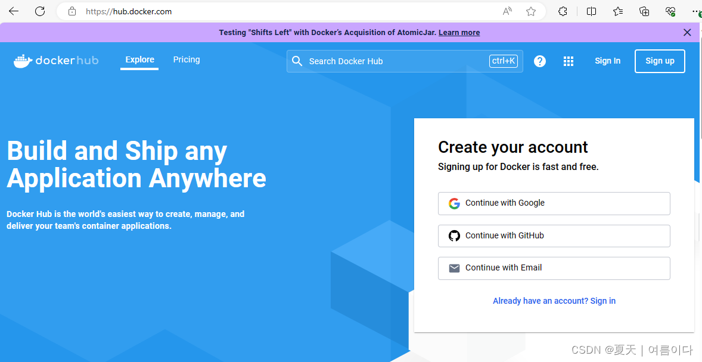
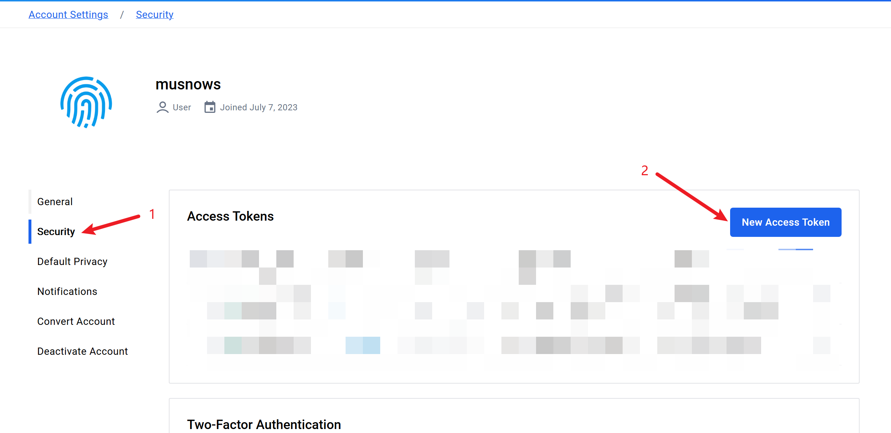
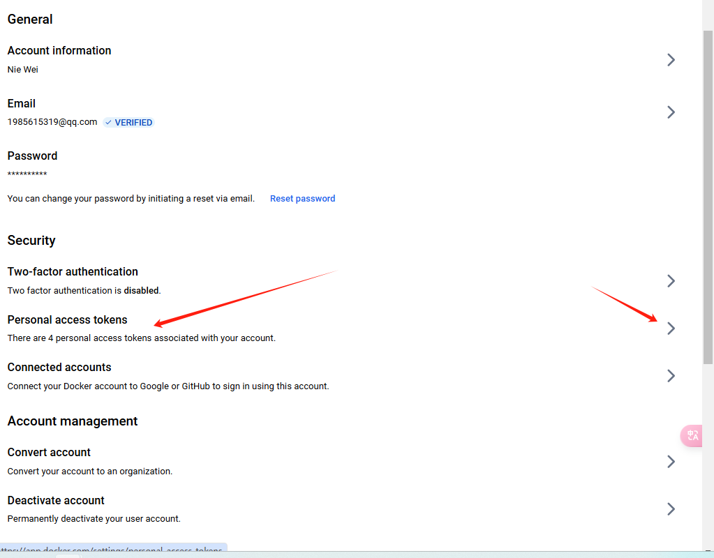
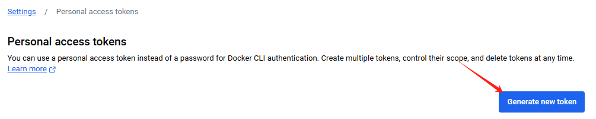
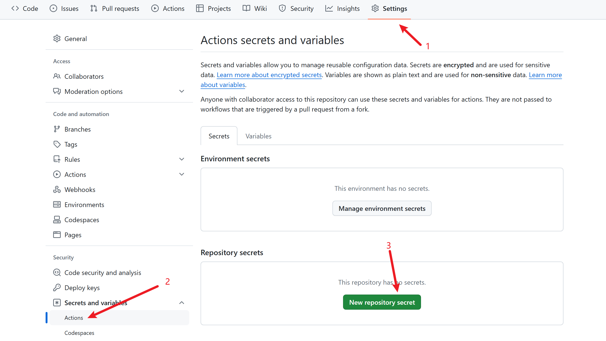
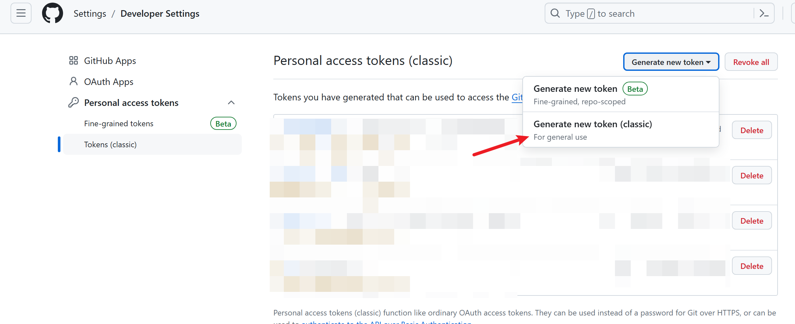
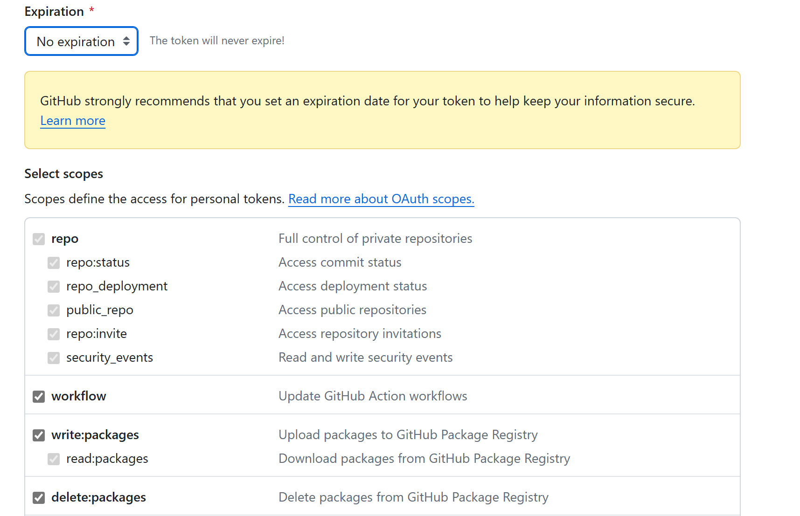
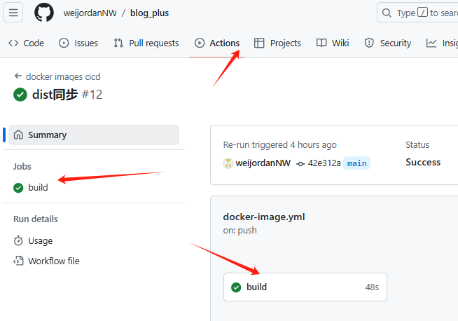
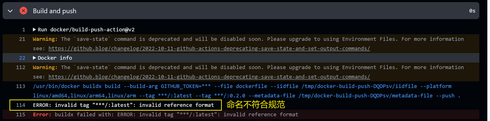
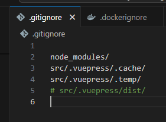

<!-- <h2 id="1.%E7%99%BB%E5%BD%95%E5%88%B0Docker%E8%B4%A6%E6%88%B7">1.准备工作</h2> -->

## 1.准备工作

登录到Docker账户

官网：[Docker Hub](https://hub.docker.com/)

首先，确保已经安装了Docker并且登录到Docker账户。如果没有账户，需要注册一个新的账户。



（也可以用github直接登录的）

<!-- <h3 id="1.1-dockerhub-token">1.1 dockerhub token</h3> -->

### 1.1 dockerhub token

[https://hub.docker.com/settings/security](https://hub.docker.com/settings/security)

登录dockerhub，在用户的account settings里面获取用户token



或者





将其添加到github仓库的secrets里面，具体位置是仓库设置中的 Secrets and variables 里面的 Actions 栏目中，如下图所示，添加 Repository secrets。

进入你的项目仓库



需要添加的是 `DOCKER_USERNAME`为你的docker用户名（注意是用户名，不是邮箱），还有 `DOCKER_TOKEN`为刚刚我们在dockerhub中获取的token。

<!-- <h3 id="9ea5d211">1.2 获取github操作token</h3> -->

### 1.2 获取github操作token

[https://github.com/settings/tokens](https://github.com/settings/tokens)

到GitHub的用户设置中，创建一个token，需要给予repo、workflow、packages权限。如果你不知道给予什么权限，直接全给他选上，保障这个token不泄露给外部就可以了。



另外，expiration是过期日期，如果你担心泄漏造成问题，可以设置一个过期时间，但是需要到时间后去更新仓库的secrets。



点击确定以后会得到token，复制他，同样是到github仓库的secrets里面添加一个 `RELEASE_TOKEN` 变量。

<!-- <h2 id="7074033f">2.上传workflows文件</h2> -->

## 2.上传workflows文件

<!-- <h3 id="390f4a45">2.1 添加如下yml文件</h3>
# -->

### 2.1 添加如下yml文件

前期的准备工作已经搞定了，现在就是添加一个github action的yml文件了。

在你的仓库里面创建一个 `.github/workflows`文件夹，并在里面创建一个 `.yml`文件，写入如下内容。

```yaml
name: docker images cicd
# 触发器设置
on:
  push:
    branches: [ "main" ]
  pull_request:
    branches: [ "main" ]

# 项目任务，任务之间可以并行调度
jobs:
  build:
  # 选择云端运行的环境
    runs-on: ubuntu-latest
    steps:
    # uses代表使用一个模块，此处使用的是checkout模块，将github项目文件导入到当前环境中
    - uses: actions/checkout@v3
    # 使用with跟在后面来为前面的模块输入参数
      with:
        submodules: 'true'
    - name: Set up QEMU
      uses: docker/setup-qemu-action@v2
    - name: Set up Docker Buildx
      uses: docker/setup-buildx-action@v2
    - name: Login to DockerHub
      uses: docker/login-action@v2
      with:
    # 这里用到了github的secrets功能，避免账户和密码随仓库泄露
       username: ${{ secrets.DOCKER_USERNAME }}
       password: ${{ secrets.DOCKER_TOKEN }}
    # 设置当前的发行版本tag
    - name: Release version
      id: release_version
      run: |
        app_version=$(cat version.py |sed -ne "s/APP_VERSION\s=\s'v\(.*\)'/\1/gp")
        echo "app_version=$app_version" >> $GITHUB_ENV
    # 开始构建镜像
    - name: Build and push
      uses: docker/build-push-action@v2
      with:
        context: .
        file: Dockerfile
        build-args: |
          GITHUB_TOKEN=${{ secrets.RELEASE_TOKEN }}
        platforms: |
          linux/amd64
          linux/arm64
          linux/arm
        push: true
        # 指定用户/仓库名
        tags: |
          ${{ secrets.DOCKER_USERNAME }}/blog_plus:latest
          ${{ secrets.DOCKER_USERNAME }}/blog_plus:${{ env.app_version }}
    # 这里是通过md文件自动生成dockerhub描述的模块，也可以不需要
    - name: Docker Hub Description
      uses: peter-evans/dockerhub-description@v3
      with:
        username: ${{ secrets.DOCKER_USERNAME }}
        password: ${{ secrets.DOCKER_PASSWORD }}
        repository: ${{ secrets.DOCKER_USERNAME }}/blog_plus
        readme-filepath: ./README.md

```

对这里面的内容做一定说明，其中 `secrets.`使用的就是我们刚刚添加到github仓库中的变量，分别用于[访问github](https://so.csdn.net/so/search?q=%E8%AE%BF%E9%97%AEgithub&spm=1001.2101.3001.7020)仓库和登录dockerhub。

你会发现最末尾通过readme文件自动生成dockerhub的描述部分，多出来了一个上文没有提到的 `secrets.DOCKER_PASSWORD`，这个是你dockerhub账户的密码。如果你不需要自动生成dockerhub的描述，那就可以把最后一个 `Docker Hub Description`条目直接删除了，否则需要添加这个secrets。

项目中我使用了 `version.py`文件来存放最新的版本号，该文件需要在项目的根路径中创建，内容格式如下

```yaml
APP_VERSION = '版本号'
```

使用这个workflows文件，你只需要修改 `${{ secrets.DOCKER_USERNAME }}/blog_plus`里面右侧的镜像名字为你的项目名字，将 `file: dockerfile`这里的dockerfile设置为你项目中dockerfile的文件路径就可以了

另外，在这个yml中，指定了三个平台的[docker镜像](https://so.csdn.net/so/search?q=docker%E9%95%9C%E5%83%8F&spm=1001.2101.3001.7020)，这里可以根据你自己的实际需要来减少一些平台。毕竟大部分用户用的都是amd64（即x86）的电脑，如果没有用户需要使用arm平台，可以把后两项删除，以加快github action的运行速度。

```yaml
        platforms: |
          linux/amd64
          linux/arm64
          linux/arm
```

最终完成action的截图如下



<!-- <h3 id="8976971e">2.2 关于GITHUB_REPOSITORY_NAME_PART环境变量</h3> -->

### 2.2 关于GITHUB_REPOSITORY_NAME_PART环境变量

在别的github action教学文章中，会提到使用 `${{ env.GITHUB_REPOSITORY_NAME_PART }}`来直接用github的仓库名字作为镜像名。但经过我的测试，这个方法不适用于本文的这个workflows文件，使用该环境变量会导致容器的名字多出来一个尾随的 `/`，最终的镜像名字变成了 `用户名/镜像名/:tag`，不符dockerhub中镜像的命名规范。以下是具体的actions执行错误截图。



<!-- <h2 id="BQZ4j">3. 实例 前端项目打包</h2>
 -->

## 3. 实例 前端项目打包

<!-- <h3 id="ZruPs">3.1.本地 build 出 dist 目录</h3> -->

## 3.1.本地 build 出 dist 目录

由于本人项目是vuepress的项目, 通过打包的  dist 文件在 根目录下的 src/.vuepress/dist 里

注意:如果 .gitignore 文件里面屏蔽了  src/.vuepress/dist/ 得禁用掉,得上传到github执行工作流,因为



<!-- <h3 id="p5jyQ">3.2 根目录下创建 Dockerfile文件而不是dockerfile免得报错</h3> -->

## 3.2 根目录下创建 Dockerfile文件而不是dockerfile免得报错

```yaml
# 使用与你本地环境一致的 Node.js 版本
FROM node:21.7.1

# 设置工作目录
WORKDIR /app

# 复制项目文件到工作目录
COPY . .

# 使用 Nginx 作为服务器
FROM nginx:latest

# 将构建好的静态文件复制到 Nginx 的默认目录
# 确保路径与你 VuePress 构建输出一致
COPY --from=0 /app/src/.vuepress/dist /usr/share/nginx/html

# 暴露 80 端口
EXPOSE 80

# 启动 Nginx 服务
CMD ["nginx", "-g", "daemon off;"]


# 使用镜像
# docker pull weijordan/blog_plus

#运行
# docker run -d \
#   --name blog_plus \
#   -p 3002:80 \
#   -v /myDocker/blog_plus:/app \
#   weijordan/blog_plus

# 查看
# docker ps
```

注意:这里的环境 得改成与你本地环境一致,不然容易报错

<!-- <h3 id="t9IC9">3.3. 也可以用docker-compose.yml 来创建容器</h3> -->

### 3.3. 也可以用docker-compose.yml 来创建容器

```yaml
# version: '3'  # docker-compose的版本

services:
  blog_plus: # 服务名称
    image: weijordan/blog_plus # 镜像名称
    container_name: blog_plus # 容器名称
    ports:
      - "3002:80"  # 将容器的80端口映射到宿主机的8080端口
    volumes:
      - /myDocker/blog_plus:/app  # 将宿主机的/data/blog_plus目录映射到容器内的/app目录
    # environment:
    #   - EXAMPLE_VAR=example_value  # 如果需要，设置环境变量
    restart: unless-stopped # 容器退出时总是重启
    networks:
      - webnet # 加入网络

networks:
  webnet: # 定义网络
  # 使用外部网络，如果存在则使用，不存在则创建
    # external: true # 外部网络
    # name: nginx_proxy # 网络名称
    # 如果不存在则创建网络
    # driver: bridge # 网络类型


  # 运行容器
  # docker-compose up -d
  # 检查运行情况
  # docker-compose ps
  # 停止并移除容器
  # docker-compose down
  # 停止容器
  # docker-compose stop
  # 启动容器
  # docker-compose start
  # 重启容器
  # docker-compose restart

```

如果使用的是 宝塔面板 的话,可以直接用模版创建 或者 cli

<!-- <h2 id="the-end">The end</h2> -->

## The end

不过，根据github actions上的warning，我这个workflows文件已经是老版本的了，里面使用的很多特性都即将不再支持，所以只是个临时用用的权宜之计，后续得去找个另外的yaml文件来处理这个docker镜像了。

## 参考

使用github action来自动发布项目到dockerhub。参考 https://msdemt.github.io/p/github-action-build-docker/ 博客
