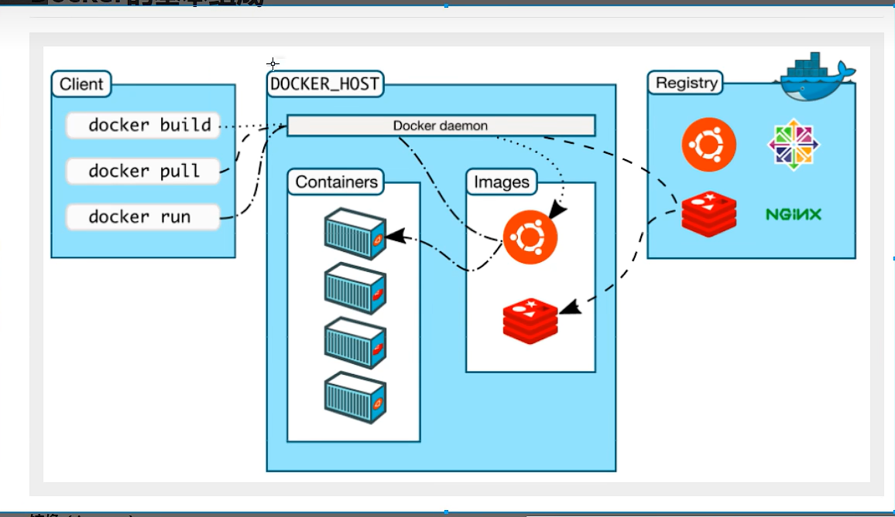

<!-- <h3 id="H2exR">**镜像(image):**</h3> -->
### 镜像(image)
docker镜像就好比是一个模板，可以通过这个模板来创建容器服务，tomcat镜像==>run=>tomcat(01容器（提供服务器），

通过这个镜像可以创建多个容器（最终服务运行或者项目运行就是在容器中的）。

<!-- <h3 id="npWq8">**容器(container):**</h3> -->
### 容器
Docker利用容器技术，独立运行一个或者一个组应用，通过镜像来创建的。

启动，停止，删除，基本命令！

目前就可以把这个容器理解为就是一个简易的iux系统

<!-- <h3 id="hmvyk">**仓库(repository)：**</h3> -->
### 仓库
仓库就是存放镜像的地方！

仓库分为公有仓库和私有仓库！

Docker Hub（默认是国外的）

阿里云…都有容器服务器(配置镜像加速！)
