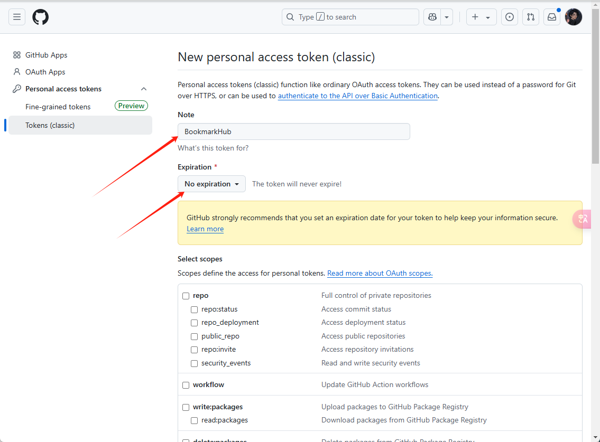
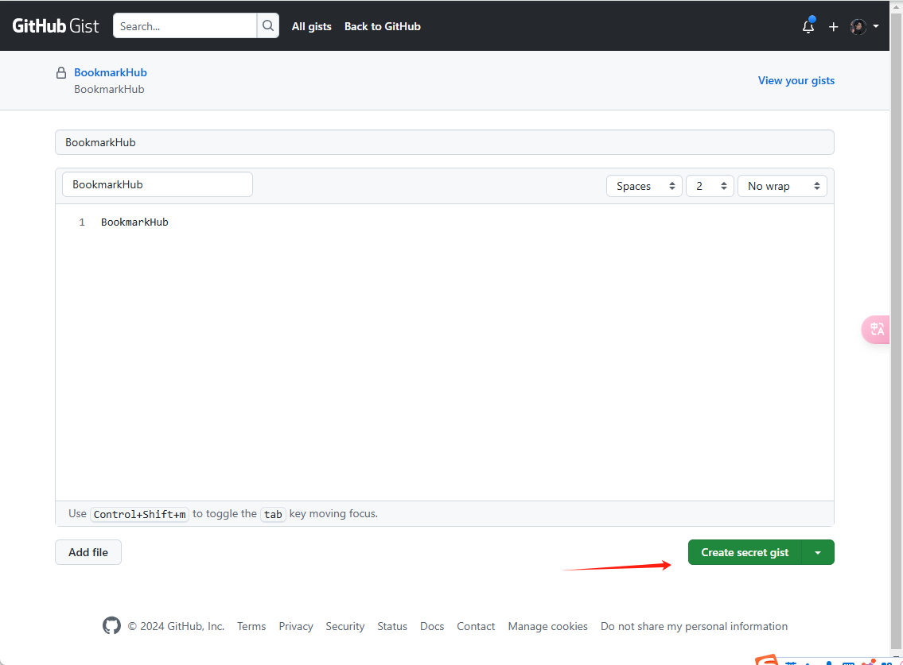
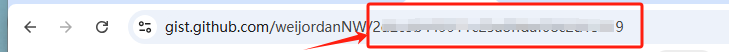
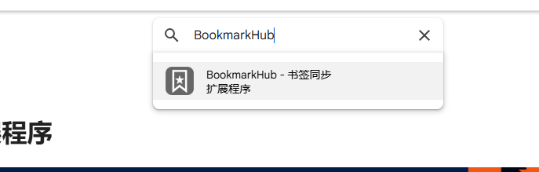
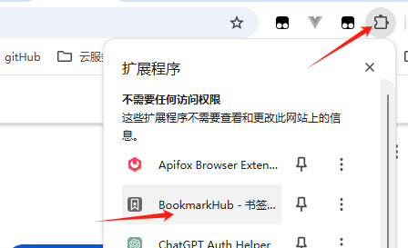
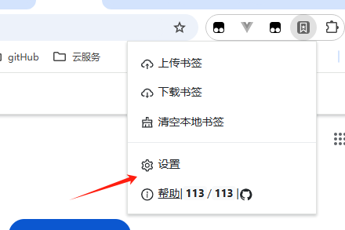
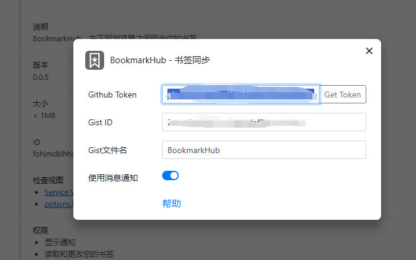

## 关于
BookmarkHub 是一款浏览器插件，可以在不同浏览器之间同步你的书签。

适用于各大主流浏览器，如 Chrome、Firefox、Microsoft Edge 等。

它使用 GitHub 的 Gist 记录来存储浏览器的书签，可以放心安全的使用。

## 功能
+ 不需要注册特殊账号，只需要用你的 GitHub 账号的Token和Gist
+ 一键上传下载书签
+ 一键清空本地所有书签
+ 支持跨电脑跨浏览器同步书签
+ 支持显示本地和远程书签的数量

## 下载安装
本插件需要把书签存储到 Gist 中，所以请确保有 GitHub 账号或可以通过网络注册 GitHub 账号。

+ [Chrome 浏览器](https://chrome.google.com/webstore/detail/bookmarkhub-sync-bookmark/fohimdklhhcpcnpmmichieidclgfdmol)
+ [Firefox 浏览器](https://addons.mozilla.org/zh-CN/firefox/addon/BookmarkHub/)
+ [Microsoft Edge 浏览器](https://microsoftedge.microsoft.com/addons/detail/BookmarkHub/fdnmfpogadcljhecfhdikdecbkggfmgk)
+ [其他基于 Chromium 内核的浏览器](https://chrome.google.com/webstore/detail/bookmarkhub-sync-bookmark/fohimdklhhcpcnpmmichieidclgfdmol)

## 使用方法
1. [登陆](https://github.com/login) GitHub，如果没有账号请点此[注册](https://github.com/join)。
2. [创建一个可以管理 gist 的 token](https://github.com/settings/tokens/new)。

向下划勾选 gist

然后保存好 github token

3. [创建一个私有的 gist](https://gist.github.com/)。**注意：如果是公开的 gist，你的书签是可以被他人搜索到的。**

去gist地址勾选部分就是 Gist id

4. 在浏览器的应用商店下载 BookmarkHub，点击插件的设置按钮，在弹出的设置窗口填入 token 和 gist ID，然后你就可以上传下载书签了。

这里示例 [谷歌浏览器应用商店](https://chromewebstore.google.com/category/extensions?utm_source=ext_sidebar&hl=zh-CN) 点击以后 搜索 添加

点击插件

点击设置

设置

5. 然后进行上传和下载即可

## 待实现的功能
+  自动同步书签
+  支持 webdav 协议
+  移动端
+  导入导出
+  分享书签

