<font style="color:rgb(85, 86, 102);background-color:rgb(238, 240, 244);">电脑A和B，</font>[vscode配置](https://so.csdn.net/so/search?q=vscode%E9%85%8D%E7%BD%AE&spm=1001.2101.3001.7020)<font style="color:rgb(85, 86, 102);background-color:rgb(238, 240, 244);">都在A电脑上，此时你想要将A电脑的vscode配置同步到B电脑的vscode中</font>

### <font style="color:rgb(79, 79, 79);">第一步：A电脑和B电脑都需要在VSCode中安装下图插件 code settings sync</font>
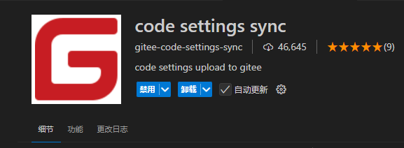


### <font style="color:rgb(79, 79, 79);">第二步：登录gitee，点击右上角+号 -> 发布代码片段，如下图所示</font>
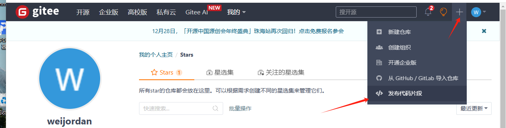


### <font style="color:rgb(79, 79, 79);">第三步：如下图，输入框随意填写，点击发布即可</font>
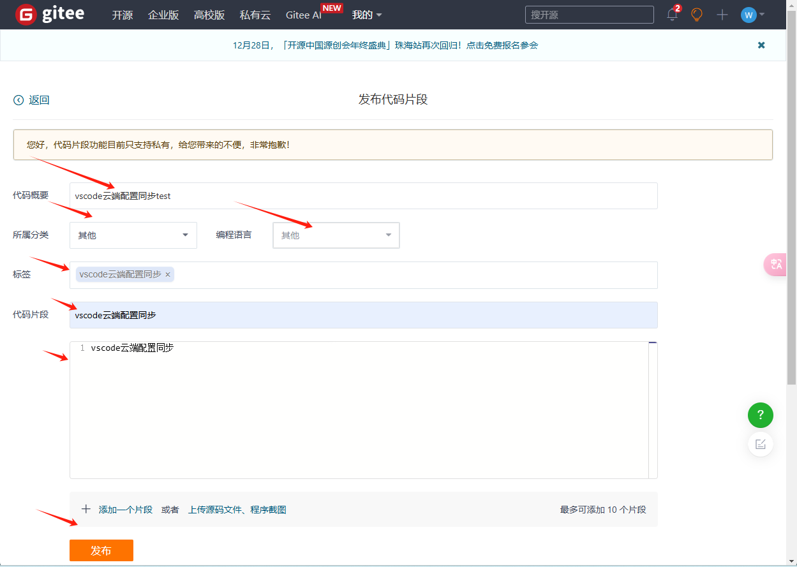


### <font style="color:rgb(79, 79, 79);">第四步：如下图所示，url后面的gist ID需要保存下来</font>
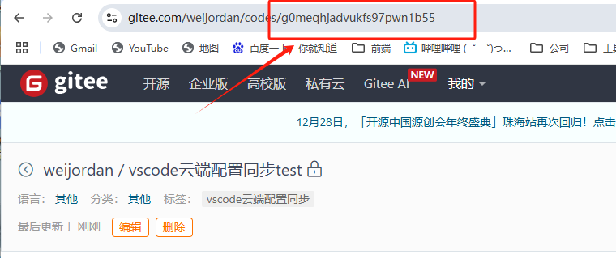


### <font style="color:rgb(79, 79, 79);">第五步：接下来需要新建一个私人令牌，如下图所示，账号设置 -> 安全设置 -> 私人令牌，</font>
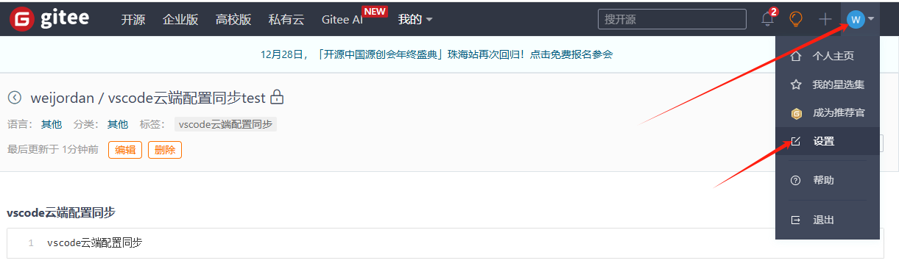

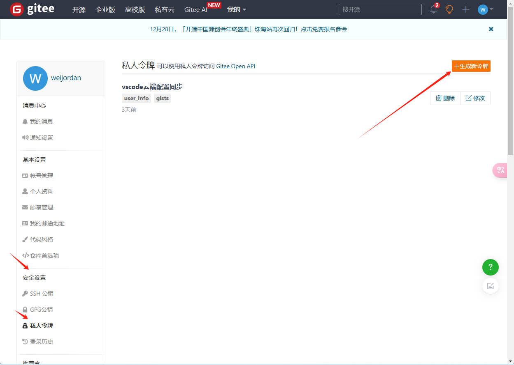

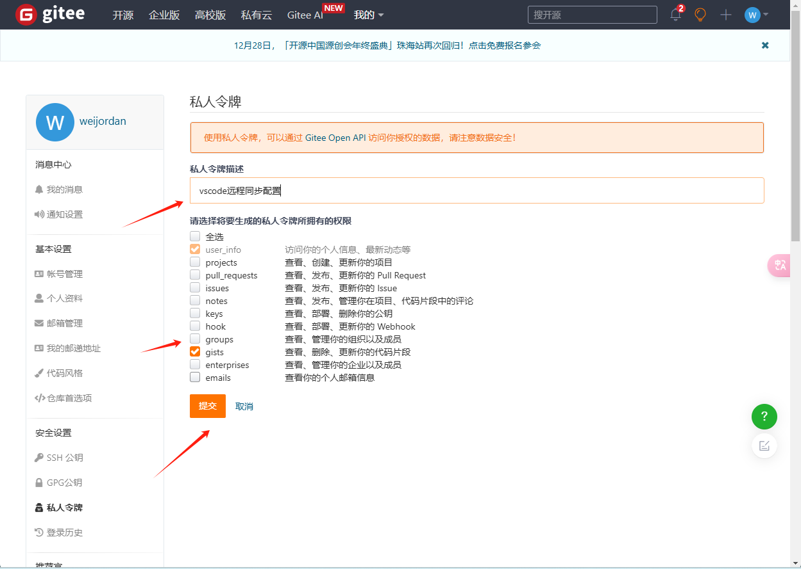

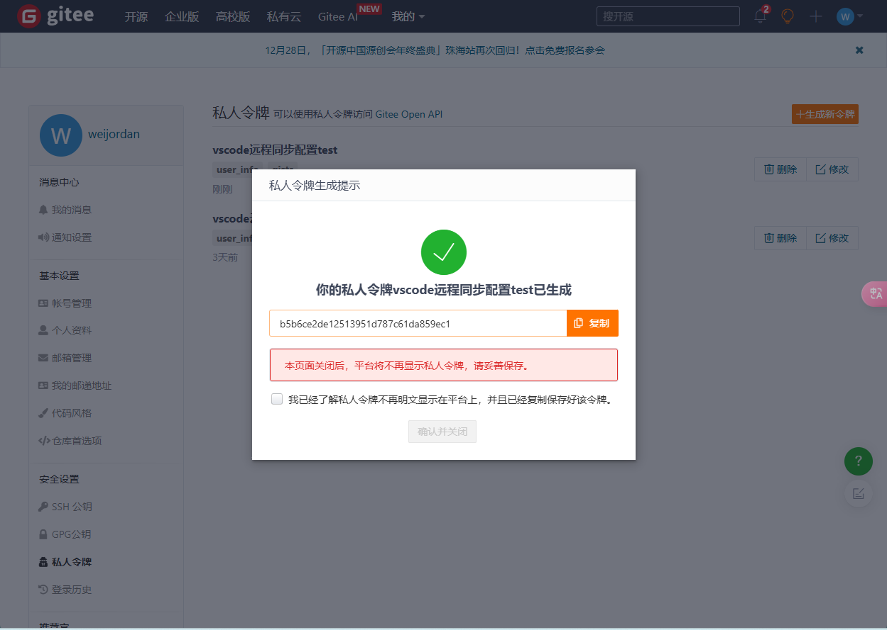


### <font style="color:rgb(79, 79, 79);">第七步：打开A电脑的VSCode，点击左下角的setting图标 -> 设置 -> 打开设置(json)</font>
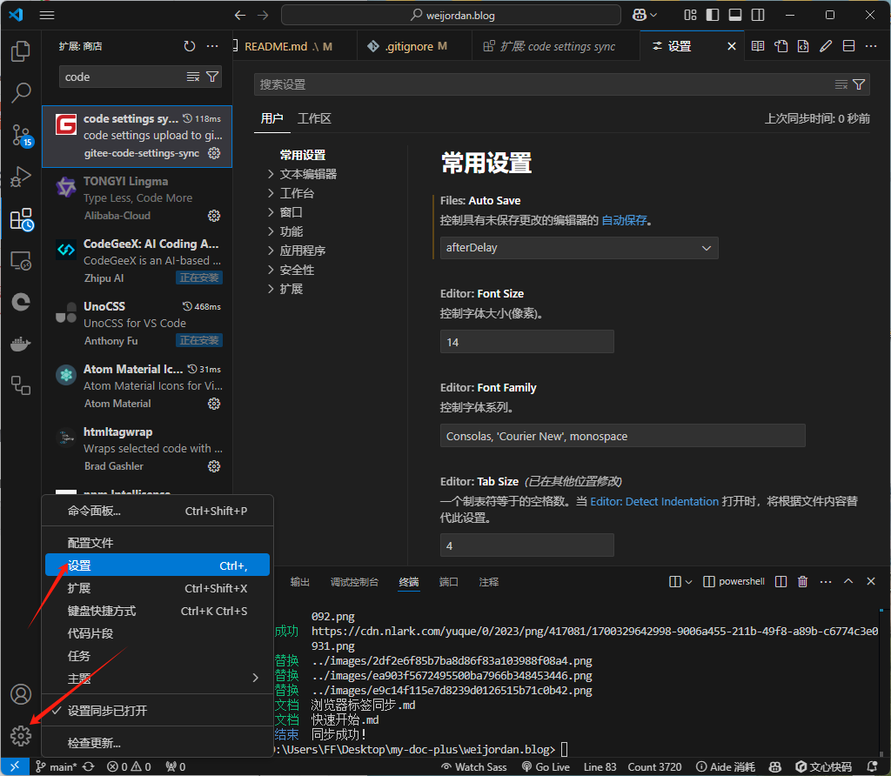


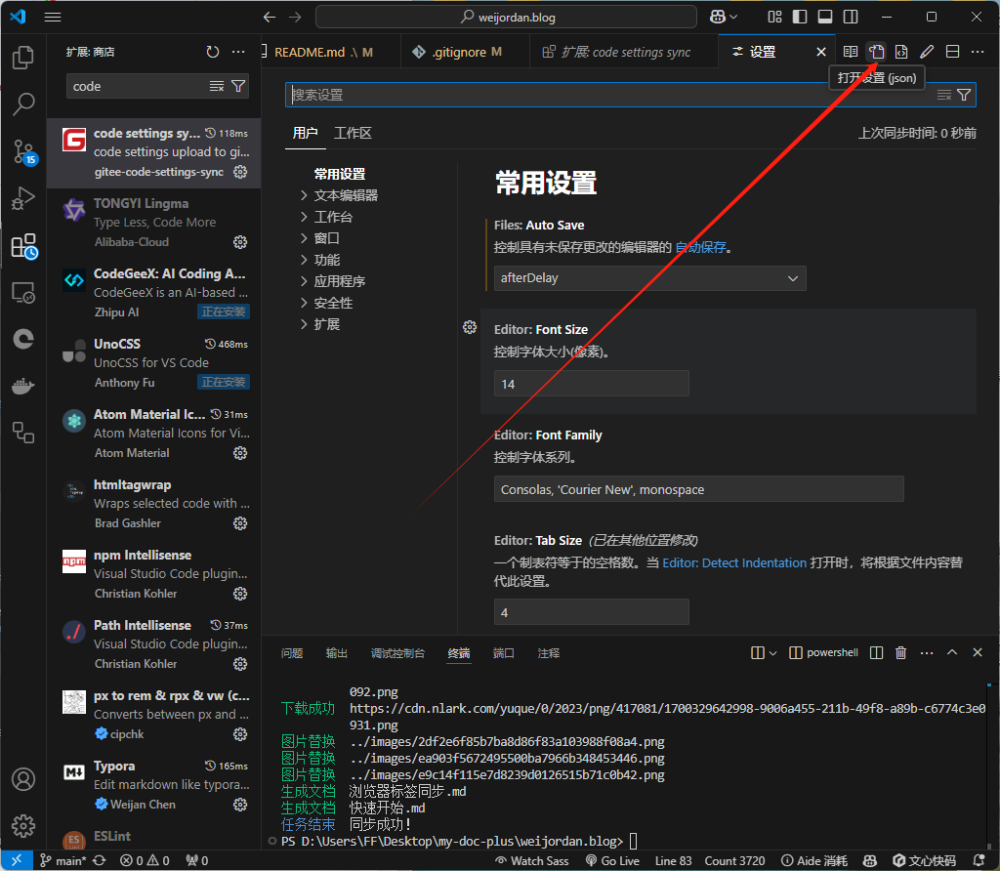


### <font style="color:rgb(79, 79, 79);">第八步：如下图所示，在settings.json文件中输入下面代码，gist对应第四步的gist ID，access_token对应第六步的私人令牌</font>


```shell
{
    "gitee.gist":"test",
    "gitee.access_token":"test",
}
```

### <font style="color:rgb(79, 79, 79);">第九步：在settings.json文件配置完成后，在vscode中按F1打开命令框，输入</font><font style="color:rgb(78, 161, 219) !important;">upload</font><font style="color:rgb(79, 79, 79);"> setting后回车，在vscode终端会出现如下图所示（我第一次上传的时候只上传了syncGitee.lock文件，不知道什么情况，然后重新输入upload setting后就上传成功了，可以根据第十一步查看是否上传配置成功）</font>
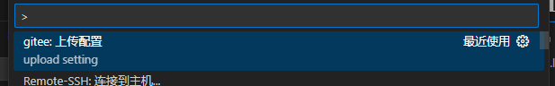

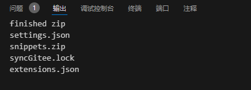

### <font style="color:rgb(79, 79, 79);">第十步：第九步已经完成配置上传云端的操作，所以此时在B电脑上打开VSCode，然后完成第八步的settings.json文件配置，按下F1，输入download setting，等待同步完成即可</font>


### <font style="color:rgb(79, 79, 79);">第十一步：如下图所示，可以查看是否成功上传了vscode配置</font>
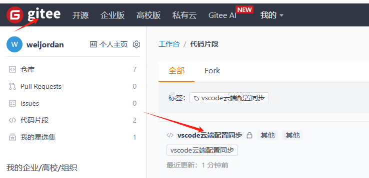

