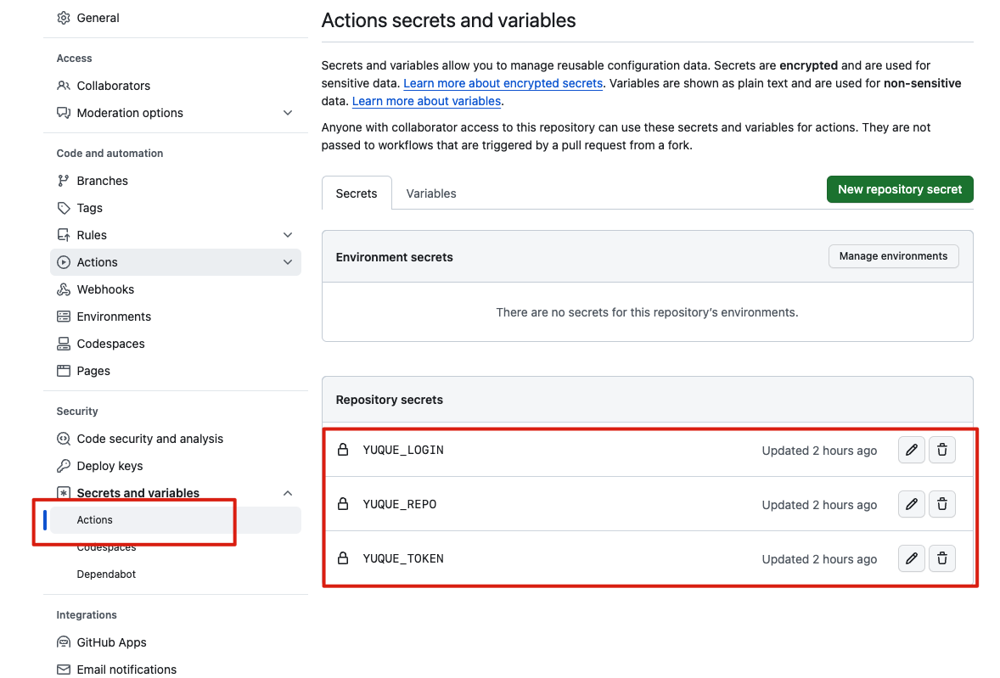

## 前言
:::warning
当前支持语雀 Token 模式（需要语雀超级会员）和账号密码模式（不需要任何会员）  

:::

## 文档站点工具汇总
+ 写作平台：语雀
+ 文档平台：[Hexo](https://hexo.io/)
+ 博客主题：[Next](https://github.com/jerryc127/hexo-theme-butterfly)
+ 文档同步：[Elog](https://github.com/LetTTGACO/elog)
+ 部署平台：[Vercel](https://vercel.com)

## 文档站点搭建指南
### Fork模板仓库
[点击 Fork](https://github.com/elog-x/yuque-hexo/fork) 该模板仓库到个人 Github 账号仓库下并 clone 到本地。

### 安装依赖
在项目根目录下运行命令安装依赖：

```shell
npm install
```

### 新建本地调试文件
在项目根目录中复制`.elog.example.env`文件并改名为`.elog.env`，此文件将用于本地同步文档时使用。

### 配置语雀
参考[示例知识库](https://www.yuque.com/1874w/yuque-hexo-template)，选择或新建语雀文档知识库，并按照[文档提示](https://elog.1874.cool/notion/gvnxobqogetukays#login)配置语雀并获取`token login repo`。并在本地`.elog.env`中写入。

:::warning
Token 模式或者账号密码模式二选一即可，默认为账号密码模式，如果需要切换为 Token 模式，则修改`elog.config.js`中的`platform`为`yuque`

:::

```plain
# 语雀（Token方式）
YUQUE_TOKEN=获取的Token

#语雀（账号密码模式）
YUQUE_USERNAME=一般是手机号
YUQUE_PASSWORD=登录密码

# 语雀公共参数
YUQUE_LOGIN=获取的login
YUQUE_REPO=获取的repo
```

### 本地调试
在项目根目录运行同步命令：

```shell
npm run sync:local
```

### 启动 Hexo
在项目根目录运行 Hexo 启动命令，打开本地链接。

```shell
npm run server
```

## 配置 Hexo 博客
根据 [Hexo](https://hexo.io/) 文档和 [next](https://github.com/next-theme/hexo-theme-next) 主题配置文档，配置你的博客直到你满意为主，你也可以换别的主题，这里不做演示

### 提交代码到 github
本地访问没问题直接提交所有文件到 Github 仓库即可

### 部署到 Vercel
注册 Vercel 账号并绑定 Github，在 Vercel 导入 该项目，Vercel 会自动识别出该 VitePress 项目，不需要改动，直接选择 Deploy 部署。部署完成会有一个 Vercel 临时域名，你也可以绑定自己的域名。


## 自动化同步&部署
:::warning
注意：在非国内CI/CD环境中使用账号密码模式登录语雀，例如Github  
Workflow，会导致语雀后台登录设备中出现大量美国IP，目前尚不清楚语雀是否会有安全限制措施，请谨慎使用。推荐本地同步时使用。

:::

### 检查 Github Actions 权限
在 Github 仓库的设置中找到 `Actions-General`，打开流水线写入权限`Workflow permissions`


### 配置环境变量
在本地运行时，用的是`.elog.env`文件中定义的语雀账号信息，而在 Github Actions 时，需要提前配置环境变量。  

在 Github 仓库的设置中找到 `Secrets and variables`，新增仓库的环境变量和`.elog.env`保持一致即可



### 自动化部署
当在语雀中改动文档后，手动/自动触发 Github Actions流水线，会重新从语雀增量拉取文档，自动提交代码到 Github 仓库。  

Vercel 会实时监测仓库代码，当有新的提交时都会重新部署博客。如此就实现了自动化部署博客。  

整个流程的关键点就在于：如何手动/自动触发 Github Actions。  

在项目.`github/workflows/sync.yaml`中已经配置了外部 API 触发 Github Actions 事件，所以只需要调用 API 触发流水线即可。

#### 手动触发
为了方便，这里提供一个部署在 Vercel 的免费公用的[**ServerlessAPI**](https://github.com/elog-x/serverless-api)，按照文档配置好 URL 参数并浏览器访问即可触发流水线

```shell
https://serverless-api-elog.vercel.app/api/github?user=xxx&repo=xxx&event_type=deploy&token=xxx
```

#### 自动触发-语雀 webhooks
:::warning
需要语雀专业会员

:::

在语雀知识库 - 更多设置 - 消息推送中可配置语雀 webhooks，填写上面的 Vercel Serverless API。当文档更新时，语雀会调用这个API进行推送，进而触发 Github Actions

:::warning
注意：语雀是国内文档平台，调用国外Vercel 的服务可能会失败，可自行部署 API

:::

:::warning
注意：知识库配置了「自动发布」功能后，文档的 更新/发布 操作暂不会发送 webhooks

:::

## 参考示例
示例 Github 仓库：待完善

示例语雀知识库：[https://www.yuque.com/1874w/yuque-hexo-template](https://www.yuque.com/1874w/yuque-hexo-template)  

示例文档站点：待完善

