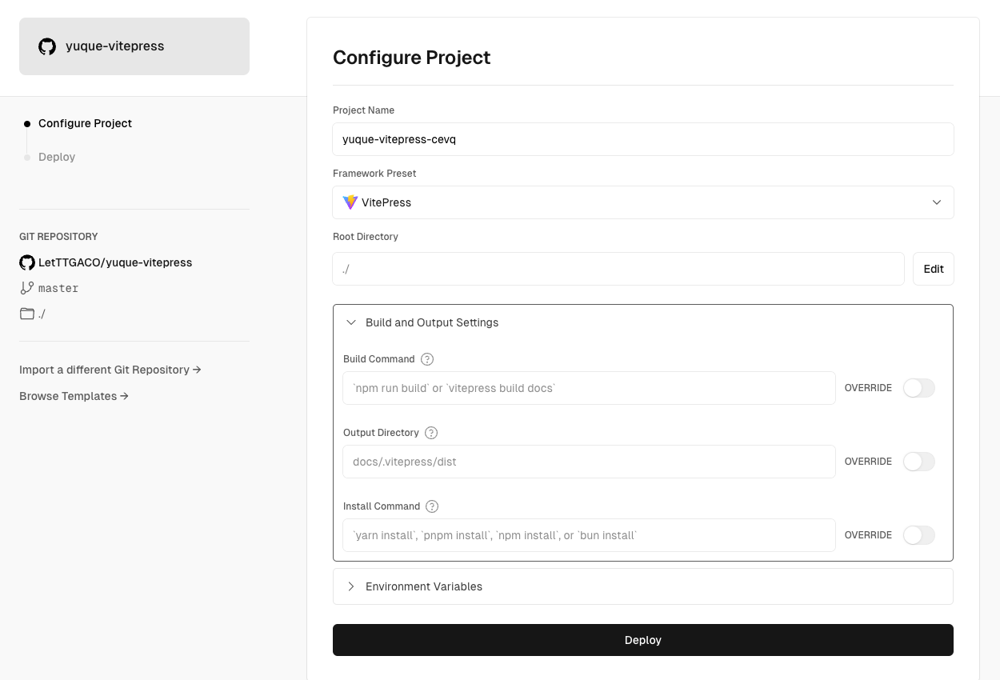
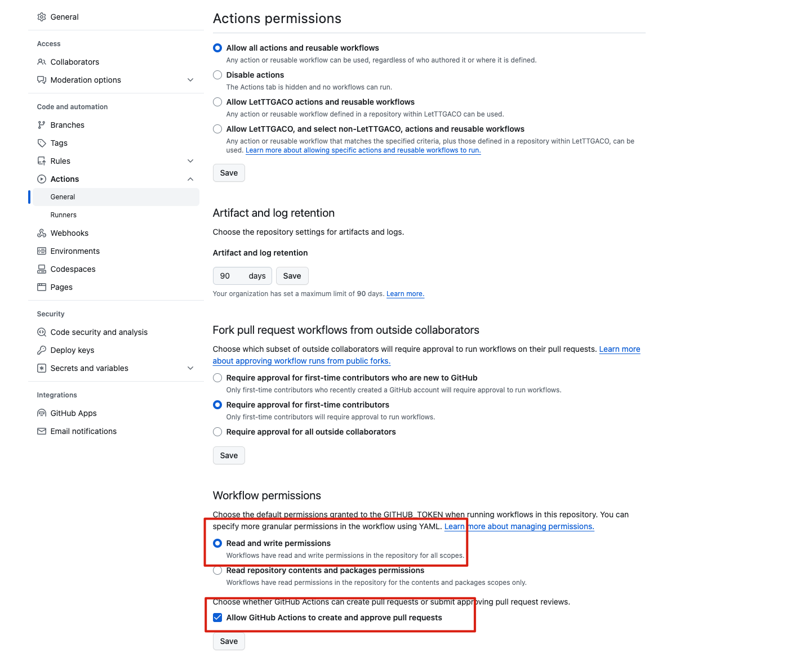
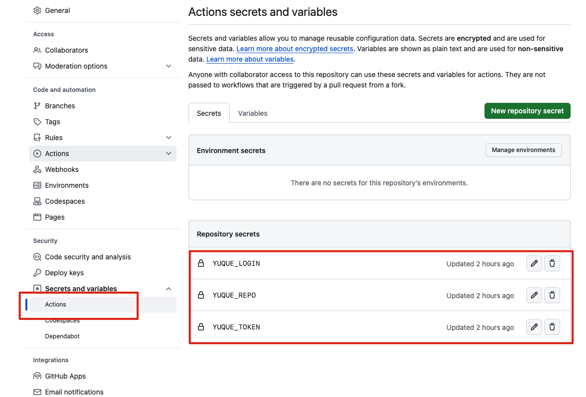

## 前言
:::warning
当前支持语雀 Token 模式（需要语雀超级会员）和账号密码模式（不需要任何会员）  

:::

## 文档站点工具汇总
+ 写作平台：语雀
+ 文档平台：[Vuepress](https://vuepress.vuejs.org/zh/guide/getting-started.html#%E5%AE%89%E8%A3%85)
+ 博客主题：[Hope](https://theme-hope.vuejs.press/zh/get-started/)
+ 文档同步：[Elog](https://github.com/LetTTGACO/elog)
+ 部署平台：[Vercel](https://vercel.com) / Docker

## 文档站点搭建指南


[点击 Vuepress](https://vuepress.vuejs.org/zh/guide/getting-started.html#%E5%AE%89%E8%A3%85)官网 根据教程进行建vuepress项目

或者

[点击 Vuepress-theme-hope](https://theme-hope.vuejs.press/zh/get-started/) 官网 根据教程进行建vuepress项目

### 安装依赖
在项目根目录下运行命令安装依赖：

```shell
npm install
```

### 新建本地调试文件
在项目根目录中复制`.elog.example.env`文件并改名为`.elog.env`，此文件将用于本地同步文档时使用。

### 配置语雀
参考[示例知识库](https://www.yuque.com/1874w/yuque-hexo-template)，选择或新建语雀文档知识库，并按照[文档提示](https://elog.1874.cool/notion/gvnxobqogetukays#login)配置语雀并获取`token login repo`。并在本地`.elog.env`中写入。

:::warning
Token 模式或者账号密码模式二选一即可，默认为账号密码模式，如果需要切换为 Token 模式，则修改`elog.config.js`中的`platform`为`yuque` 如果是用密码模式则修改为 yuque-pwd;对应平台进行修改即可

:::

```plain
# 语雀（Token方式）
YUQUE_TOKEN=获取的Token

#语雀（账号密码模式）
YUQUE_USERNAME=一般是手机号
YUQUE_PASSWORD=登录密码

# 语雀公共参数
YUQUE_LOGIN=获取的login
YUQUE_REPO=获取的repo
```


不看示例可以参考这里

elog安装

```shell
npm install @elog/cli -g
```


elog初始化到项目

```shell
elog init
```


修改  elog.config.js 文件 platform , deploy , image内容 具体的.md文档地址和图片地址配置按照个人喜好去设置就行

```shell
module.exports = {
  write: {
    platform: 'yuque-pwd',
    // platform: 'yuque',
    yuque: {
      token: process.env.YUQUE_TOKEN,
      // baseUrl: '',
      login: process.env.YUQUE_LOGIN,
      repo: process.env.YUQUE_REPO,
      onlyPublic: false,
      onlyPublished: true,
    },
    'yuque-pwd': {
      username: process.env.YUQUE_USERNAME,
      password: process.env.YUQUE_PASSWORD,
      login: process.env.YUQUE_LOGIN,
      repo: process.env.YUQUE_REPO,
      onlyPublic: false,
      onlyPublished: true,
    },
    notion: {
      token: process.env.NOTION_TOKEN,
      databaseId: process.env.NOTION_DATABASE_ID,
      filter: false, // {property: 'status', select: {equals: '已发布'}}
    },
    feishu: {
      type: 'space',
      wikiId: process.env.FEISHU_WIKI_ID,
      folderToken: process.env.FEISHU_FOLDER_TOKEN,
      appId: process.env.FEISHU_APP_ID,
      appSecret: process.env.FEISHU_APP_SECRET,
    },
    flowus: {
      tablePageId: process.env.FLOWUS_TABLE_PAGE_ID,
      filter: false, // {property: 'status',value: '已发布'}
    },
    wolai: {
      token: process.env.WOLAI_TOKEN,
      pageId: process.env.WOLAI_PAGE_ID,
    }
  },
  deploy: {
    platform: 'local',
    local: {
      outputDir: './src/_yuque',// 输出目录
      filename: 'title',// 文件名
      format: 'markdown',// markdown
      catalog: true,// 目录
      frontMatter: {// 前端元数据
        enable: true,
        include: ['categories', 'tags', 'title', 'date', 'updated', 'permalink', 'cover', 'description'],
        // include: ['title', 'shortTitle', 'date', 'icon', 'star', 'isOriginal', 'cover', 'category', 'tag'], // 更新字段列表
        timeFormat: true,// 时间格式化
      }
    },

    halo: {
      endpoint: process.env.HALO_ENDPOINT,
      token: process.env.HALO_TOKEN,
      policyName: process.env.HALO_POLICY_NAME,
      rowType: 'html',
      needUploadImage: true,
    },
    confluence: {
      user: process.env.CONFLUENCE_USER,
      password: process.env.WORDPRESS_PASSWORD,
      endpoint: process.env.WORDPRESS_ENDPOINT,
      spaceKey: process.env.CONFLUENCE_SPACE_KEY,
      rootPageId: process.env.CONFLUENCE_ROOT_PAGE_ID, // 可选
    },
    wordpress: {
      username: process.env.WORDPRESS_USERNAME,
      password: process.env.WORDPRESS_PASSWORD,
      endpoint: process.env.WORDPRESS_ENDPOINT,
    }
  },
  image: {
    enable: true,
    platform: 'local',
    local: {
      outputDir: './src/_yuque/_images',// 图片输出目录
      prefixKey: '_images',// 图片路径前缀
      pathFollowDoc: true,// 图片路径是否跟随文档路径
      // imagePathExt : "",// 图片路径拓展点
    },

    oss: {
      secretId: process.env.OSS_SECRET_ID,
      secretKey: process.env.OSS_SECRET_KEY,
      bucket: process.env.OSS_BUCKET,
      region: process.env.OSS_REGION,
      host: process.env.OSS_HOST,
      prefixKey: '',
    },
    cos: {
      secretId: process.env.COS_SECRET_ID,
      secretKey: process.env.COS_SECRET_KEY,
      bucket: process.env.COS_BUCKET,
      region: process.env.COS_REGION,
      host: process.env.COS_HOST,
      prefixKey: '',
    },
    qiniu: {
      secretId: process.env.QINIU_SECRET_ID,
      secretKey: process.env.QINIU_SECRET_KEY,
      bucket: process.env.QINIU_BUCKET,
      region: process.env.QINIU_REGION,
      host: process.env.QINIU_HOST,
      prefixKey: '',
    },
    upyun: {
      user: process.env.UPYUN_USER,
      password: process.env.UPYUN_PASSWORD,
      bucket: process.env.UPYUN_BUCKET,
      host: process.env.UPYUN_HOST,
      prefixKey: '',
    },
    github: {
      token: process.env.GITHUB_TOKEN,
      user: process.env.ELOG_GITHUB_USER,
      repo: process.env.ELOG_GITHUB_REPO,
      prefixKey: '',
    }
  }

}

```

### 本地调试
配置完成后在根目录下;在项目根目录运行同步命令：

```shell
elog sync -e .elog.env
```


在根目录创建文件夹 scripts  新建updateFrontMatter.js文件脚本;这个指令代码是将elog 的 FrontMatter 匹配 到 Vuepress 的 FrontMatter 进行兼容

```shell
const fs = require('fs');
const path = require('path');

// 定义要处理的目录
const outputDir = './src/_yuque';

// 递归读取目录中的所有 Markdown 文件
function processDirectory(directory) {
    fs.readdir(directory, { withFileTypes: true }, (err, entries) => {
        if (err) {
            console.error('Error reading directory:', err);
            return;
        }
        entries.forEach(entry => {// 处理目录中的每个条目
            const entryPath = path.join(directory, entry.name);// 获取完整路径
            if (entry.isDirectory()) {// 处理子目录
                processDirectory(entryPath); // 递归处理子目录
            } else if (entry.isFile() && path.extname(entry.name) === '.md' && entry.name !== 'README.md') {// 处理 Markdown 文件
                processFile(entryPath);
            }
        });
    });
}

// 处理单个 Markdown 文件
function processFile(filePath) {
    fs.readFile(filePath, 'utf8', (err, content) => {
        if (err) {
            console.error('Error reading file:', err);
            return;
        }

        // 解析现有的 frontMatter
        const frontMatterMatch = content.match(/^(---[\s\S]*?---)/m);// 匹配 frontMatter
        if (!frontMatterMatch) {
            console.error('No front matter found in file:', filePath);
            return;
        }
        let frontMatter = frontMatterMatch[1];

        // 获取 title 值以便在 shortTitle 缺失时使用
        const titleValue = getFieldValue(frontMatter, 'title') || '默认标题';
        // 获取 date 值并只保留日期部分
        // const existingDate = getFieldValue(frontMatter, 'date');
        // const dateValue = existingDate ? existingDate.split(' ')[0] : new Date().toISOString().split('T')[0]; // 获取 date 值并只保留日期部分

        const existingDate = getFieldValueData(frontMatter, 'date');
        const dateValue = existingDate ? existingDate.split(' ')[0] : new Date().toISOString().split('T')[0]; // 获取 date 值并只保留日期部分
        console.log("dateValue", dateValue);
        // 创建新的 frontMatter 字段
        const newFrontMatter = `
---
title: ${titleValue}
shortTitle: "${getFieldValue(frontMatter, 'shortTitle') || titleValue}"
date: ${dateValue} 
icon: ${getFieldValue(frontMatter, 'icon') || 'blog'}
star: ${getFieldValue(frontMatter, 'star') !== null ? getFieldValue(frontMatter, 'star') : 'false'}
isOriginal: ${getFieldValue(frontMatter, 'isOriginal') !== null ? getFieldValue(frontMatter, 'isOriginal') : 'false'}
cover: "${getFieldValue(frontMatter, 'cover') || ''}"
category:
- ${getFieldValue(frontMatter, 'category') || 'yuque'}
tag:
- ${getFieldValue(frontMatter, 'tag') || 'yuque'}
---
`.trim();

        // 替换原有的 frontMatter
        const newContent = content.replace(frontMatter, newFrontMatter);

        // 写回文件
        fs.writeFile(filePath, newContent, 'utf8', err => {
            if (err) {
                console.error('Error writing file:', err);
                return;
            }
            console.log(`Updated file: ${filePath}`);
        });
    });
}

// 辅助函数，从现有的 frontMatter 中获取字段值
function getFieldValue(frontMatter, fieldName) {
    const regex = new RegExp(`^${fieldName}:\\s*([^\n]+)`, 'm');
    const match = frontMatter.match(regex);
    return match ? match[1].trim() : null;
}
function getFieldValueData(frontMatter, fieldName) {
    const regex = new RegExp(`^${fieldName}:\\s*['"]?([^'"\n]+)['"]?`, 'm');
    const match = frontMatter.match(regex);
    return match ? match[1].trim() : null;
}

// 开始处理指定目录
processDirectory(outputDir);

```

### 启动 Vuepress
在项目根目录运行 Vuepress 启动命令，打开本地链接。

```shell
npm run server
```

## 配置 Vuepress 博客
根据 Vuepress 文档和 Hope 主题配置文档，配置你的博客直到你满意为主，你也可以换别的主题，这里不做演示

### 提交代码到 github
本地访问没问题直接提交所有文件到 Github 仓库即可

### 部署到 Vercel
注册 Vercel 账号并绑定 Github，在 Vercel 导入 该项目，Vercel 会自动识别出该 VitePress 项目，不需要改动，直接选择 Deploy 部署。部署完成会有一个 Vercel 临时域名，你也可以绑定自己的域名。



## 自动化同步&部署
:::warning
注意：在非国内CI/CD环境中使用账号密码模式登录语雀，例如Github  
Workflow，会导致语雀后台登录设备中出现大量美国IP，目前尚不清楚语雀是否会有安全限制措施，请谨慎使用。推荐本地同步时使用。

:::

### 检查 Github Actions 权限
在 Github 仓库的设置中找到 `Actions-General`，打开流水线写入权限`Workflow permissions`



### 配置环境变量
在本地运行时，用的是`.elog.env`文件中定义的语雀账号信息，而在 Github Actions 时，需要提前配置环境变量。  

在 Github 仓库的设置中找到 `Secrets and variables`，新增仓库的环境变量和`.elog.env`保持一致即可



### 自动化部署
当在语雀中改动文档后，手动/自动触发 Github Actions流水线，会重新从语雀增量拉取文档，自动提交代码到 Github 仓库。  

Vercel 会实时监测仓库代码，当有新的提交时都会重新部署博客。如此就实现了自动化部署博客。  

整个流程的关键点就在于：如何手动/自动触发 Github Actions。  

在项目.`github/workflows/sync.yaml`中已经配置了外部 API 触发 Github Actions 事件，所以只需要调用 API 触发流水线即可。

#### 手动触发
为了方便，这里提供一个部署在 Vercel 的免费公用的[**ServerlessAPI**](https://github.com/elog-x/serverless-api)，按照文档配置好 URL 参数并浏览器访问即可触发流水线

```shell
https://serverless-api-elog.vercel.app/api/github?user=xxx&repo=xxx&event_type=deploy&token=xxx
```

#### 自动触发-语雀 webhooks
:::warning
需要语雀专业会员

:::

在语雀知识库 - 更多设置 - 消息推送中可配置语雀 webhooks，填写上面的 Vercel Serverless API。当文档更新时，语雀会调用这个API进行推送，进而触发 Github Actions

:::warning
注意：语雀是国内文档平台，调用国外Vercel 的服务可能会失败，可自行部署 API

:::

:::warning
注意：知识库配置了「自动发布」功能后，文档的 更新/发布 操作暂不会发送 webhooks

:::

## 参考示例
示例 Github 仓库：待完善

示例语雀知识库：[https://www.yuque.com/ziming-rrjvu/crg0xg/execk2ysh7x0fr4w?singleDoc#](https://www.yuque.com/ziming-rrjvu/crg0xg/execk2ysh7x0fr4w?singleDoc#) 《快速开始》 

示例文档站点：待完善

