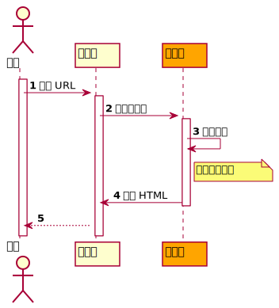

## 基础
### 1.图片


### 2.表格
| 字段 | 备注 |
| --- | --- |
| name | 名称 |
| age | 年龄 |


### 3.附件
[测试文本1.docx](https://www.yuque.com/attachments/yuque/0/2024/docx/45821596/1734504582972-baa80e32-7e60-4f66-9070-d97f1d153085.docx)

### 4.状态
<font style="background:#C0DDFC;color:#00346B">计划中</font>

<font style="background:#F8CED3;color:#70000D">未完成</font>

<font style="background:#DBF1B7;color:#2A4200">已完成</font>

## 布局和样式
### 1.高亮块
:::info
蓝色背景高亮块

:::

:::tips
灰色背景高亮

:::

:::color1
天蓝

:::

:::color2
翠绿

:::

:::success
绿色

:::

:::warning
黄色

:::

:::color3
橙色

:::

:::danger
橙粉

:::

:::color4
粉色

:::

:::color5
紫色

:::

### 2.折叠块
<details class="lake-collapse"><summary id="u1f995588"><span class="ne-text">折叠标题</span></summary><p id="ub753d366" class="ne-p"><span class="ne-text">折叠内容</span></p></details>
### 3.分栏卡片
两列分栏——左


两列分栏——右

```typescript
const a = 1
```


### 4.引用
> 引用文本第一行
>
> 引用文本第二行
>
> 引用文本第三行
>

### 5.分割线
---

### 6.表情
😃 🤪

## 画板类
### 1.画板
### 2.思维导图
### 3.流程图
## 数据表
[此处为语雀卡片，点击链接查看](https://www.yuque.com/docs/199114685#RCDZu)

## 程序员专区
### 1.代码块
```typescript
// TypeScript
const test = (post: DocDetail) => {
	const newPost = process(post)
  return newPost
}
export default test
```

```java
// Java
@Test
public void test11() {
    long start = System.currentTimeMillis();
    int a = 0;
    for(int i=0;i<1000000000;i++){
        try {
            a++;
        }catch (Exception e){
            e.printStackTrace();
        }
    }
    long useTime = System.currentTimeMillis()-start;
    System.out.println("useTime:"+useTime);
}
```

### 2.公式


### 3.UML图
### 4.文本绘图


## 小工具
### 1.提及
[@1874](undefined/1874w)

### 2.内嵌语雀内容
[快速开始](https://www.yuque.com/1874w/elog-docs/start)

### 3.日历
### 4.投票
[此处为语雀卡片，点击链接查看](https://www.yuque.com/docs/199114685#bRyCX)

### 5.打卡
[此处为语雀卡片，点击链接查看](https://www.yuque.com/docs/199114685#kQZ0v)

### 6.加密文本
[此处为语雀卡片，点击链接查看](https://www.yuque.com/docs/199114685#iXt4q)

## 嵌入本地内容
### 1.本地文件
[测试文本1.docx](https://www.yuque.com/attachments/yuque/0/2024/docx/45821596/1734504583174-1a5f22ba-181f-4d93-85b2-524239249b12.docx)

### 2.本地音频
[此处为语雀卡片，点击链接查看](https://www.yuque.com/docs/199114685#ELNL6)

### 3.本地视频
[此处为语雀卡片，点击链接查看](https://www.yuque.com/docs/199114685#zSBKg)

## 第三方服务
### 1.优酷
[youku](https://player.youku.com/embed/XNDc1NDU1MTQwOA==)

### 2.B站
[bilibili](https://player.bilibili.com/player.html?aid=55895675)

### 3.网易云
[music163](https://music.163.com/outchain/player?type=2&id=1420830402&auto=0&height=66)

### 4.ProcessOn
[processon](https://www.processon.com/embed/5d006c43e4b071ad5a206ed2)

### 5.Canva
[canva](https://www.canva.cn/design/DAFbZ8rE5T4/view?embed)

### 6.CodePen
[codepen](https://codepen.io/afc163-1472555193/embed/oNXqWGP)

### 7.码上掘金
[juejin](https://code.juejin.cn/pen/7111233570496053255?embed=true)

